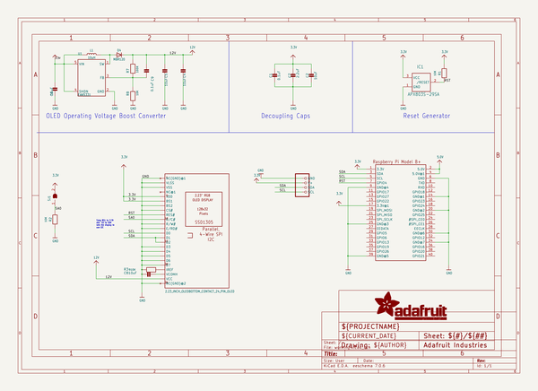
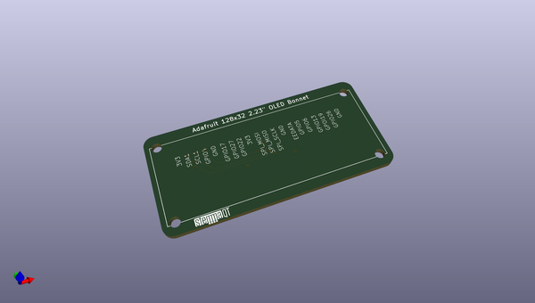
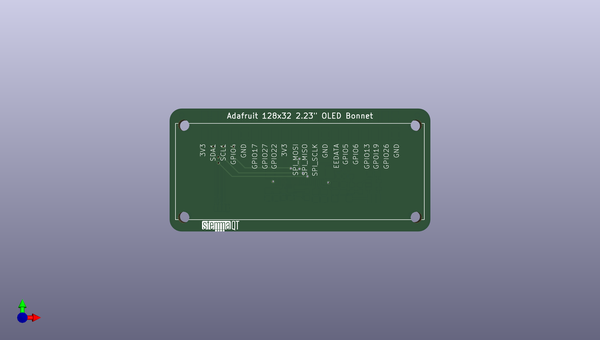
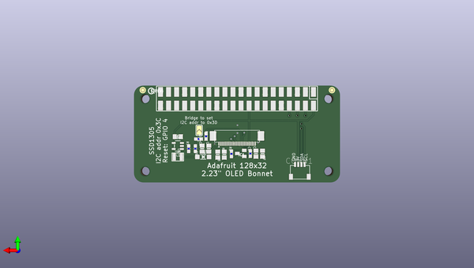

# adafruit_2_23_inch_monochrome_oled_bonnet_pcb
 
## summary 
* id: adafruit_adafruit_2_23_inch_monochrome_oled_bonnet_pcb_adafruit_2_23_inch_monochrome_oled_bonnet
* user: adafruit
* name: adafruit_2_23_inch_monochrome_oled_bonnet_pcb
* board: adafruit_2_23_inch_monochrome_oled_bonnet
* repo: https://github.com/adafruit/Adafruit-2.23-inch-Monochrome-OLED-Bonnet-PCB

* src_file_repo_sch: 
* src_file_repo_sch_link: https://github.com/adafruit/Adafruit-2.23-inch-Monochrome-OLED-Bonnet-PCB/tree/master/

## schematic  
  
[schematic (pdf)](working_schematic.pdf)  

## pcb  
 
  
  
  
[board (pdf)](working.pdf)  

## working_bom
| Id | Designator | Footprint | Quantity | Designation | Supplier and ref |  | None | 
| --- | --- | --- | --- | --- | --- | --- | --- | 
| 1 | RPI1 | PI_BONNET_SMT | 1 | RASPBERRYPI_BPLUS_BONNETSMT |  |  | [''] | 
| 2 | U$11 | STEMMAQT | 1 |  |  |  | [''] | 
| 3 | U$33 | 2.23OLED_BOTTOM_CONTACT | 1 | 2.23_INCH_OLEDBOTTOM_CONTACT_24_PIN_OLED |  |  | [''] | 
| 4 | C9,C1 | 0603-NO | 2 | 0.1uF |  |  | [''] | 
| 5 | C8,C2,C6,C5,C4 | 0805-NO | 5 | 10uF |  |  | [''] | 
| 6 | R2,R1,R8 | 0603-NO | 3 | 10K |  |  | [''] | 
| 7 | R3 | 0805-NO | 1 | 910K |  |  | [''] | 
| 8 | IC1 | SOT23 | 1 | APX803S-29SA |  |  | [''] | 
| 9 | CONN1 | JST_SH4 | 1 | STEMMA_I2C_QT |  |  | [''] | 
| 10 | D4 | SOD-123 | 1 | MBR120 |  |  | [''] | 
| 11 | SJ1 | SOLDERJUMPER_ARROW_NOPASTE | 1 |  |  |  | [''] | 
| 12 | C7 | 0805-NO | 1 | 2.2uF |  |  | [''] | 
| 13 | U1 | SOT23-5 | 1 | FAN5331 |  |  | [''] | 
| 14 | R7 | 0603-NO | 1 | 100K |  |  | [''] | 
| 15 | L1 | INDUCTOR_1007 | 1 | 10uH |  |  | [''] | 
| 16 | U$2 | PCBFEAT-REV-040 | 1 |  |  |  | [''] | 

## bom_schematic
| Ref | Qnty | Value | Cmp name | Footprint | Description | Vendor | DNP | 
| --- | --- | --- | --- | --- | --- | --- | --- | 
| C1, C9 | 2 | 0.1uF | CAP_CERAMIC0603_NO | working:0603-NO |  |  |  | 
| C2, C4, C5, C6, C8 | 5 | 10uF | CAP_CERAMIC0805-NOOUTLINE | working:0805-NO |  |  |  | 
| C7 | 1 | 2.2uF | CAP_CERAMIC0805-NOOUTLINE | working:0805-NO |  |  |  | 
| CONN1 | 1 | STEMMA_I2C_QT | STEMMA_I2C_QT | working:JST_SH4 |  |  |  | 
| D4 | 1 | MBR120 | DIODESOD-123 | working:SOD-123 |  |  |  | 
| IC1 | 1 | APX803S-29SA | AXP083-SAG | working:SOT23 |  |  |  | 
| L1 | 1 | 10uH | INDUCTOR | working:INDUCTOR_1007 |  |  |  | 
| R1, R2, R8 | 3 | 10K | RESISTOR_0603_NOOUT | working:0603-NO |  |  |  | 
| R3 | 1 | 910K | RESISTOR0805_NOOUTLINE | working:0805-NO |  |  |  | 
| R7 | 1 | 100K | RESISTOR_0603_NOOUT | working:0603-NO |  |  |  | 
| RPI1 | 1 | RASPBERRYPI_BPLUS_BONNETSMT | RASPBERRYPI_BPLUS_BONNETSMT | working:PI_BONNET_SMT |  |  |  | 
| SJ1 | 1 | SOLDERJUMPER | SOLDERJUMPER | working:SOLDERJUMPER_ARROW_NOPASTE |  |  |  | 
| U1 | 1 | FAN5331 | VREG_FAN5331 | working:SOT23-5 |  |  |  | 
| U$33 | 1 | 2.23_INCH_OLEDBOTTOM_CONTACT_24_PIN_OLED | 2.23_INCH_OLEDBOTTOM_CONTACT_24_PIN_OLED | working:2.23OLED_BOTTOM_CONTACT |  |  |  | 

