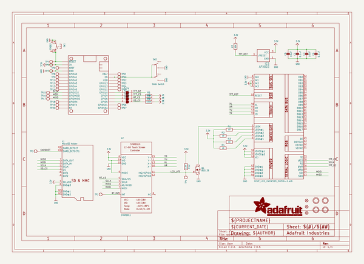
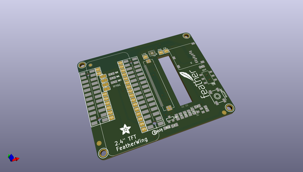
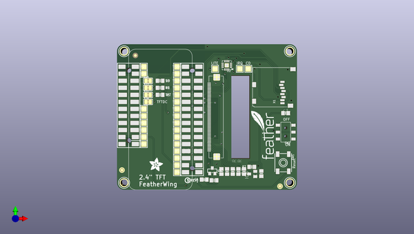
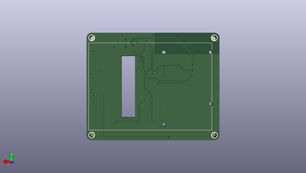

# adafruit_2_4_tft_featherwing_pcb
 
## summary 
* id: adafruit_adafruit_2_4_tft_featherwing_pcb_adafruit_2_4in_tft_featherwing
* user: adafruit
* name: adafruit_2_4_tft_featherwing_pcb
* board: adafruit_2_4in_tft_featherwing
* repo: https://github.com/adafruit/Adafruit-2.4-TFT-FeatherWing-PCB

* src_file_repo_sch: 
* src_file_repo_sch_link: https://github.com/adafruit/Adafruit-2.4-TFT-FeatherWing-PCB/tree/master/

## schematic  
  
[schematic (pdf)](working_schematic.pdf)  

## pcb  
 
  
  
  
[board (pdf)](working.pdf)  

## working_bom
| Id | Designator | Footprint | Quantity | Designation | Supplier and ref |  | None | 
| --- | --- | --- | --- | --- | --- | --- | --- | 
| 1 | R2,R4,R3,R1 | 0805-NO | 4 | 10 |  |  | [''] | 
| 2 | Q4 | SOT23-WIDE | 1 | BSS138 |  |  | [''] | 
| 3 | SJ4,SJ1,SJ3,SJ2 | SOLDERJUMPER_CLOSEDWIRE | 4 |  |  |  | [''] | 
| 4 | TP17,TP11,TP26,TP14,TP3,TP5,TP22,TP15,TP21,TP20,TP1,TP16,TP19,TP13,TP12,TP25,TP18,TP9,TP4,TP23,TP6,TP10,TP27,TP7,TP2,TP24,TP8 | TESTPOINT_PAD_2MM | 27 |  |  |  | [''] | 
| 5 | MS2 | FEATHERWING_SMT2 | 1 | FEATHERWING_SMTDUAL |  |  | [''] | 
| 6 | C1,C4 | 0805-NO | 2 | 0.1uF |  |  | [''] | 
| 7 | R5,R8,R6 | 0805-NO | 3 | 100K |  |  | [''] | 
| 8 | U$29 | FEATHERLOGO_MED | 1 |  |  |  | [''] | 
| 9 | FID2,FID1,FID3 | FIDUCIAL_1MM | 3 | FIDUCIAL" |  |  | [''] | 
| 10 | X1 | MICROSD | 1 | MicroSD Holder |  |  | [''] | 
| 11 | U$17,U$9,U$15,U$11 | MOUNTINGHOLE_2.5_PLATED | 4 | MOUNTINGHOLE2.5 |  |  | [''] | 
| 12 | U$30 | ADAFRUIT_5MM | 1 |  |  |  | [''] | 
| 13 | U$34 | PCBFEAT-REV-040 | 1 |  |  |  | [''] | 
| 14 | U2 | QFN16_3MM | 1 | STMPE811 |  |  | [''] | 
| 15 | IC5 | SOT23 | 1 | APX803 |  |  | [''] | 
| 16 | C6,C3 | 0805-NO | 2 | 10uF |  |  | [''] | 
| 17 | SW1 | EVQ-Q2_SMALLER | 1 | EVQQ2 |  |  | [''] | 
| 18 | R12 | 0805-NO | 1 | 3.9K |  |  | [''] | 
| 19 | R7 | 0805-NO | 1 | 10K |  |  | [''] | 
| 20 | SW2 | EG1390 | 1 | Slide Switch |  |  | [''] | 
| 21 | U$10 | TFT_2.4IN_240X320_50PIN | 1 | DISP_LCD_240X320_50PIN-2.4IN |  |  | [''] | 

## bom_schematic
| Ref | Qnty | Value | Cmp name | Footprint | Description | Vendor | DNP | 
| --- | --- | --- | --- | --- | --- | --- | --- | 
| C1, C4 | 2 | 0.1uF | CAP_CERAMIC0805-NOOUTLINE | working:0805-NO |  |  |  | 
| C3, C6 | 2 | 10uF | CAP_CERAMIC0805-NOOUTLINE | working:0805-NO |  |  |  | 
| FID1, FID2, FID3 | 3 | FIDUCIAL"" | FIDUCIAL{dblquote}{dblquote} | working:FIDUCIAL_1MM |  |  |  | 
| IC5 | 1 | APX803 | AXP083-SAG | working:SOT23 |  |  |  | 
| MS2 | 1 | FEATHERWING_SMTDUAL | FEATHERWING_SMTDUAL | working:FEATHERWING_SMT2 |  |  |  | 
| Q4 | 1 | BSS138 | MOSFET-NWIDE | working:SOT23-WIDE |  |  |  | 
| R1, R2, R3, R4 | 4 | 10 | RESISTOR0805_NOOUTLINE | working:0805-NO |  |  |  | 
| R5, R6, R8 | 3 | 100K | RESISTOR0805_NOOUTLINE | working:0805-NO |  |  |  | 
| R7 | 1 | 10K | RESISTOR0805_NOOUTLINE | working:0805-NO |  |  |  | 
| R12 | 1 | 3.9K | RESISTOR0805_NOOUTLINE | working:0805-NO |  |  |  | 
| SJ1, SJ2, SJ3, SJ4 | 4 | SOLDERJUMPER_CLOSED | SOLDERJUMPER_CLOSED | working:SOLDERJUMPER_CLOSEDWIRE |  |  |  | 
| SW1 | 1 | EVQQ2 | SWITCH_TACT_SMT_EVQQ2_SMALL | working:EVQ-Q2_SMALLER |  |  |  | 
| SW2 | 1 | Slide Switch | SWITCH_DPDTEG1390 | working:EG1390 |  |  |  | 
| TP1, TP2, TP3, TP4, TP5, TP6, TP7, TP8, TP9, TP10, TP11, TP12, TP13, TP14, TP15, TP16, TP17, TP18, TP19, TP20, TP21, TP22, TP23, TP24, TP25, TP26, TP27 | 27 | TESTPOINTPAD2MM | TESTPOINTPAD2MM | working:TESTPOINT_PAD_2MM |  |  |  | 
| U2 | 1 | STMPE811 | STMPE610 | working:QFN16_3MM |  |  |  | 
| U$9, U$11, U$15, U$17 | 4 | MOUNTINGHOLE2.5 | MOUNTINGHOLE2.5 | working:MOUNTINGHOLE_2.5_PLATED |  |  |  | 
| U$10 | 1 | DISP_LCD_240X320_50PIN-2.4IN | DISP_LCD_240X320_50PIN-2.4IN | working:TFT_2.4IN_240X320_50PIN |  |  |  | 
| X1 | 1 | MicroSD Holder | MICROSD | working:MICROSD |  |  |  | 

## mounting_holes
| x | y | package | value | ref | size | 
| --- | --- | --- | --- | --- | --- | 
| 0.0 | 0.0 | MOUNTINGHOLE_2.5_PLATED | MOUNTINGHOLE2.5 | U$9 | m3 | 
| 0.0 | 47.498000000000005 | MOUNTINGHOLE_2.5_PLATED | MOUNTINGHOLE2.5 | U$11 | m3 | 
| 59.69000000000001 | 0.0 | MOUNTINGHOLE_2.5_PLATED | MOUNTINGHOLE2.5 | U$15 | m3 | 
| 59.69000000000001 | 47.498000000000005 | MOUNTINGHOLE_2.5_PLATED | MOUNTINGHOLE2.5 | U$17 | m3 | 

