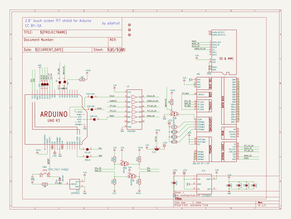
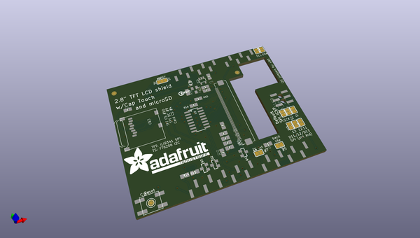
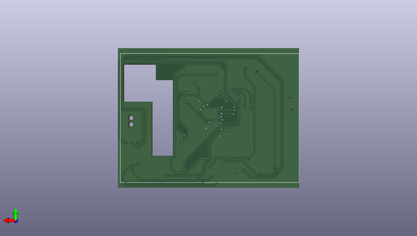

# adafruit_2_8_tft_shield_v2_pcb
 
## summary 
* id: adafruit_adafruit_2_8_tft_shield_v2_pcb_adafruit_tftcaptouchshield_rev_c
* user: adafruit
* name: adafruit_2_8_tft_shield_v2_pcb
* board: adafruit_tftcaptouchshield_rev_c
* repo: https://github.com/adafruit/Adafruit-2.8-TFT-Shield-v2-PCB

* src_file_repo_sch: 
* src_file_repo_sch_link: https://github.com/adafruit/Adafruit-2.8-TFT-Shield-v2-PCB/tree/master/

## schematic  
  
[schematic (pdf)](working_schematic.pdf)  

## pcb  
 
  
  
  
[board (pdf)](working.pdf)  

## working_bom
| Id | Designator | Footprint | Quantity | Designation | Supplier and ref |  | None | 
| --- | --- | --- | --- | --- | --- | --- | --- | 
| 1 | C5,C4,C1 | 0805-NO | 3 | 10uF |  |  | [''] | 
| 2 | SW1 | EVQ-Q2 | 1 | SPST_TACT-EVQQ2 |  |  | [''] | 
| 3 | SCL_A5,SDA_A4 | SOLDERJUMPER_REFLOW_NOPASTE | 2 |  |  |  | [''] | 
| 4 | C3,C2 | 0805-NO | 2 | 0.1uF |  |  | [''] | 
| 5 | U$3 | MICROSD | 1 | MICROSD |  |  | [''] | 
| 6 | U$19,U$11,U$10 | FIDUCIAL_1MM | 3 | FIDUCIAL_1MM |  |  | [''] | 
| 7 | R16,R15,R14,R6,R8,R13 | 0805-NO | 6 | 10K |  |  | [''] | 
| 8 | D1 | SOD-323F | 1 | 1N4148 |  |  | [''] | 
| 9 | D7,SJ2,SJ3,D5,SJ1 | SOLDERJUMPER_ARROW_NOPASTE | 5 |  |  |  | [''] | 
| 10 | R4,R3,R2 | 0805-NO | 3 | 68 ohm |  |  | [''] | 
| 11 | IC5 | SOT23 | 1 | AXP803 |  |  | [''] | 
| 12 | SJ4 | SOLDERJUMPER_2WAY_OPEN_NOPASTE | 1 |  |  |  | [''] | 
| 13 | U$7 | PCBFEAT-REV-040 | 1 |  |  |  | [''] | 
| 14 | U$20 | ADAFRUIT_TEXT_30MM | 1 |  |  |  | [''] | 
| 15 | Q2,Q3,Q4 | SOT23-WIDE | 3 | BSS138 |  |  | [''] | 
| 16 | U3 | SOIC16 | 1 | 74HC4050 |  |  | [''] | 
| 17 | R9 | 0805-NO | 1 | 2.2K |  |  | [''] | 
| 18 | ICSP_SO0,ICSP_SI0,ICSP_CLK0 | SOLDERJUMPER_CLOSEDWIRE | 3 |  |  |  | [''] | 
| 19 | R1 | 0805-NO | 1 | 68 |  |  | [''] | 
| 20 | IC4 | SOT23-5L | 1 | MIC5225-3.3 |  |  | [''] | 
| 21 | U$17 | ARDUINOR3_ICSP_SMT | 1 | ARDUINO_R3_ICSPSMT |  |  | [''] | 
| 22 | U$2 | TFT_2.83IN_240X320_50PIN | 1 | 2.8 TFT + CTP" |  |  | [''] | 

## bom_schematic
| Ref | Qnty | Value | Cmp name | Footprint | Description | Vendor | DNP | 
| --- | --- | --- | --- | --- | --- | --- | --- | 
| C1, C4, C5 | 3 | 10uF | CAP_CERAMIC0805-NOOUTLINE | working:0805-NO |  |  |  | 
| C2, C3 | 2 | 0.1uF | CAP_CERAMIC0805-NOOUTLINE | working:0805-NO |  |  |  | 
| D1 | 1 | 1N4148 | DIODESOD-323F | working:SOD-323F |  |  |  | 
| D5, D7 | 2 | SOLDERJUMPER | SOLDERJUMPER | working:SOLDERJUMPER_ARROW_NOPASTE |  |  |  | 
| IC4 | 1 | LP298XS | LP298XS | working:SOT23-5L |  |  |  | 
| IC5 | 1 | AXP803 | AXP083-SAG | working:SOT23 |  |  |  | 
| ICSP_CLK0 | 1 | SOLDERJUMPERCLOSED | SOLDERJUMPERCLOSED | working:SOLDERJUMPER_CLOSEDWIRE |  |  |  | 
| ICSP_SI0 | 1 | SOLDERJUMPERCLOSED | SOLDERJUMPERCLOSED | working:SOLDERJUMPER_CLOSEDWIRE |  |  |  | 
| ICSP_SO0 | 1 | SOLDERJUMPERCLOSED | SOLDERJUMPERCLOSED | working:SOLDERJUMPER_CLOSEDWIRE |  |  |  | 
| Q2, Q3, Q4 | 3 | BSS138 | MOSFET-NWIDE | working:SOT23-WIDE |  |  |  | 
| R1 | 1 | 68 | RESISTOR0805_NOOUTLINE | working:0805-NO |  |  |  | 
| R2, R3, R4 | 3 | 68 ohm | RESISTOR0805_NOOUTLINE | working:0805-NO |  |  |  | 
| R6, R8, R13, R14, R15, R16 | 6 | 10K | RESISTOR0805_NOOUTLINE | working:0805-NO |  |  |  | 
| R9 | 1 | 2.2K | RESISTOR0805_NOOUTLINE | working:0805-NO |  |  |  | 
| SCL_A5 | 1 | SOLDERJUMPERREFLOW_NOPASTE | SOLDERJUMPERREFLOW_NOPASTE | working:SOLDERJUMPER_REFLOW_NOPASTE |  |  |  | 
| SDA_A4 | 1 | SOLDERJUMPERREFLOW_NOPASTE | SOLDERJUMPERREFLOW_NOPASTE | working:SOLDERJUMPER_REFLOW_NOPASTE |  |  |  | 
| SJ1, SJ2, SJ3 | 3 | SOLDERJUMPER | SOLDERJUMPER | working:SOLDERJUMPER_ARROW_NOPASTE |  |  |  | 
| SJ4 | 1 | SOLDERJUMPER_2WAY | SOLDERJUMPER_2WAY | working:SOLDERJUMPER_2WAY_OPEN_NOPASTE |  |  |  | 
| SW1 | 1 | SPST_TACT-EVQQ2 | SPST_TACT-EVQQ2 | working:EVQ-Q2 |  |  |  | 
| U3 | 1 | 74HC4050 | 74HC4050D | working:SOIC16 |  |  |  | 
| U$2 | 1 | 2.8" TFT + CTP | DISP_LCD_CTP28_SAMPLE | working:TFT_2.83IN_240X320_50PIN |  |  |  | 
| U$3 | 1 | MICROSD | MICROSD | working:MICROSD |  |  |  | 
| U$10, U$11, U$19 | 3 | FIDUCIAL_1MM | FIDUCIAL_1MM | working:FIDUCIAL_1MM |  |  |  | 
| U$17 | 1 | ARDUINO_R3_ICSPSMT | ARDUINO_R3_ICSPSMT | working:ARDUINOR3_ICSP_SMT |  |  |  | 

