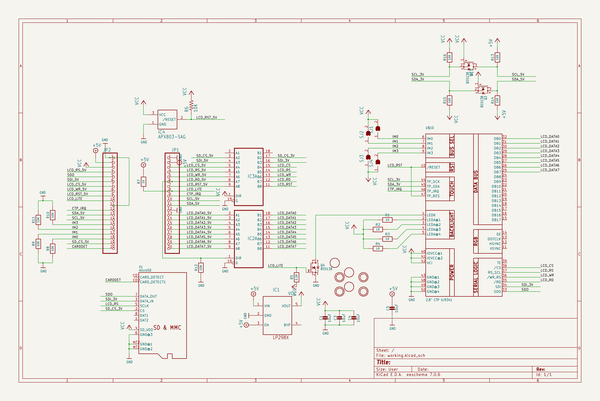
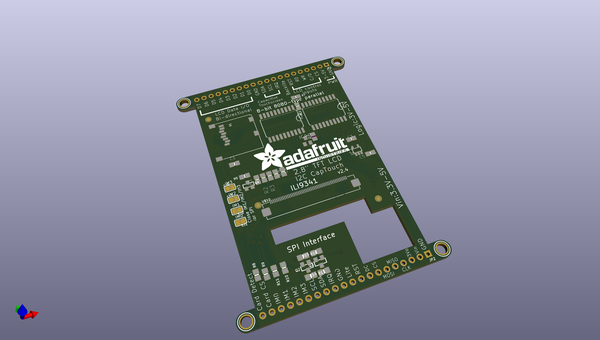
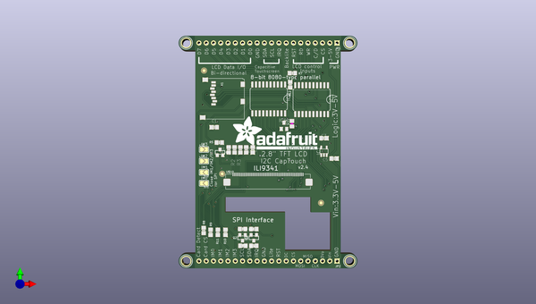
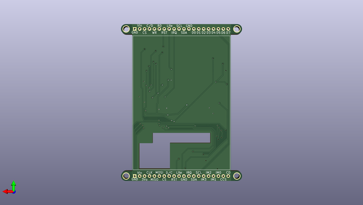

# adafruit_2_8_tft_with_capacitive_touch_pcb
 
## summary 
* id: adafruit_adafruit_2_8_tft_with_capacitive_touch_pcb_adafruit_2_8_inch_tft_w_capacitive_touch
* user: adafruit
* name: adafruit_2_8_tft_with_capacitive_touch_pcb
* board: adafruit_2_8_inch_tft_w_capacitive_touch
* repo: https://github.com/adafruit/Adafruit-2.8-TFT-with-Capacitive-Touch-PCB

* src_file_repo_sch: 
* src_file_repo_sch_link: https://github.com/adafruit/Adafruit-2.8-TFT-with-Capacitive-Touch-PCB/tree/master/

## schematic  
  
[schematic (pdf)](working_schematic.pdf)  

## pcb  
 
  
  
  
[board (pdf)](working.pdf)  

## working_bom
| Id | Designator | Footprint | Quantity | Designation | Supplier and ref |  | None | 
| --- | --- | --- | --- | --- | --- | --- | --- | 
| 1 | U$15,U$16,U$7,U$17 | MOUNTINGHOLE_3.0_PLATEDTHIN | 4 | MOUNTINGHOLE3.0THIN |  |  | [''] | 
| 2 | R11,R10,R15,R8,R12,R13,R16,R14,R9 | 0805-NO | 9 | 10K |  |  | [''] | 
| 3 | R2,R1,R4,R3 | 0805-NO | 4 | 10 |  |  | [''] | 
| 4 | JP2,JP1 | 1X20_ROUND | 2 |  |  |  | [''] | 
| 5 | SJ3,SJ2,SJ4,SJ1 | SOLDERJUMPER_ARROW_NOPASTE | 4 |  |  |  | [''] | 
| 6 | Q3,Q2,Q4 | SOT23-WIDE | 3 | BSS138 |  |  | [''] | 
| 7 | U$9,U$11,U$23 | FIDUCIAL_1MM | 3 | FIDUCIAL |  |  | [''] | 
| 8 | C4,C3,C1,C5 | 0805-NO | 4 | 10uF |  |  | [''] | 
| 9 | X1 | MICROSD | 1 | microSD |  |  | [''] | 
| 10 | R5 | 0805-NO | 1 | 2.2K |  |  | [''] | 
| 11 | U$19 | ADAFRUIT_TEXT_30MM | 1 |  |  |  | [''] | 
| 12 | R6 | R0805 | 1 | 10K |  |  | [''] | 
| 13 | IC3,IC2 | SO20W | 2 | 74LVC245 |  |  | [''] | 
| 14 | IC1 | SOT23-5L | 1 | MIC5225-3.3 |  |  | [''] | 
| 15 | R7 | 0805-NO | 1 | 1K |  |  | [''] | 
| 16 | IC4 | SOT23 | 1 | APX803-SAG |  |  | [''] | 
| 17 | U$10 | TFT_2.83IN_240X320_50PIN | 1 | 2.8 CTP ILI9341" |  |  | [''] | 

## bom_schematic
| Ref | Qnty | Value | Cmp name | Footprint | Description | Vendor | DNP | 
| --- | --- | --- | --- | --- | --- | --- | --- | 
| C1, C3, C4, C5 | 4 | 10uF | CAP_CERAMIC0805-NOOUTLINE | working:0805-NO |  |  |  | 
| IC1 | 1 | LP298XS | LP298XS | working:SOT23-5L |  |  |  | 
| IC2, IC3 | 2 | 74245DW | 74245DW | working:SO20W |  |  |  | 
| IC4 | 1 | APX803-SAG | AXP083-SAG | working:SOT23 |  |  |  | 
| JP1, JP2 | 2 | HEADER-1X20ROUND | HEADER-1X20ROUND | working:1X20_ROUND |  |  |  | 
| Q2, Q3, Q4 | 3 | BSS138 | MOSFET-NWIDE | working:SOT23-WIDE |  |  |  | 
| R1, R2, R3, R4 | 4 | 10 | RESISTOR0805_NOOUTLINE | working:0805-NO |  |  |  | 
| R5 | 1 | 2.2K | RESISTOR0805_NOOUTLINE | working:0805-NO |  |  |  | 
| R6 | 1 | 10K | R-US_R0805 | working:R0805 |  |  |  | 
| R7 | 1 | 1K | RESISTOR0805_NOOUTLINE | working:0805-NO |  |  |  | 
| R8, R9, R10, R11, R12, R13, R14, R15, R16 | 9 | 10K | RESISTOR0805_NOOUTLINE | working:0805-NO |  |  |  | 
| SJ1, SJ2, SJ3, SJ4 | 4 | SOLDERJUMPER | SOLDERJUMPER | working:SOLDERJUMPER_ARROW_NOPASTE |  |  |  | 
| U$7, U$15, U$16, U$17 | 4 | MOUNTINGHOLE3.0THIN | MOUNTINGHOLE3.0THIN | working:MOUNTINGHOLE_3.0_PLATEDTHIN |  |  |  | 
| U$9, U$11, U$23 | 3 | FIDUCIAL | FIDUCIAL | working:FIDUCIAL_1MM |  |  |  | 
| U$10 | 1 | 2.8" CTP ILI9341 | DISP_LCD_CTP28_SAMPLE | working:TFT_2.83IN_240X320_50PIN |  |  |  | 
| X1 | 1 | microSD | MICROSD | working:MICROSD |  |  |  | 

## mounting_holes
| x | y | package | value | ref | size | 
| --- | --- | --- | --- | --- | --- | 
| 0.0 | 0.0 | MOUNTINGHOLE_3.0_PLATEDTHIN | MOUNTINGHOLE3.0THIN | U$7 | m3 | 
| 57.14999999999999 | 0.0 | MOUNTINGHOLE_3.0_PLATEDTHIN | MOUNTINGHOLE3.0THIN | U$15 | m3 | 
| 0.0 | 76.2 | MOUNTINGHOLE_3.0_PLATEDTHIN | MOUNTINGHOLE3.0THIN | U$16 | m3 | 
| 57.14999999999999 | 76.2 | MOUNTINGHOLE_3.0_PLATEDTHIN | MOUNTINGHOLE3.0THIN | U$17 | m3 | 

