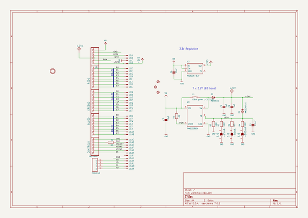
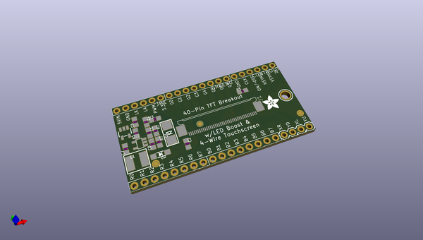
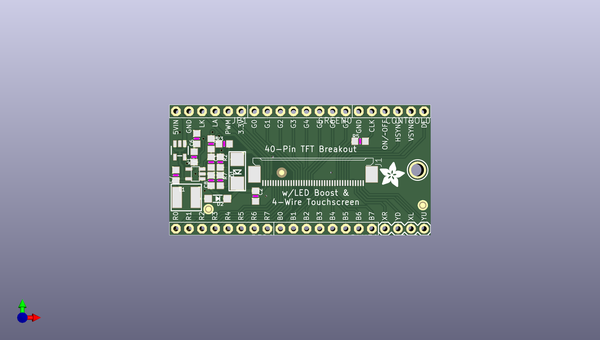
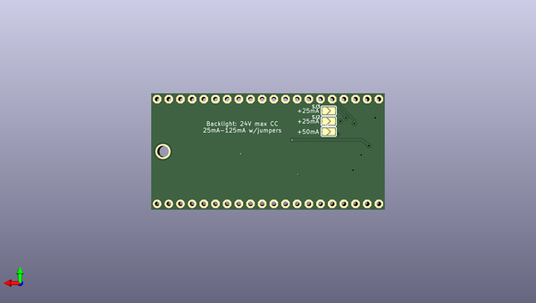

# adafruit_40_pin_tft_friend
 
## summary 
* id: adafruit_adafruit_40_pin_tft_friend_adafruit_40pin_tft_friend
* user: adafruit
* name: adafruit_40_pin_tft_friend
* board: adafruit_40pin_tft_friend
* repo: https://github.com/adafruit/Adafruit-40-pin-TFT-Friend

* src_file_repo_sch: 
* src_file_repo_sch_link: https://github.com/adafruit/Adafruit-40-pin-TFT-Friend/tree/master/

## schematic  
  
[schematic (pdf)](working_schematic.pdf)  

## pcb  
 
  
  
  
[board (pdf)](working.pdf)  

## working_bom
| Id | Designator | Footprint | Quantity | Designation | Supplier and ref |  | None | 
| --- | --- | --- | --- | --- | --- | --- | --- | 
| 1 | C6,C7 | _0805MP | 2 | 10uF |  |  | [''] | 
| 2 | FID2,FID1,FID3 | FIDUCIAL_1MM | 3 | FIDUCIAL" |  |  | [''] | 
| 3 | U$15 | ADAFRUIT_5MM | 1 |  |  |  | [''] | 
| 4 | C8,C2 | _0805MP | 2 | 1uF |  |  | [''] | 
| 5 | D2 | SOD-123 | 1 | MBR0540 |  |  | [''] | 
| 6 | D1 | SMADIODE | 1 | MM3Z24VT1G |  |  | [''] | 
| 7 | GREEN0,RED0,BLUE0 | 1X08-BIG | 3 |  |  |  | [''] | 
| 8 | L1 | INDUCTOR_5X5MM_NR5040_NOTHERMALS | 1 | 6.8uH power L CID 2276 |  |  | [''] | 
| 9 | TOUCH0 | 1X04-BIG | 1 |  |  |  | [''] | 
| 10 | CONTROL0,JP1 | 1X06-BIG | 2 |  |  |  | [''] | 
| 11 | J1 | 4-1734839-0 | 1 | 40PINFPCM4-1734839-0 |  |  | [''] | 
| 12 | R2 | _0805MP | 1 | 6Ω |  |  | [''] | 
| 13 | R7,R4,R3 | _0805MP | 3 | 12Ω |  |  | [''] | 
| 14 | U3 | SOT23-5@1 | 1 | FAN5333BSX |  |  | [''] | 
| 15 | R5 | _0805MP | 1 | 22 |  |  | [''] | 
| 16 | U2 | SOT23-5 | 1 | MIC5225-3.3v |  |  | [''] | 
| 17 | C1 | _0805MP | 1 | 0.1uF |  |  | [''] | 
| 18 | R1 | _0805MP | 1 | 10K |  |  | [''] | 
| 19 | U$7 | MOUNTINGHOLE_2.5_PLATED | 1 | MOUNTINGHOLE2.5 |  |  | [''] | 
| 20 | SJ3 | SOLDERJUMPER_ARROW_NOPASTE | 1 | +100mA |  |  | [''] | 
| 21 | SJ1 | SOLDERJUMPER_ARROW_NOPASTE | 1 | +50mA |  |  | [''] | 
| 22 | SJ2 | SOLDERJUMPER_ARROW_NOPASTE | 1 | +25mA |  |  | [''] | 

## bom_schematic
| Ref | Qnty | Value | Cmp name | Footprint | Description | Vendor | DNP | 
| --- | --- | --- | --- | --- | --- | --- | --- | 
| BLUE0 | 1 | PINHD-1X8BIG | PINHD-1X8BIG | working:1X08-BIG |  |  |  | 
| C1 | 1 | 0.1uF | CAP_CERAMIC_0805MP | working:_0805MP |  |  |  | 
| C2, C8 | 2 | 1uF | CAP_CERAMIC_0805MP | working:_0805MP |  |  |  | 
| C6, C7 | 2 | 10uF | CAP_CERAMIC_0805MP | working:_0805MP |  |  |  | 
| CONTROL0 | 1 | PINHD-1X6B | PINHD-1X6B | working:1X06-BIG |  |  |  | 
| D1 | 1 | MM3Z24VT1G | DIODESMA | working:SMADIODE |  |  |  | 
| D2 | 1 | MBR0540 | DIODESOD-123 | working:SOD-123 |  |  |  | 
| FID1, FID2, FID3 | 3 | FIDUCIAL"" | FIDUCIAL{dblquote}{dblquote} | working:FIDUCIAL_1MM |  |  |  | 
| GREEN0 | 1 | PINHD-1X8BIG | PINHD-1X8BIG | working:1X08-BIG |  |  |  | 
| J1 | 1 | 40PINFPC4-1734839-0 | 40PINFPC4-1734839-0 | working:4-1734839-0 |  |  |  | 
| JP1 | 1 | PINHD-1X6B | PINHD-1X6B | working:1X06-BIG |  |  |  | 
| L1 | 1 | 6.8uH power L CID 2276 | INDUCTORNR5040 | working:INDUCTOR_5X5MM_NR5040_NOTHERMALS |  |  |  | 
| R1 | 1 | 10K | RESISTOR_0805MP | working:_0805MP |  |  |  | 
| R2 | 1 | 6Ω | RESISTOR_0805MP | working:_0805MP |  |  |  | 
| R3, R4, R7 | 3 | 12Ω | RESISTOR_0805MP | working:_0805MP |  |  |  | 
| R5 | 1 | 22 | RESISTOR_0805MP | working:_0805MP |  |  |  | 
| RED0 | 1 | PINHD-1X8BIG | PINHD-1X8BIG | working:1X08-BIG |  |  |  | 
| SJ1 | 1 | +50mA | SOLDERJUMPER | working:SOLDERJUMPER_ARROW_NOPASTE |  |  |  | 
| SJ2 | 1 | +25mA | SOLDERJUMPER | working:SOLDERJUMPER_ARROW_NOPASTE |  |  |  | 
| SJ3 | 1 | +100mA | SOLDERJUMPER | working:SOLDERJUMPER_ARROW_NOPASTE |  |  |  | 
| TOUCH0 | 1 | 1X4-BIG | 1X4-BIG | working:1X04-BIG |  |  |  | 
| U2 | 1 | MIC5225-3.3v | VREG_SOT23-5 | working:SOT23-5 |  |  |  | 
| U3 | 1 | FAN5333BSX | FAN5331 | working:SOT23-5@1 |  |  |  | 
| U$7 | 1 | MOUNTINGHOLE2.5 | MOUNTINGHOLE2.5 | working:MOUNTINGHOLE_2.5_PLATED |  |  |  | 

## mounting_holes
| x | y | package | value | ref | size | 
| --- | --- | --- | --- | --- | --- | 
| 0.0 | 0.0 | MOUNTINGHOLE_2.5_PLATED | MOUNTINGHOLE2.5 | U$7 | m3 | 

