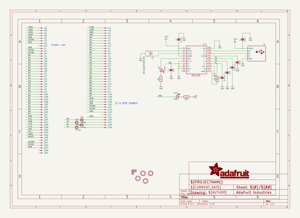
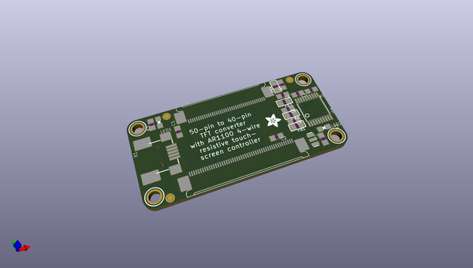
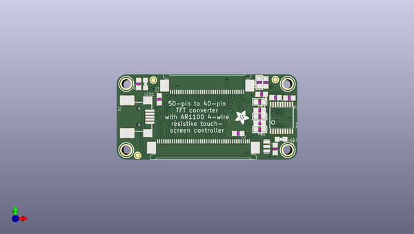
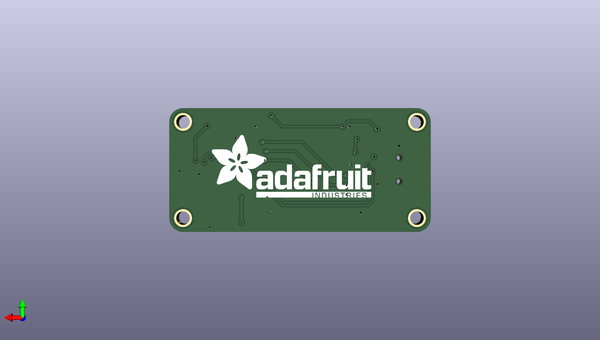

# adafruit_50pin_to_40pin_tft_with_ar1100_adapter_pcb
 
## summary 
* id: adafruit_adafruit_50pin_to_40pin_tft_with_ar1100_adapter_pcb_adafruit_50pin_to_40pin_tft_with_ar1100_adapter
* user: adafruit
* name: adafruit_50pin_to_40pin_tft_with_ar1100_adapter_pcb
* board: adafruit_50pin_to_40pin_tft_with_ar1100_adapter
* repo: https://github.com/adafruit/Adafruit-50pin-to-40pin-TFT-with-AR1100-Adapter-PCB

* src_file_repo_sch: 
* src_file_repo_sch_link: https://github.com/adafruit/Adafruit-50pin-to-40pin-TFT-with-AR1100-Adapter-PCB/tree/master/

## schematic  
  
[schematic (pdf)](working_schematic.pdf)  

## pcb  
 
  
  
  
[board (pdf)](working.pdf)  

## working_bom
| Id | Designator | Footprint | Quantity | Designation | Supplier and ref |  | None | 
| --- | --- | --- | --- | --- | --- | --- | --- | 
| 1 | R1 | _0805MP | 1 | 20K |  |  | [''] | 
| 2 | J2 | 5-1734839-0-REV | 1 | XF2-50-REV |  |  | [''] | 
| 3 | C4,C6 | _0805MP | 2 | 0.01uF |  |  | [''] | 
| 4 | FID1,FID3,FID2 | FIDUCIAL_1MM | 3 | FIDUCIAL" |  |  | [''] | 
| 5 | U$15,U$14,U$11,U$16 | MOUNTINGHOLE_2.5_PLATED | 4 | MOUNTINGHOLE2.5 |  |  | [''] | 
| 6 | C5,C7 | _0805MP | 2 | dnp |  |  | [''] | 
| 7 | R2,R3 | _0805MP | 2 | 1K |  |  | [''] | 
| 8 | FB3,FB1,FB2,FB4 | _0805 | 4 | Ferrite |  |  | [''] | 
| 9 | C1,C3 | _0805MP | 2 | 10uF |  |  | [''] | 
| 10 | IC1 | TSSOP20-5.3MMBODY | 1 | AR1100_SSOP |  |  | [''] | 
| 11 | J1 | 4-1734839-0 | 1 | XF2-40-RARBT |  |  | [''] | 
| 12 | LED1 | CHIPLED_0805_NOOUTLINE | 1 | Green |  |  | [''] | 
| 13 | C2 | _0805MP | 1 | 0.1uF |  |  | [''] | 
| 14 | Y1 | RESONATOR-SMD | 1 | 12MHz |  |  | [''] | 
| 15 | X1 | USB-MINIB_LARGER | 1 |  |  |  | [''] | 
| 16 | LED2 | CHIPLED_0805_NOOUTLINE | 1 | red |  |  | [''] | 
| 17 | U$19 | ADAFRUIT_3.5MM | 1 |  |  |  | [''] | 
| 18 | U$18 | ADAFRUIT_TEXT_30MM | 1 |  |  |  | [''] | 

## bom_schematic
| Ref | Qnty | Value | Cmp name | Footprint | Description | Vendor | DNP | 
| --- | --- | --- | --- | --- | --- | --- | --- | 
| C1, C3 | 2 | 10uF | CAP_CERAMIC_0805MP | working:_0805MP |  |  |  | 
| C2 | 1 | 0.1uF | CAP_CERAMIC_0805MP | working:_0805MP |  |  |  | 
| C4, C6 | 2 | 0.01uF | CAP_CERAMIC_0805MP | working:_0805MP |  |  |  | 
| C5, C7 | 2 | dnp | CAP_CERAMIC_0805MP | working:_0805MP |  |  |  | 
| FB1, FB2, FB3, FB4 | 4 | Ferrite | FERRITE_0805 | working:_0805 |  |  |  | 
| FID1, FID2, FID3 | 3 | FIDUCIAL"" | FIDUCIAL{dblquote}{dblquote} | working:FIDUCIAL_1MM |  |  |  | 
| IC1 | 1 | AR1100_SSOP | AR1100_SSOP | working:TSSOP20-5.3MMBODY |  |  |  | 
| J1 | 1 | XF2-40?-RARBT | XF2-40?-RARBT | working:4-1734839-0 |  |  |  | 
| J2 | 1 | XF2-50?-REV | XF2-50?-REV | working:5-1734839-0-REV |  |  |  | 
| LED1 | 1 | Green | LED0805_NOOUTLINE | working:CHIPLED_0805_NOOUTLINE |  |  |  | 
| LED2 | 1 | red | LED0805_NOOUTLINE | working:CHIPLED_0805_NOOUTLINE |  |  |  | 
| R1 | 1 | 20K | RESISTOR_0805MP | working:_0805MP |  |  |  | 
| R2, R3 | 2 | 1K | RESISTOR_0805MP | working:_0805MP |  |  |  | 
| U$11, U$14, U$15, U$16 | 4 | MOUNTINGHOLE2.5 | MOUNTINGHOLE2.5 | working:MOUNTINGHOLE_2.5_PLATED |  |  |  | 
| X1 | 1 | USBMINIBLARGE | USBMINIBLARGE | working:USB-MINIB_LARGER |  |  |  | 
| Y1 | 1 | RESONATORSMD | RESONATORSMD | working:RESONATOR-SMD |  |  |  | 

## mounting_holes
| x | y | package | value | ref | size | 
| --- | --- | --- | --- | --- | --- | 
| 43.18000000000001 | 0.0 | MOUNTINGHOLE_2.5_PLATED | MOUNTINGHOLE2.5 | U$11 | m3 | 
| 43.18000000000001 | 17.78 | MOUNTINGHOLE_2.5_PLATED | MOUNTINGHOLE2.5 | U$14 | m3 | 
| 0.0 | 17.78 | MOUNTINGHOLE_2.5_PLATED | MOUNTINGHOLE2.5 | U$15 | m3 | 
| 0.0 | 0.0 | MOUNTINGHOLE_2.5_PLATED | MOUNTINGHOLE2.5 | U$16 | m3 | 

