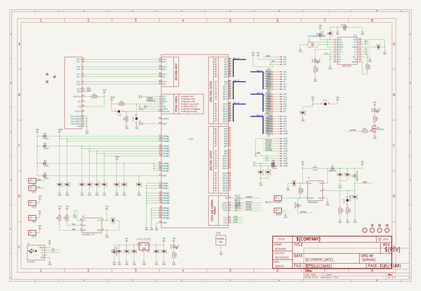
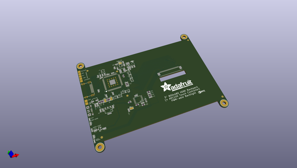
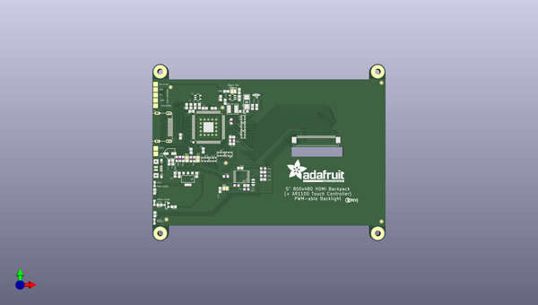
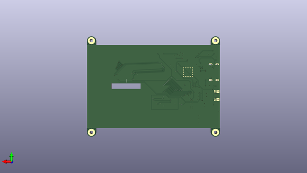

# adafruit_5_hdmi_backpack_pcb
 
## summary 
* id: adafruit_adafruit_5_hdmi_backpack_pcb_adafruit_5in_hdmi_backpack
* user: adafruit
* name: adafruit_5_hdmi_backpack_pcb
* board: adafruit_5in_hdmi_backpack
* repo: https://github.com/adafruit/Adafruit-5-HDMI-Backpack-PCB

* src_file_repo_sch: 
* src_file_repo_sch_link: https://github.com/adafruit/Adafruit-5-HDMI-Backpack-PCB/tree/master/

## schematic  
  
[schematic (pdf)](working_schematic.pdf)  

## pcb  
 
  
  
  
[board (pdf)](working.pdf)  

## working_bom
| Id | Designator | Footprint | Quantity | Designation | Supplier and ref |  | None | 
| --- | --- | --- | --- | --- | --- | --- | --- | 
| 1 | GND0,JP6,BACKLITEPWM0,JP3,JP4,JP7,JP5 | 1X01_SMD_MASKHELD_2X2MM | 7 |  |  |  | [''] | 
| 2 | LED3 | CHIPLED_0805_NOOUTLINE | 1 | Blue |  |  | [''] | 
| 3 | C13,C16,C14,C15,C12 | 0805-NO | 5 | 10uF |  |  | [''] | 
| 4 | FB3,FB7,FB2,FB8,FB1,FB5,FB4,FB6 | _0805MP | 8 | Ferrite |  |  | [''] | 
| 5 | R15,R16 | 0805-NO | 2 | 12 |  |  | [''] | 
| 6 | R21,R19,R20,R14 | 0805-NO | 4 | 1K |  |  | [''] | 
| 7 | R18,R1,R4,R13,R3 | 0805-NO | 5 | 10K |  |  | [''] | 
| 8 | C23,C3,C9,C10,C7,C1,C2,C8,C19,C11,C20 | 0805-NO | 11 | 0.1uF |  |  | [''] | 
| 9 | D1 | SOD-123 | 1 | MBR0540 |  |  | [''] | 
| 10 | SJ2,SJ1 | SOLDERJUMPER_ARROW_NOPASTE | 2 |  |  |  | [''] | 
| 11 | FID6,FID3,FID1,FID4,FID5,FID2 | FIDUCIAL_1MM | 6 | FIDUCIAL" |  |  | [''] | 
| 12 | C24 | PANASONIC_C | 1 | 100uF/6V |  |  | [''] | 
| 13 | R10,R6,R11,R9,R12,R7,R8 | RESPACK_4X0603 | 7 | 33 |  |  | [''] | 
| 14 | C4,C6 | _0805MP | 2 | 0.1uF |  |  | [''] | 
| 15 | LED1 | CHIPLED_0805_NOOUTLINE | 1 | Red |  |  | [''] | 
| 16 | U$32,U$33,U$34,U$31 | MOUNTINGHOLE_3.0_PLATED | 4 | MOUNTINGHOLE3.0 |  |  | [''] | 
| 17 | X2 | 4UCONN_20329 | 1 | MicroUSB |  |  | [''] | 
| 18 | Q1 | SOT23-WIDE | 1 | BSS138 |  |  | [''] | 
| 19 | SJ4 | SOLDERJUMPER_CLOSEDWIRE | 1 |  |  |  | [''] | 
| 20 | C5 | 0805-NO | 1 | 0.1u |  |  | [''] | 
| 21 | X1 | HDMI_MOLEX_47151-0001_DIMLAYER | 1 | 47151-0001 |  |  | [''] | 
| 22 | U4 | SOT23-5 | 1 | FAN5333BSX |  |  | [''] | 
| 23 | D2 | SMADIODE | 1 | MM3Z24VT1G |  |  | [''] | 
| 24 | C22,C21 | 0805-NO | 2 | 0.01uF |  |  | [''] | 
| 25 | U3 | SOT223-R | 1 | LT1117(3V3) |  |  | [''] | 
| 26 | LED2 | CHIPLED_0805_NOOUTLINE | 1 | Green |  |  | [''] | 
| 27 | U$75 | ADAFRUIT_TEXT_30MM | 1 |  |  |  | [''] | 
| 28 | D3 | SOD-323 | 1 | 1N4148 |  |  | [''] | 
| 29 | R2,R5 | _0805MP | 2 | 10K |  |  | [''] | 
| 30 | Y1 | RESONATOR-SMD | 1 | 12MHz |  |  | [''] | 
| 31 | L1 | INDUCTOR_5X5MM_NR5040_NOTHERMALS | 1 | 15uH |  |  | [''] | 
| 32 | U1 | S-PQFP-G100 | 1 | TFP401 |  |  | [''] | 
| 33 | C17,C25,C18 | 0805-NO | 3 | 1uF |  |  | [''] | 
| 34 | SJ3 | SOLDERJUMPER_CLOSEDWIRE | 1 | -25mA |  |  | [''] | 
| 35 | IC1 | TSSOP20-5.3MMBODY | 1 | AR1100 |  |  | [''] | 
| 36 | U$76 | PCBFEAT-REV-056 | 1 |  |  |  | [''] | 
| 37 | U2 | SOT23-5 | 1 | 24LC02BT-I/OT |  |  | [''] | 
| 38 | J1 | TFTLCD-KD50G21-40NT-A1 | 1 | TFTLCD-KD50G21-40NT-A1 |  |  | [''] | 

## bom_schematic
| Ref | Qnty | Value | Cmp name | Footprint | Description | Vendor | DNP | 
| --- | --- | --- | --- | --- | --- | --- | --- | 
| BACKLITEPWM0 | 1 | HEADER-1X1-SMD_MASKHELD_2X2MM | HEADER-1X1-SMD_MASKHELD_2X2MM | working:1X01_SMD_MASKHELD_2X2MM |  |  |  | 
| C1, C2, C3, C7, C8, C9, C10, C11, C19, C20, C23 | 11 | 0.1uF | CAP_CERAMIC0805-NOOUTLINE | working:0805-NO |  |  |  | 
| C4, C6 | 2 | 0.1uF | CAP_CERAMIC_0805MP | working:_0805MP |  |  |  | 
| C5 | 1 | 0.1u | CAP_CERAMIC0805-NOOUTLINE | working:0805-NO |  |  |  | 
| C12, C13, C14, C15, C16 | 5 | 10uF | CAP_CERAMIC0805-NOOUTLINE | working:0805-NO |  |  |  | 
| C17, C18, C25 | 3 | 1uF | CAP_CERAMIC0805-NOOUTLINE | working:0805-NO |  |  |  | 
| C21, C22 | 2 | 0.01uF | CAP_CERAMIC0805-NOOUTLINE | working:0805-NO |  |  |  | 
| C24 | 1 | 100uF/6V | CAP_ELECTROLYTICPANASONIC_C | working:PANASONIC_C |  |  |  | 
| D1 | 1 | MBR0540 | DIODESOD-123 | working:SOD-123 |  |  |  | 
| D2 | 1 | MM3Z24VT1G | DIODESMA | working:SMADIODE |  |  |  | 
| D3 | 1 | 1N4148 | DIODESOD-323 | working:SOD-323 |  |  |  | 
| FB1, FB2, FB3, FB4, FB5, FB6, FB7, FB8 | 8 | Ferrite | FERRITE_0805MP | working:_0805MP |  |  |  | 
| FID1, FID2, FID3, FID4, FID5, FID6 | 6 | FIDUCIAL"" | FIDUCIAL{dblquote}{dblquote} | working:FIDUCIAL_1MM |  |  |  | 
| GND0 | 1 | HEADER-1X1-SMD_MASKHELD_2X2MM | HEADER-1X1-SMD_MASKHELD_2X2MM | working:1X01_SMD_MASKHELD_2X2MM |  |  |  | 
| IC1 | 1 | AR1100_SSOP | AR1100_SSOP | working:TSSOP20-5.3MMBODY |  |  |  | 
| J1 | 1 | TFTLCD-KD50G21-40NT-A1 | TFTLCD-KD50G21-40NT-A1 | working:TFTLCD-KD50G21-40NT-A1 |  |  |  | 
| JP3, JP4, JP5, JP6, JP7 | 5 | HEADER-1X1-SMD_MASKHELD_2X2MM | HEADER-1X1-SMD_MASKHELD_2X2MM | working:1X01_SMD_MASKHELD_2X2MM |  |  |  | 
| L1 | 1 | 15uH | INDUCTORNR5040 | working:INDUCTOR_5X5MM_NR5040_NOTHERMALS |  |  |  | 
| LED1 | 1 | Red | LED0805_NOOUTLINE | working:CHIPLED_0805_NOOUTLINE |  |  |  | 
| LED2 | 1 | Green | LED0805_NOOUTLINE | working:CHIPLED_0805_NOOUTLINE |  |  |  | 
| LED3 | 1 | Blue | LED0805_NOOUTLINE | working:CHIPLED_0805_NOOUTLINE |  |  |  | 
| Q1 | 1 | BSS138 | MOSFET-NWIDE | working:SOT23-WIDE |  |  |  | 
| R1, R3, R4, R13, R18 | 5 | 10K | RESISTOR0805_NOOUTLINE | working:0805-NO |  |  |  | 
| R2, R5 | 2 | 10K | RESISTOR_0805MP | working:_0805MP |  |  |  | 
| R6, R7, R8, R9, R10, R11, R12 | 7 | 33 | RESISTOR_4PACK_US | working:RESPACK_4X0603 |  |  |  | 
| R14, R19, R20, R21 | 4 | 1K | RESISTOR0805_NOOUTLINE | working:0805-NO |  |  |  | 
| R15, R16 | 2 | 12 | RESISTOR0805_NOOUTLINE | working:0805-NO |  |  |  | 
| SJ1, SJ2 | 2 | SOLDERJUMPER | SOLDERJUMPER | working:SOLDERJUMPER_ARROW_NOPASTE |  |  |  | 
| SJ3 | 1 | -25mA | SOLDERJUMPERCLOSED | working:SOLDERJUMPER_CLOSEDWIRE |  |  |  | 
| SJ4 | 1 | SOLDERJUMPERCLOSED | SOLDERJUMPERCLOSED | working:SOLDERJUMPER_CLOSEDWIRE |  |  |  | 
| U1 | 1 | TFP401 | TFP401 | working:S-PQFP-G100 |  |  |  | 
| U2 | 1 | 24LC02BT-I/OT | EEPROM_I2C_MCP24AA32 | working:SOT23-5 |  |  |  | 
| U3 | 1 | LT1117(3V3) | VREG_SOT223 | working:SOT223-R |  |  |  | 
| U4 | 1 | FAN5333BSX | VREG_FAN5331 | working:SOT23-5 |  |  |  | 
| U$31, U$32, U$33, U$34 | 4 | MOUNTINGHOLE3.0 | MOUNTINGHOLE3.0 | working:MOUNTINGHOLE_3.0_PLATED |  |  |  | 
| X1 | 1 | 47151-0001 | HDMI_MOLEX_47151DIM | working:HDMI_MOLEX_47151-0001_DIMLAYER |  |  |  | 
| X2 | 1 | MicroUSB | USBMICRO_20329 | working:4UCONN_20329 |  |  |  | 
| Y1 | 1 | RESONATORSMD | RESONATORSMD | working:RESONATOR-SMD |  |  |  | 

## mounting_holes
| x | y | package | value | ref | size | 
| --- | --- | --- | --- | --- | --- | 
| 0.0 | 83.79999999999998 | MOUNTINGHOLE_3.0_PLATED | MOUNTINGHOLE3.0 | U$31 | m3 | 
| 112.7 | 83.79999999999998 | MOUNTINGHOLE_3.0_PLATED | MOUNTINGHOLE3.0 | U$32 | m3 | 
| 112.7 | 0.0 | MOUNTINGHOLE_3.0_PLATED | MOUNTINGHOLE3.0 | U$33 | m3 | 
| 0.0 | 0.0 | MOUNTINGHOLE_3.0_PLATED | MOUNTINGHOLE3.0 | U$34 | m3 | 

