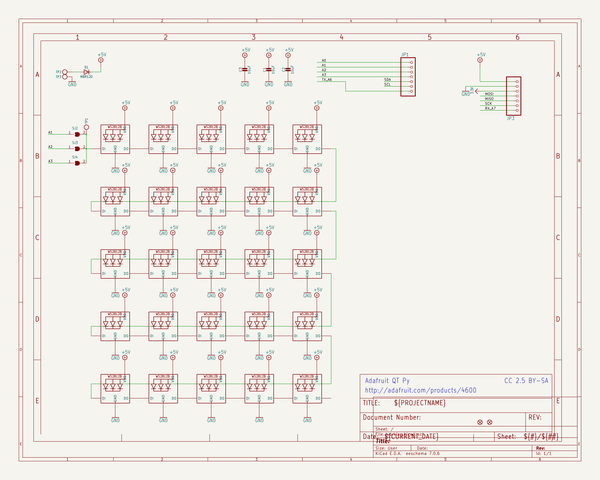
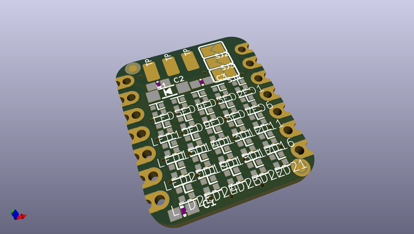
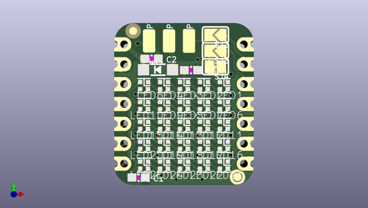
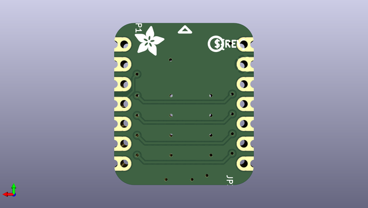

# adafruit_5x5_neopixel_grid_bff_pcb
 
## summary 
* id: adafruit_adafruit_5x5_neopixel_grid_bff_pcb_adafruit_5x5_neopixel_grid_bff
* user: adafruit
* name: adafruit_5x5_neopixel_grid_bff_pcb
* board: adafruit_5x5_neopixel_grid_bff
* repo: https://github.com/adafruit/Adafruit-5x5-NeoPixel-Grid-BFF-PCB

* src_file_repo_sch: 
* src_file_repo_sch_link: https://github.com/adafruit/Adafruit-5x5-NeoPixel-Grid-BFF-PCB/tree/main/

## schematic  
  
[schematic (pdf)](working_schematic.pdf)  

## pcb  
 
  
  
  
[board (pdf)](working.pdf)  

## working_bom
| Id | Designator | Footprint | Quantity | Designation | Supplier and ref |  | None | 
| --- | --- | --- | --- | --- | --- | --- | --- | 
| 1 | LED3,LED13,LED1,LED17,LED20,LED10,LED8,LED15,LED22,LED6,LED25,LED18,LED5,LED9,LED16,LED2,LED7,LED19,LED24,LED4,LED11,LED14,LED21,LED12,LED23 | SK6805_1515 | 25 | WS2812B_SK6805_1515 |  |  | [''] | 
| 2 | TP2 | TESTPOINT_PLUS_1X3MM | 1 |  |  |  | [''] | 
| 3 | C3,C1,C2 | 0603-NO | 3 | 10uF |  |  | [''] | 
| 4 | PLABEL3 | PLABEL3 | 1 |  |  |  | [''] | 
| 5 | TP1 | TESTPOINT_RECT_1X3MM | 1 |  |  |  | [''] | 
| 6 | U$8,U$6 | FIDUCIAL_1MM | 2 | FIDUCIAL_1MM |  |  | [''] | 
| 7 | PLABEL5 | PLABEL5 | 1 |  |  |  | [''] | 
| 8 | D1 | SOD-123 | 1 | MBR120 |  |  | [''] | 
| 9 | PLABEL4 | PLABEL4 | 1 |  |  |  | [''] | 
| 10 | SJ3,SJ2 | SOLDERJUMPER_ARROW_NOPASTE | 2 |  |  |  | [''] | 
| 11 | PLABEL0 | PLABEL0 | 1 |  |  |  | [''] | 
| 12 | SJ4 | SOLDERJUMPER_CLOSEDWIRE | 1 |  |  |  | [''] | 
| 13 | PLABEL2 | PLABEL2 | 1 |  |  |  | [''] | 
| 14 | TP3 | TESTPOINT_MINUS_1X3MM | 1 |  |  |  | [''] | 
| 15 | E$3 | ADAFRUIT_3.5MM | 1 |  |  |  | [''] | 
| 16 | JP3,JP1 | 1X07_CASTEL | 2 |  |  |  | [''] | 
| 17 | E$1 | PCBFEAT-REV-040 | 1 |  |  |  | [''] | 
| 18 | PLABEL8 | PLABEL8 | 1 |  |  |  | [''] | 
| 19 | PLABEL7 | PLABEL7 | 1 |  |  |  | [''] | 

## bom_schematic
| Ref | Qnty | Value | Cmp name | Footprint | Description | Vendor | DNP | 
| --- | --- | --- | --- | --- | --- | --- | --- | 
| C1, C2, C3 | 3 | 10uF | CAP_CERAMIC0603_NO | working:0603-NO |  |  |  | 
| D1 | 1 | MBR120 | DIODESOD-123 | working:SOD-123 |  |  |  | 
| JP1, JP3 | 2 | HEADER-1X7_CASTEL | HEADER-1X7_CASTEL | working:1X07_CASTEL |  |  |  | 
| LED1, LED2, LED3, LED4, LED5, LED6, LED7, LED8, LED9, LED10, LED11, LED12, LED13, LED14, LED15, LED16, LED17, LED18, LED19, LED20, LED21, LED22, LED23, LED24, LED25 | 25 | WS2812B_SK6805_1515 | WS2812B_SK6805_1515 | working:SK6805_1515 |  |  |  | 
| SJ2, SJ3 | 2 | SOLDERJUMPER | SOLDERJUMPER | working:SOLDERJUMPER_ARROW_NOPASTE |  |  |  | 
| SJ4 | 1 | SOLDERJUMPERCLOSED | SOLDERJUMPERCLOSED | working:SOLDERJUMPER_CLOSEDWIRE |  |  |  | 
| TP1 | 1 | TESTPOINT_1X3 | TESTPOINT_1X3 | working:TESTPOINT_RECT_1X3MM |  |  |  | 
| TP2 | 1 | TESTPOINT_PLUS13 | TESTPOINT_PLUS13 | working:TESTPOINT_PLUS_1X3MM |  |  |  | 
| TP3 | 1 | TESTPOINT_MINUS | TESTPOINT_MINUS | working:TESTPOINT_MINUS_1X3MM |  |  |  | 
| U$6, U$8 | 2 | FIDUCIAL_1MM | FIDUCIAL_1MM | working:FIDUCIAL_1MM |  |  |  | 

