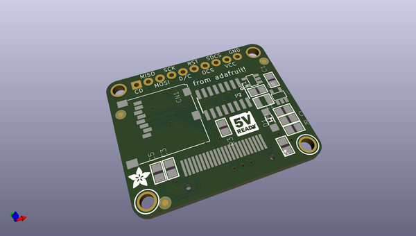
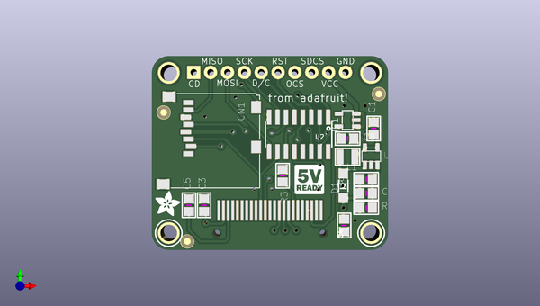

# adafruit_96x64_rgb_oled_breakout_pcb
 
## summary 
* id: adafruit_adafruit_96x64_rgb_oled_breakout_pcb_adafruit_96x64_rgb_oled_breakout
* user: adafruit
* name: adafruit_96x64_rgb_oled_breakout_pcb
* board: adafruit_96x64_rgb_oled_breakout
* repo: https://github.com/adafruit/Adafruit-96x64-RGB-OLED-Breakout-PCB

* src_file_repo_sch: 
* src_file_repo_sch_link: https://github.com/adafruit/Adafruit-96x64-RGB-OLED-Breakout-PCB/tree/master/

## schematic  
  
[schematic (pdf)](working_schematic.pdf)  

## pcb  
 
  
  
  
[board (pdf)](working.pdf)  

## working_bom
| Id | Designator | Footprint | Quantity | Designation | Supplier and ref |  | None | 
| --- | --- | --- | --- | --- | --- | --- | --- | 
| 1 | U1 | SOT23-5 | 1 | FAN5331SX |  |  | [''] | 
| 2 | C2 | 0805 | 1 | 0.1uF |  |  | [''] | 
| 3 | C3,C4,C5 | 0805 | 3 | 10uF/16V |  |  | [''] | 
| 4 | C1,C8 | 0805 | 2 | 10uF |  |  | [''] | 
| 5 | U$28 | LOGIC_5VREADY_5MM | 1 |  |  |  | [''] | 
| 6 | CN1 | MICROSD | 1 |  |  |  | [''] | 
| 7 | U2 | SOIC16 | 1 | 74HC4050 |  |  | [''] | 
| 8 | U$15,U$10,U$11,U$9 | MOUNTINGHOLE_2.5_PLATED | 4 | MOUNTINGHOLE2.5 |  |  | [''] | 
| 9 | U$17 | ADAFRUIT_3.5MM | 1 |  |  |  | [''] | 
| 10 | U$12,U$16,U$13 | FIDUCIAL_1MM | 3 | FIDUCIAL |  |  | [''] | 
| 11 | R1 | 0805 | 1 | 100K |  |  | [''] | 
| 12 | L1 | INDUCTOR_1007 | 1 | 10uH |  |  | [''] | 
| 13 | D1 | SOD-123 | 1 | BAT54T1G |  |  | [''] | 
| 14 | IC1 | SOT23-5L | 1 | MIC5225-3.3 |  |  | [''] | 
| 15 | R2 | 0805 | 1 | 10K |  |  | [''] | 
| 16 | R3 | 0805 | 1 | 920K |  |  | [''] | 
| 17 | LCD1 | UG-9664HDDAG01_WRAPAROUND | 1 | UG-9664HDDAG01 |  |  | [''] | 
| 18 | JP2 | 1X10_ROUND_76 | 1 |  |  |  | [''] | 

## bom_schematic
| Ref | Qnty | Value | Cmp name | Footprint | Description | Vendor | DNP | 
| --- | --- | --- | --- | --- | --- | --- | --- | 
| C1, C8 | 2 | 10uF | CAP_CERAMIC0805 | working:0805 |  |  |  | 
| C2 | 1 | 0.1uF | CAP_CERAMIC0805 | working:0805 |  |  |  | 
| C3, C4, C5 | 3 | 10uF/16V | CAP_CERAMIC0805 | working:0805 |  |  |  | 
| CN1 | 1 | MICROSD | MICROSD | working:MICROSD |  |  |  | 
| D1 | 1 | BAT54T1G | DIODESOD-123 | working:SOD-123 |  |  |  | 
| IC1 | 1 | LP298XS | LP298XS | working:SOT23-5L |  |  |  | 
| JP2 | 1 | HEADER-1X10THICKER | HEADER-1X10THICKER | working:1X10_ROUND_76 |  |  |  | 
| L1 | 1 | 10uH | INDUCTOR | working:INDUCTOR_1007 |  |  |  | 
| LCD1 | 1 | UG-9664HDDAG01 | DISP_OLED_UG-9664HDDAG01WRAPAROUND | working:UG-9664HDDAG01_WRAPAROUND |  |  |  | 
| R1 | 1 | 100K | RESISTOR0805 | working:0805 |  |  |  | 
| R2 | 1 | 10K | RESISTOR0805 | working:0805 |  |  |  | 
| R3 | 1 | 920K | RESISTOR0805 | working:0805 |  |  |  | 
| U1 | 1 | FAN5331SX | FAN5331 | working:SOT23-5 |  |  |  | 
| U2 | 1 | 74HC4050 | 74HC4050D | working:SOIC16 |  |  |  | 
| U$9, U$10, U$11, U$15 | 4 | MOUNTINGHOLE2.5 | MOUNTINGHOLE2.5 | working:MOUNTINGHOLE_2.5_PLATED |  |  |  | 
| U$12, U$13, U$16 | 3 | FIDUCIAL | FIDUCIAL | working:FIDUCIAL_1MM |  |  |  | 

## mounting_holes
| x | y | package | value | ref | size | 
| --- | --- | --- | --- | --- | --- | 
| 0.0 | 0.0 | MOUNTINGHOLE_2.5_PLATED | MOUNTINGHOLE2.5 | U$10 | m3 | 
| 30.47999999999999 | 0.0 | MOUNTINGHOLE_2.5_PLATED | MOUNTINGHOLE2.5 | U$15 | m3 | 

