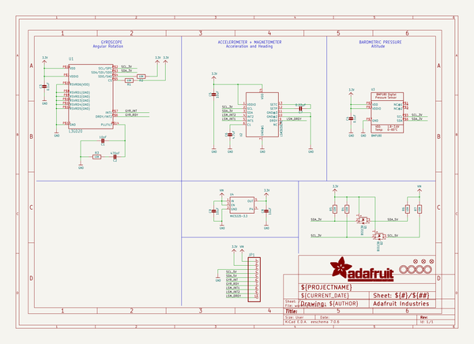
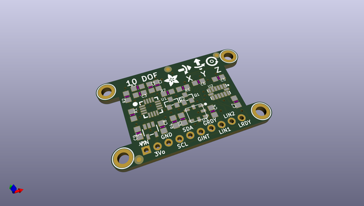
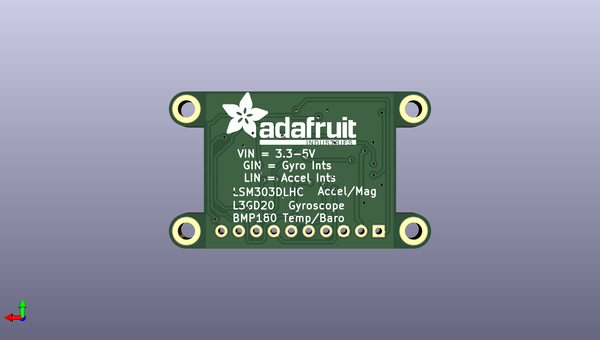

# adafruit_9_dof_and_10_dof_pcbs
 
## summary 
* id: adafruit_adafruit_9_dof_and_10_dof_pcbs_adafuit_10dof
* user: adafruit
* name: adafruit_9_dof_and_10_dof_pcbs
* board: adafuit_10dof
* repo: https://github.com/adafruit/Adafruit-9-DOF-and-10-DOF-PCBs

* src_file_repo_sch: 
* src_file_repo_sch_link: https://github.com/adafruit/Adafruit-9-DOF-and-10-DOF-PCBs/tree/master/

## schematic  
  
[schematic (pdf)](working_schematic.pdf)  

## pcb  
 
  
  
  
[board (pdf)](working.pdf)  

## working_bom
| Id | Designator | Footprint | Quantity | Designation | Supplier and ref |  | None | 
| --- | --- | --- | --- | --- | --- | --- | --- | 
| 1 | C7 | _0805MP | 1 | 0.22µF |  |  | [''] | 
| 2 | C9,C5,C8 | _0805MP | 3 | 10uF |  |  | [''] | 
| 3 | Q1,Q2 | SOT23-WIDE | 2 | BSS138 |  |  | [''] | 
| 4 | U1 | L3G4200D_LGA16L | 1 | L3GD20 |  |  | [''] | 
| 5 | R7,R4,R1,R3,R6,R2,R5 | _0805MP | 7 | 10K |  |  | [''] | 
| 6 | C2 | _0805MP | 1 | 470nF |  |  | [''] | 
| 7 | U$32 | ADAFRUIT_3.5MM | 1 |  |  |  | [''] | 
| 8 | U2 | LGA14 | 1 | LSM303DLHC |  |  | [''] | 
| 9 | C4,C3 | _0805MP | 2 | 0.1uF |  |  | [''] | 
| 10 | U$28,U$30,U$31,U$29 | MOUNTINGHOLE_2.5_PLATED_THICK | 4 | MOUNTINGHOLE2.5_THICK |  |  | [''] | 
| 11 | FID3,FID1,FID2 | FIDUCIAL_1MM | 3 | FIDUCIAL" |  |  | [''] | 
| 12 | C6 | _0805MP | 1 | 4.7uF |  |  | [''] | 
| 13 | C1 | _0805MP | 1 | 10nF |  |  | [''] | 
| 14 | U$25 | SYMBOL_GYROXYZ_10MM | 1 |  |  |  | [''] | 
| 15 | JP1 | 1X10_ROUND | 1 |  |  |  | [''] | 
| 16 | U3 | BMP180_EXTENDED | 1 | BMP180 |  |  | [''] | 
| 17 | U4 | SOT23-5 | 1 | MIC5225-3.3 |  |  | [''] | 
| 18 | U$26 | ADAFRUIT_TEXT_20MM | 1 |  |  |  | [''] | 

## bom_schematic
| Ref | Qnty | Value | Cmp name | Footprint | Description | Vendor | DNP | 
| --- | --- | --- | --- | --- | --- | --- | --- | 
| C1 | 1 | 10nF | CAP_CERAMIC_0805MP | working:_0805MP |  |  |  | 
| C2 | 1 | 470nF | CAP_CERAMIC_0805MP | working:_0805MP |  |  |  | 
| C3, C4 | 2 | 0.1uF | CAP_CERAMIC_0805MP | working:_0805MP |  |  |  | 
| C5, C8, C9 | 3 | 10uF | CAP_CERAMIC_0805MP | working:_0805MP |  |  |  | 
| C6 | 1 | 4.7uF | CAP_CERAMIC_0805MP | working:_0805MP |  |  |  | 
| C7 | 1 | 0.22µF | CAP_CERAMIC_0805MP | working:_0805MP |  |  |  | 
| FID1, FID2, FID3 | 3 | FIDUCIAL"" | FIDUCIAL{dblquote}{dblquote} | working:FIDUCIAL_1MM |  |  |  | 
| JP1 | 1 | HEADER-1X10ROUND | HEADER-1X10ROUND | working:1X10_ROUND |  |  |  | 
| Q1, Q2 | 2 | BSS138 | MOSFET-NWIDE | working:SOT23-WIDE |  |  |  | 
| R1, R2, R3, R4, R5, R6, R7 | 7 | 10K | RESISTOR_0805MP | working:_0805MP |  |  |  | 
| U1 | 1 | L3GD20 | GYRO_L3G2400D | working:L3G4200D_LGA16L |  |  |  | 
| U2 | 1 | LSM303DLHC | LSM303DLHC | working:LGA14 |  |  |  | 
| U3 | 1 | BMP180 | BMP180EXT | working:BMP180_EXTENDED |  |  |  | 
| U4 | 1 | MIC5225-3.3 | VREG_SOT23-5 | working:SOT23-5 |  |  |  | 
| U$28, U$29, U$30, U$31 | 4 | MOUNTINGHOLE2.5_THICK | MOUNTINGHOLE2.5_THICK | working:MOUNTINGHOLE_2.5_PLATED_THICK |  |  |  | 

## mounting_holes
| x | y | package | value | ref | size | 
| --- | --- | --- | --- | --- | --- | 
| 33.02000000000001 | 0.0 | MOUNTINGHOLE_2.5_PLATED_THICK | MOUNTINGHOLE2.5_THICK | U$28 | m3 | 
| 33.02000000000001 | 17.78 | MOUNTINGHOLE_2.5_PLATED_THICK | MOUNTINGHOLE2.5_THICK | U$29 | m3 | 
| 0.0 | 17.78 | MOUNTINGHOLE_2.5_PLATED_THICK | MOUNTINGHOLE2.5_THICK | U$30 | m3 | 
| 0.0 | 0.0 | MOUNTINGHOLE_2.5_PLATED_THICK | MOUNTINGHOLE2.5_THICK | U$31 | m3 | 

