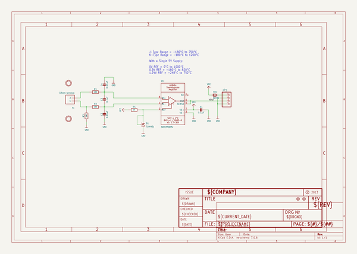
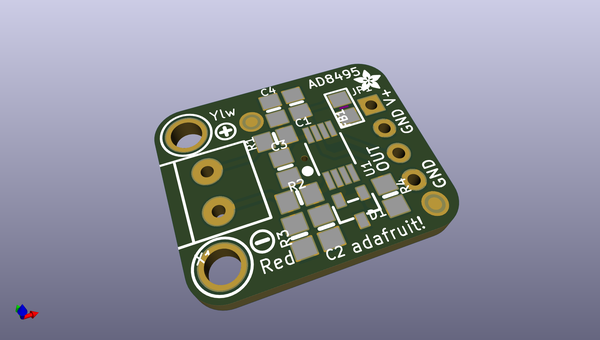
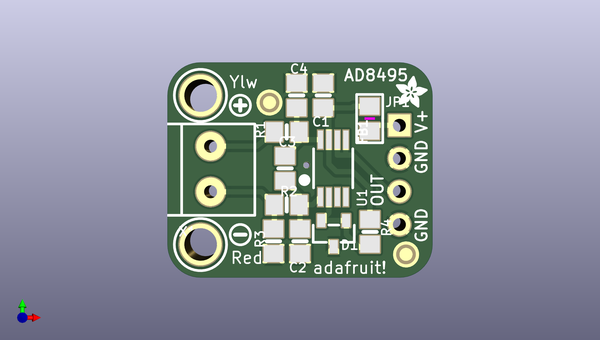
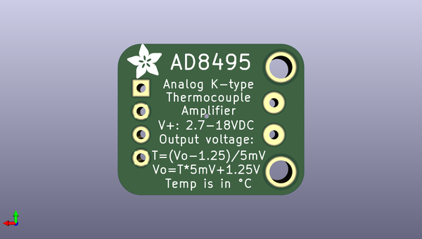

# adafruit_ad8495_breakout_pcb
 
## summary 
* id: adafruit_adafruit_ad8495_breakout_pcb_adafruit_ad849x_thermo
* user: adafruit
* name: adafruit_ad8495_breakout_pcb
* board: adafruit_ad849x_thermo
* repo: https://github.com/adafruit/Adafruit-AD8495-Breakout-PCB

* src_file_repo_sch: 
* src_file_repo_sch_link: https://github.com/adafruit/Adafruit-AD8495-Breakout-PCB/tree/master/

## schematic  
  
[schematic (pdf)](working_schematic.pdf)  

## pcb  
 
  
  
  
[board (pdf)](working.pdf)  

## working_bom
| Id | Designator | Footprint | Quantity | Designation | Supplier and ref |  | None | 
| --- | --- | --- | --- | --- | --- | --- | --- | 
| 1 | R4 | 0805-NO | 1 | 1K |  |  | [''] | 
| 2 | D1 | SOT23-R | 1 | TLVH431 |  |  | [''] | 
| 3 | U$12,U$11 | MOUNTINGHOLE_2.5_PLATED | 2 | MOUNTINGHOLE2.5 |  |  | [''] | 
| 4 | U$9 | SYMBOL_MINUS | 1 |  |  |  | [''] | 
| 5 | FB1 | 0805 | 1 | ferrite |  |  | [''] | 
| 6 | X1 | TERMBLOCK_1X2-3.5MM | 1 | 3.5mm terminal |  |  | [''] | 
| 7 | R3 | 0805-NO | 1 | 1M |  |  | [''] | 
| 8 | U1 | MSOP8_0.65MM | 1 | AD8495ARMZ  |  |  | [''] | 
| 9 | U$10 | ADAFRUIT_2.5MM | 1 |  |  |  | [''] | 
| 10 | R1,R2 | 0805-NO | 2 | 100 |  |  | [''] | 
| 11 | C1 | 0805-NO | 1 | 0.1µF |  |  | [''] | 
| 12 | C4,C2 | 0805-NO | 2 | 0.01uF |  |  | [''] | 
| 13 | FID2,FID1 | FIDUCIAL_1MM | 2 | FIDUCIAL" |  |  | [''] | 
| 14 | C3 | 0805-NO | 1 | 0.1uF |  |  | [''] | 
| 15 | JP1 | 1X04_ROUND | 1 |  |  |  | [''] | 
| 16 | U$8 | SYMBOL_PLUS | 1 |  |  |  | [''] | 
| 17 | U$13 | ADAFRUIT_3.5MM | 1 |  |  |  | [''] | 

## bom_schematic
| Ref | Qnty | Value | Cmp name | Footprint | Description | Vendor | DNP | 
| --- | --- | --- | --- | --- | --- | --- | --- | 
| C1 | 1 | 0.1µF | CAP_CERAMIC0805-NOOUTLINE | working:0805-NO |  |  |  | 
| C2, C4 | 2 | 0.01uF | CAP_CERAMIC0805-NOOUTLINE | working:0805-NO |  |  |  | 
| C3 | 1 | 0.1uF | CAP_CERAMIC0805-NOOUTLINE | working:0805-NO |  |  |  | 
| D1 | 1 | TLVH431 | SHUNT-VREF | working:SOT23-R |  |  |  | 
| FB1 | 1 | ferrite | FERRITE0805 | working:0805 |  |  |  | 
| FID1, FID2 | 2 | FIDUCIAL"" | FIDUCIAL{dblquote}{dblquote} | working:FIDUCIAL_1MM |  |  |  | 
| JP1 | 1 | HEADER-1X4ROUND | HEADER-1X4ROUND | working:1X04_ROUND |  |  |  | 
| R1, R2 | 2 | 100 | RESISTOR0805_NOOUTLINE | working:0805-NO |  |  |  | 
| R3 | 1 | 1M | RESISTOR0805_NOOUTLINE | working:0805-NO |  |  |  | 
| R4 | 1 | 1K | RESISTOR0805_NOOUTLINE | working:0805-NO |  |  |  | 
| U1 | 1 | AD8495ARMZ  | AD849X | working:MSOP8_0.65MM |  |  |  | 
| U$11, U$12 | 2 | MOUNTINGHOLE2.5 | MOUNTINGHOLE2.5 | working:MOUNTINGHOLE_2.5_PLATED |  |  |  | 
| X1 | 1 | 3.5mm terminal | TERMBLOCK_1X2 | working:TERMBLOCK_1X2-3.5MM |  |  |  | 

## mounting_holes
| x | y | package | value | ref | size | 
| --- | --- | --- | --- | --- | --- | 
| 0.0 | 11.429999999999993 | MOUNTINGHOLE_2.5_PLATED | MOUNTINGHOLE2.5 | U$11 | m3 | 
| 0.0 | 0.0 | MOUNTINGHOLE_2.5_PLATED | MOUNTINGHOLE2.5 | U$12 | m3 | 

