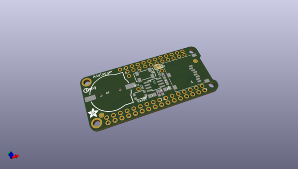

# adafruit_adalogger_featherwing_pcb
 
## summary 
* id: adafruit_adafruit_adalogger_featherwing_pcb_adalogger_featherwing
* user: adafruit
* name: adafruit_adalogger_featherwing_pcb
* board: adalogger_featherwing
* repo: https://github.com/adafruit/Adafruit-Adalogger-FeatherWing-PCB

* src_file_repo_sch: 
* src_file_repo_sch_link: https://github.com/adafruit/Adafruit-Adalogger-FeatherWing-PCB/tree/master/

## schematic  
  
[schematic (pdf)](working_schematic.pdf)  

## pcb  
 
  
  
  
[board (pdf)](working.pdf)  

## working_bom
| Id | Designator | Footprint | Quantity | Designation | Supplier and ref |  | None | 
| --- | --- | --- | --- | --- | --- | --- | --- | 
| 1 | U$5 | PCBFEAT-REV-040 | 1 |  |  |  | [''] | 
| 2 | MS1 | FEATHERWING_NODIM | 1 | FEATHERWING_NODIM |  |  | [''] | 
| 3 | IC1 | SOIC8_150MIL | 1 | PCF8523T |  |  | [''] | 
| 4 | B1 | CR1220-2 | 1 | cr1220 |  |  | [''] | 
| 5 | R3 | 0603-NO | 1 | 100K |  |  | [''] | 
| 6 | JP1 | 1X11_ROUND | 1 |  |  |  | [''] | 
| 7 | R2,R1 | 0603-NO | 2 | 10K |  |  | [''] | 
| 8 | R4 | 0603-NO | 1 | 1K |  |  | [''] | 
| 9 | JP2 | 1X16_ROUND | 1 |  |  |  | [''] | 
| 10 | FID2,FID1 | FIDUCIAL_1MM | 2 | FIDUCIAL_1MM |  |  | [''] | 
| 11 | Y1 | CRYSTAL_8X3.8 | 1 | 32khz |  |  | [''] | 
| 12 | X4 | MICROSD | 1 | microsd |  |  | [''] | 
| 13 | SJ1 | SOLDERJUMPER_CLOSEDWIRE | 1 |  |  |  | [''] | 
| 14 | JP3,INT1,SDCS0 | 1X01_ROUND | 3 |  |  |  | [''] | 
| 15 | U$4 | ADAFRUIT_3.5MM | 1 |  |  |  | [''] | 
| 16 | SW1 | BTN_KMR2_4.6X2.8 | 1 | KMR2 |  |  | [''] | 
| 17 | C2,C1 | 0805-NO | 2 | 10uF |  |  | [''] | 
| 18 | U$3 | ADALOGGER_LOGO | 1 |  |  |  | [''] | 
| 19 | U$2 | FEATHERLOGO | 1 |  |  |  | [''] | 

## bom_schematic
| Ref | Qnty | Value | Cmp name | Footprint | Description | Vendor | DNP | 
| --- | --- | --- | --- | --- | --- | --- | --- | 
| B1 | 1 | cr1220 | BATTERYCR1220_2 | working:CR1220-2 |  |  |  | 
| C1, C2 | 2 | 10uF | CAP_CERAMIC0805-NOOUTLINE | working:0805-NO |  |  |  | 
| FID1, FID2 | 2 | FIDUCIAL_1MM | FIDUCIAL_1MM | working:FIDUCIAL_1MM |  |  |  | 
| IC1 | 1 | RTC_PCF8523T | RTC_PCF8523T | working:SOIC8_150MIL |  |  |  | 
| INT1 | 1 | HEADER-1X1ROUND | HEADER-1X1ROUND | working:1X01_ROUND |  |  |  | 
| JP1 | 1 | HEADER-1X11 | HEADER-1X11 | working:1X11_ROUND |  |  |  | 
| JP2 | 1 | HEADER-1X16ROUND | HEADER-1X16ROUND | working:1X16_ROUND |  |  |  | 
| JP3 | 1 | HEADER-1X1ROUND | HEADER-1X1ROUND | working:1X01_ROUND |  |  |  | 
| MS1 | 1 | FEATHERWING_NODIM | FEATHERWING_NODIM | working:FEATHERWING_NODIM |  |  |  | 
| R1, R2 | 2 | 10K | RESISTOR_0603_NOOUT | working:0603-NO |  |  |  | 
| R3 | 1 | 100K | RESISTOR_0603_NOOUT | working:0603-NO |  |  |  | 
| R4 | 1 | 1K | RESISTOR_0603_NOOUT | working:0603-NO |  |  |  | 
| SDCS0 | 1 | HEADER-1X1ROUND | HEADER-1X1ROUND | working:1X01_ROUND |  |  |  | 
| SJ1 | 1 | SOLDERJUMPER_CLOSED | SOLDERJUMPER_CLOSED | working:SOLDERJUMPER_CLOSEDWIRE |  |  |  | 
| SW1 | 1 | KMR2 | SWITCH_TACT_SMT4.6X2.8 | working:BTN_KMR2_4.6X2.8 |  |  |  | 
| X4 | 1 | microsd | MICROSD | working:MICROSD |  |  |  | 
| Y1 | 1 | 32khz | CRYSTAL8.0X3.8 | working:CRYSTAL_8X3.8 |  |  |  | 

