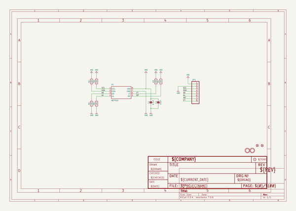
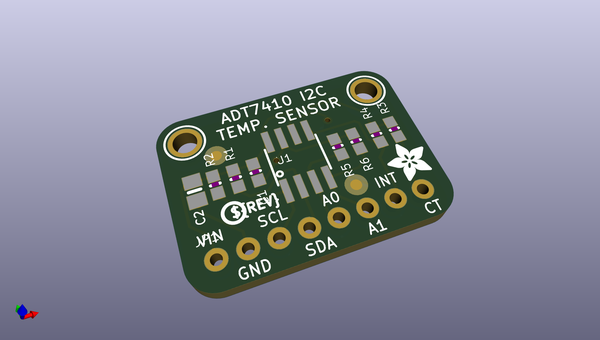
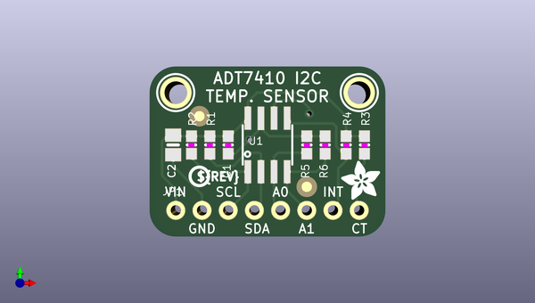
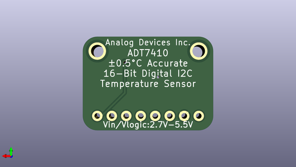

# adafruit_adt7410_pcb
 
## summary 
* id: adafruit_adafruit_adt7410_pcb_adafruit_adt7410_stemma_qt
* user: adafruit
* name: adafruit_adt7410_pcb
* board: adafruit_adt7410_stemma_qt
* repo: https://github.com/adafruit/Adafruit-ADT7410-PCB

* src_file_repo_sch: 
* src_file_repo_sch_link: https://github.com/adafruit/Adafruit-ADT7410-PCB/tree/master/

## schematic  
  
[schematic (pdf)](working_schematic.pdf)  

## pcb  
 
  
  
  
[board (pdf)](working.pdf)  

## working_bom
| Id | Designator | Footprint | Quantity | Designation | Supplier and ref |  | None | 
| --- | --- | --- | --- | --- | --- | --- | --- | 
| 1 | C1 | 0603-NO | 1 | 0.1uF |  |  | [''] | 
| 2 | U$16 | ADAFRUIT_3.5MM | 1 |  |  |  | [''] | 
| 3 | R5,R4,R1,R3,R6,R2 | 0603-NO | 6 | 10K |  |  | [''] | 
| 4 | U$4,U$3 | MOUNTINGHOLE_2.0_PLATED | 2 | MOUNTINGHOLE2.0 |  |  | [''] | 
| 5 | JP1 | 1X08_ROUND_70 | 1 |  |  |  | [''] | 
| 6 | C2 | 0805-NO | 1 | 10uF |  |  | [''] | 
| 7 | U1 | SOIC8_150MIL | 1 | ADT7410 |  |  | [''] | 
| 8 | U$1 | PCBFEAT-REV-040 | 1 |  |  |  | [''] | 
| 9 | FID1,FID2 | FIDUCIAL_1MM | 2 | FIDUCIAL_1MM |  |  | [''] | 

## bom_schematic
| Ref | Qnty | Value | Cmp name | Footprint | Description | Vendor | DNP | 
| --- | --- | --- | --- | --- | --- | --- | --- | 
| C1 | 1 | 0.1uF | CAP_CERAMIC0603_NO | working:0603-NO |  |  |  | 
| C2 | 1 | 10uF | CAP_CERAMIC0805-NOOUTLINE | working:0805-NO |  |  |  | 
| FID1, FID2 | 2 | FIDUCIAL_1MM | FIDUCIAL_1MM | working:FIDUCIAL_1MM |  |  |  | 
| JP1 | 1 | HEADER-1X870MIL | HEADER-1X870MIL | working:1X08_ROUND_70 |  |  |  | 
| R1, R2, R3, R4, R5, R6 | 6 | 10K | RESISTOR_0603_NOOUT | working:0603-NO |  |  |  | 
| U1 | 1 | ADT7410 | TEMP_ADT7410 | working:SOIC8_150MIL |  |  |  | 
| U$3, U$4 | 2 | MOUNTINGHOLE2.0 | MOUNTINGHOLE2.0 | working:MOUNTINGHOLE_2.0_PLATED |  |  |  | 

## mounting_holes
| x | y | package | value | ref | size | 
| --- | --- | --- | --- | --- | --- | 
| 0.0 | 0.0 | MOUNTINGHOLE_2.0_PLATED | MOUNTINGHOLE2.0 | U$3 | m3 | 
| 17.78 | 0.0 | MOUNTINGHOLE_2.0_PLATED | MOUNTINGHOLE2.0 | U$4 | m3 | 

