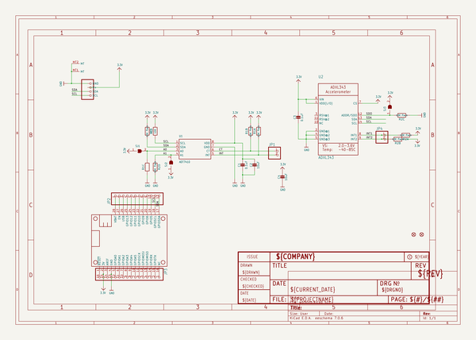
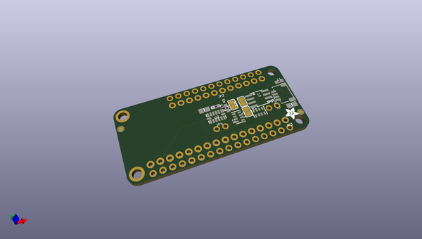
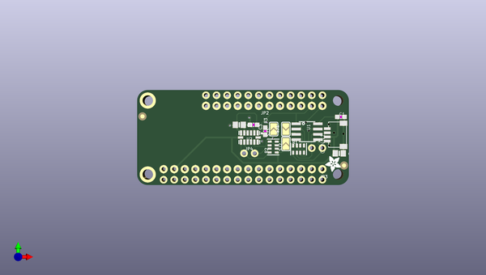
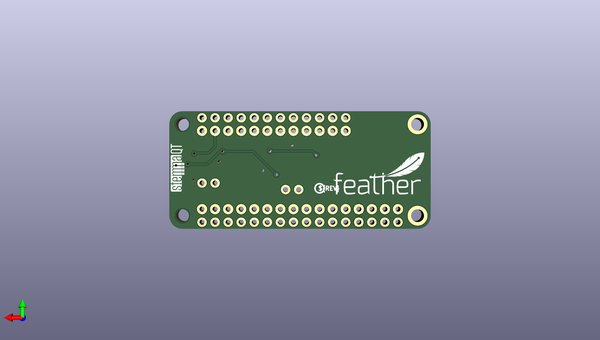

# adafruit_adxl343_adt7410_sensor_featherwing_pcb
 
## summary 
* id: adafruit_adafruit_adxl343_adt7410_sensor_featherwing_pcb_adafruit_adxl343_adt7410_featherwing
* user: adafruit
* name: adafruit_adxl343_adt7410_sensor_featherwing_pcb
* board: adafruit_adxl343_adt7410_featherwing
* repo: https://github.com/adafruit/Adafruit-ADXL343-ADT7410-Sensor-FeatherWing-PCB

* src_file_repo_sch: 
* src_file_repo_sch_link: https://github.com/adafruit/Adafruit-ADXL343-ADT7410-Sensor-FeatherWing-PCB/tree/main/

## schematic  
  
[schematic (pdf)](working_schematic.pdf)  

## pcb  
 
  
  
  
[board (pdf)](working.pdf)  

## working_bom
| Id | Designator | Footprint | Quantity | Designation | Supplier and ref |  | None | 
| --- | --- | --- | --- | --- | --- | --- | --- | 
| 1 | SJ3,SJ1,SJ2 | SOLDERJUMPER_ARROW_NOPASTE | 3 |  |  |  | [''] | 
| 2 | R2,R1 | RESPACK_4X0603 | 2 | 10K Pack |  |  | [''] | 
| 3 | JP4,JP1 | 1X02_ROUND | 2 |  |  |  | [''] | 
| 4 | U1 | SOIC8_150MIL | 1 | ADT7410 |  |  | [''] | 
| 5 | C4,C2 | 0805-NO | 2 | 10uF |  |  | [''] | 
| 6 | C3,C1 | 0603-NO | 2 | 0.1uF |  |  | [''] | 
| 7 | CONN1 | JST_SH4 | 1 | STEMMA_I2C_QT |  |  | [''] | 
| 8 | JP2 | 1X12_ROUND_76MIL | 1 |  |  |  | [''] | 
| 9 | JP3 | 1X16_ROUND_76MIL | 1 |  |  |  | [''] | 
| 10 | U$28 | ADAFRUIT_3.5MM | 1 |  |  |  | [''] | 
| 11 | FID1,FID2 | FIDUCIAL_1MM | 2 | FIDUCIAL_1MM |  |  | [''] | 
| 12 | MS1 | FEATHERWING_NODIM | 1 | FEATHERWING_NODIM |  |  | [''] | 
| 13 | U$24 | ADIWING_TOP | 1 |  |  |  | [''] | 
| 14 | U2 | LGA14 | 1 | ADXL343 |  |  | [''] | 
| 15 | R3 | 0603-NO | 1 | 10K |  |  | [''] | 
| 16 | U$29 | STEMMAQT | 1 |  |  |  | [''] | 
| 17 | U$1 | PCBFEAT-REV-040 | 1 |  |  |  | [''] | 
| 18 | U$23 | FEATHERLOGO_MED | 1 |  |  |  | [''] | 

## bom_schematic
| Ref | Qnty | Value | Cmp name | Footprint | Description | Vendor | DNP | 
| --- | --- | --- | --- | --- | --- | --- | --- | 
| C1, C3 | 2 | 0.1uF | CAP_CERAMIC0603_NO | working:0603-NO |  |  |  | 
| C2, C4 | 2 | 10uF | CAP_CERAMIC0805-NOOUTLINE | working:0805-NO |  |  |  | 
| CONN1 | 1 | STEMMA_I2C_QT | STEMMA_I2C_QT | working:JST_SH4 |  |  |  | 
| FID1, FID2 | 2 | FIDUCIAL_1MM | FIDUCIAL_1MM | working:FIDUCIAL_1MM |  |  |  | 
| JP1, JP4 | 2 | HEADER-1X2ROUND | HEADER-1X2ROUND | working:1X02_ROUND |  |  |  | 
| JP2 | 1 | HEADER-1X1276MIL | HEADER-1X1276MIL | working:1X12_ROUND_76MIL |  |  |  | 
| JP3 | 1 | HEADER-1X16_76MIL | HEADER-1X16_76MIL | working:1X16_ROUND_76MIL |  |  |  | 
| MS1 | 1 | FEATHERWING_NODIM | FEATHERWING_NODIM | working:FEATHERWING_NODIM |  |  |  | 
| R1, R2 | 2 | 10K Pack | RESISTOR_4PACK | working:RESPACK_4X0603 |  |  |  | 
| R3 | 1 | 10K | RESISTOR_0603_NOOUT | working:0603-NO |  |  |  | 
| SJ1, SJ2, SJ3 | 3 | SOLDERJUMPER | SOLDERJUMPER | working:SOLDERJUMPER_ARROW_NOPASTE |  |  |  | 
| U1 | 1 | ADT7410 | TEMP_ADT7410 | working:SOIC8_150MIL |  |  |  | 
| U2 | 1 | ADXL343 | ACCEL_ADXL343 | working:LGA14 |  |  |  | 

