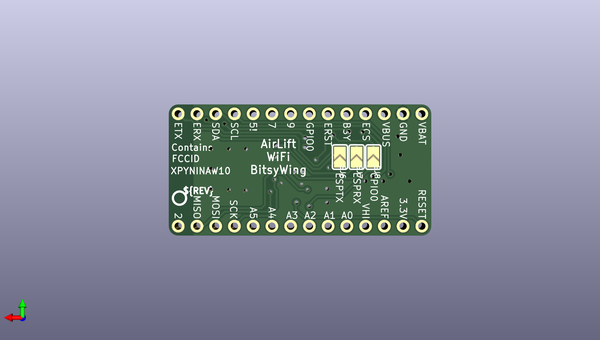

# adafruit_airlift_bitsy_add_on_pcb
 
## summary 
* id: adafruit_adafruit_airlift_bitsy_add_on_pcb_adafruit_airlift_bitsy_add_on
* user: adafruit
* name: adafruit_airlift_bitsy_add_on_pcb
* board: adafruit_airlift_bitsy_add_on
* repo: https://github.com/adafruit/Adafruit-Airlift-Bitsy-Add-On-PCB

* src_file_repo_sch: 
* src_file_repo_sch_link: https://github.com/adafruit/Adafruit-Airlift-Bitsy-Add-On-PCB/tree/master/

## schematic  
  
[schematic (pdf)](working_schematic.pdf)  

## pcb  
 
  
  
  
[board (pdf)](working.pdf)  

## working_bom
| Id | Designator | Footprint | Quantity | Designation | Supplier and ref |  | None | 
| --- | --- | --- | --- | --- | --- | --- | --- | 
| 1 | IC3 | SOT23-5L | 1 | 74AHC1G125 |  |  | [''] | 
| 2 | D7 | RGBLED_3535_PLCC6 | 1 |  |  |  | [''] | 
| 3 | U$62 | ADAFRUIT_3.5MM | 1 |  |  |  | [''] | 
| 4 | R2 | RESPACK_4X0603_NO | 1 | 10K |  |  | [''] | 
| 5 | C1,C5,C4,C3,C2 | 0805-NO | 5 | 10uF |  |  | [''] | 
| 6 | U5 | ARDUINO-UCS&SOCS_NINA-W1X | 1 | NINA-W102 |  |  | [''] | 
| 7 | U$34,U$35 | FIDUCIAL_1MM | 2 | FIDUCIAL_1MM |  |  | [''] | 
| 8 | JP2,JP4 | 1X14_ROUND70 | 2 |  |  |  | [''] | 
| 9 | C6 | 0603-NO | 1 | 0.1uF |  |  | [''] | 
| 10 | R1 | RESPACK_4X0603_NO | 1 | 1K |  |  | [''] | 
| 11 | IC4 | SOIC8_150MIL | 1 | ATECCX08 |  |  | [''] | 
| 12 | SW2 | BTN_KMR2_4.6X2.8 | 1 | KMR2 |  |  | [''] | 
| 13 | SJ6,SJ8,SJ7 | SOLDERJUMPER_ARROW_NOPASTE | 3 |  |  |  | [''] | 
| 14 | U$6 | PCBFEAT-REV-040 | 1 |  |  |  | [''] | 

## bom_schematic
| Ref | Qnty | Value | Cmp name | Footprint | Description | Vendor | DNP | 
| --- | --- | --- | --- | --- | --- | --- | --- | 
| C1, C2, C3, C4, C5 | 5 | 10uF | CAP_CERAMIC0805-NOOUTLINE | working:0805-NO |  |  |  | 
| C6 | 1 | 0.1uF | CAP_CERAMIC0603_NO | working:0603-NO |  |  |  | 
| D7 | 1 | LED_RGB_PLCC63535 | LED_RGB_PLCC63535 | working:RGBLED_3535_PLCC6 |  |  |  | 
| IC3 | 1 | 74AHC1G125 | 74AHC1G125 | working:SOT23-5L |  |  |  | 
| IC4 | 1 | ATECCX08 | ATECCX08 | working:SOIC8_150MIL |  |  |  | 
| JP2, JP4 | 2 | HEADER-1X14 | HEADER-1X14 | working:1X14_ROUND70 |  |  |  | 
| R1 | 1 | 1K | RESISTOR_4PACK_NO | working:RESPACK_4X0603_NO |  |  |  | 
| R2 | 1 | 10K | RESISTOR_4PACK_NO | working:RESPACK_4X0603_NO |  |  |  | 
| SJ6, SJ7, SJ8 | 3 | SOLDERJUMPER | SOLDERJUMPER | working:SOLDERJUMPER_ARROW_NOPASTE |  |  |  | 
| SW2 | 1 | KMR2 | SWITCH_TACT_SMT4.6X2.8 | working:BTN_KMR2_4.6X2.8 |  |  |  | 
| U5 | 1 | NINA-W10XNINA-W10X | NINA-W10XNINA-W10X | working:ARDUINO-UCS&SOCS_NINA-W1X |  |  |  | 
| U$34, U$35 | 2 | FIDUCIAL_1MM | FIDUCIAL_1MM | working:FIDUCIAL_1MM |  |  |  | 

