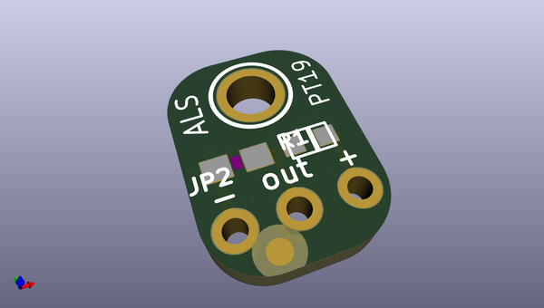

# adafruit_als_pt19_sensor_breakout_pcb
 
## summary 
* id: adafruit_adafruit_als_pt19_sensor_breakout_pcb_adafruit_als_pt19_315c_breakout
* user: adafruit
* name: adafruit_als_pt19_sensor_breakout_pcb
* board: adafruit_als_pt19_315c_breakout
* repo: https://github.com/adafruit/Adafruit-ALS-PT19-Sensor-Breakout-PCB

* src_file_repo_sch: 
* src_file_repo_sch_link: https://github.com/adafruit/Adafruit-ALS-PT19-Sensor-Breakout-PCB/tree/master/

## schematic  
  
[schematic (pdf)](working_schematic.pdf)  

## pcb  
 
  
  
  
[board (pdf)](working.pdf)  

## working_bom
| Id | Designator | Footprint | Quantity | Designation | Supplier and ref |  | None | 
| --- | --- | --- | --- | --- | --- | --- | --- | 
| 1 | U1 | ALS-PT19-315C | 1 | ALS-PT19-315C |  |  | [''] | 
| 2 | JP2 | 1X03_ROUND | 1 |  |  |  | [''] | 
| 3 | U$2 | MOUNTINGHOLE_2.0_PLATED | 1 | MOUNTINGHOLE2.0 |  |  | [''] | 
| 4 | R1 | 0603-NO | 1 | 10K |  |  | [''] | 
| 5 | FID1 | FIDUCIAL_1MM | 1 | FIDUCIAL" |  |  | [''] | 
| 6 | U$3 | PCBFEAT-REV-040 | 1 |  |  |  | [''] | 
| 7 | U$1 | ADAFRUIT_2.5MM | 1 |  |  |  | [''] | 

## bom_schematic
| Ref | Qnty | Value | Cmp name | Footprint | Description | Vendor | DNP | 
| --- | --- | --- | --- | --- | --- | --- | --- | 
| FID1 | 1 | FIDUCIAL"" | FIDUCIAL{dblquote}{dblquote} | working:FIDUCIAL_1MM |  |  |  | 
| JP2 | 1 | HEADER-1X3ROUND | HEADER-1X3ROUND | working:1X03_ROUND |  |  |  | 
| R1 | 1 | 10K | RESISTOR_0603_NOOUT | working:0603-NO |  |  |  | 
| U1 | 1 | ALS-PT19-315C | LIGHT_ALS-PT19-315C | working:ALS-PT19-315C |  |  |  | 
| U$2 | 1 | MOUNTINGHOLE2.0 | MOUNTINGHOLE2.0 | working:MOUNTINGHOLE_2.0_PLATED |  |  |  | 

## mounting_holes
| x | y | package | value | ref | size | 
| --- | --- | --- | --- | --- | --- | 
| 0.0 | 0.0 | MOUNTINGHOLE_2.0_PLATED | MOUNTINGHOLE2.0 | U$2 | m3 | 

