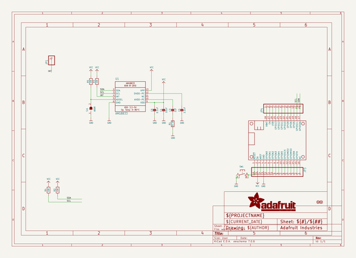
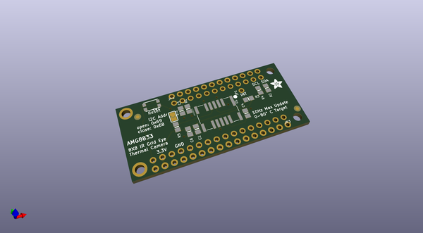
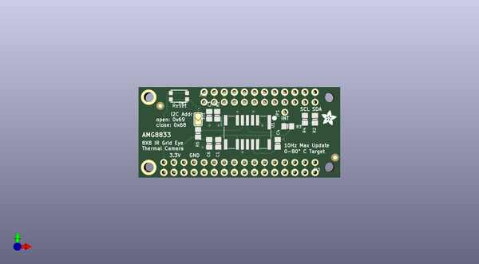
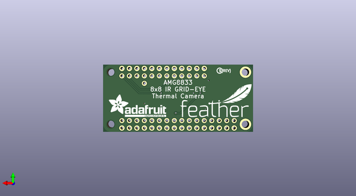

# adafruit_amg8833_breakout_pcb
 
## summary 
* id: adafruit_adafruit_amg8833_breakout_pcb_adafruit_amg8833_featherwing
* user: adafruit
* name: adafruit_amg8833_breakout_pcb
* board: adafruit_amg8833_featherwing
* repo: https://github.com/adafruit/Adafruit-AMG8833-Breakout-PCB

* src_file_repo_sch: 
* src_file_repo_sch_link: https://github.com/adafruit/Adafruit-AMG8833-Breakout-PCB/tree/master/

## schematic  
  
[schematic (pdf)](working_schematic.pdf)  

## pcb  
 
  
  
  
[board (pdf)](working.pdf)  

## working_bom
| Id | Designator | Footprint | Quantity | Designation | Supplier and ref |  | None | 
| --- | --- | --- | --- | --- | --- | --- | --- | 
| 1 | MS1 | FEATHERWING | 1 | FEATHERWING |  |  | [''] | 
| 2 | C3 | 0805-NO | 1 | 1uF |  |  | [''] | 
| 3 | R5,R3,R4,R2 | 0805-NO | 4 | 10K |  |  | [''] | 
| 4 | JP3 | 1X16_ROUND | 1 |  |  |  | [''] | 
| 5 | JP4 | 1X12_ROUND | 1 |  |  |  | [''] | 
| 6 | U$14 | ADAFRUIT_3.5MM | 1 |  |  |  | [''] | 
| 7 | SJ1 | SOLDERJUMPER_ARROW_NOPASTE | 1 | ADDR |  |  | [''] | 
| 8 | FID1,FID2 | FIDUCIAL_1MM | 2 | FIDUCIAL" |  |  | [''] | 
| 9 | C4 | 0805-NO | 1 | 2.2uF |  |  | [''] | 
| 10 | C1 | 0805-NO | 1 | 10uF |  |  | [''] | 
| 11 | R1 | 0805-NO | 1 | 22 1% |  |  | [''] | 
| 12 | JP1 | 1X01_ROUND | 1 |  |  |  | [''] | 
| 13 | C6 | 0805-NO | 1 | 0.1uF |  |  | [''] | 
| 14 | SW1 | BTN_KMR2_4.6X2.8 | 1 |  |  |  | [''] | 
| 15 | U1 | AMG8833 | 1 | AMG8833 |  |  | [''] | 
| 16 | U$15 | FEATHERLOGO | 1 |  |  |  | [''] | 
| 17 | U$16 | PCBFEAT-REV-040 | 1 |  |  |  | [''] | 
| 18 | U$2 | ADAFRUIT_TEXT_20MM | 1 |  |  |  | [''] | 

## bom_schematic
| Ref | Qnty | Value | Cmp name | Footprint | Description | Vendor | DNP | 
| --- | --- | --- | --- | --- | --- | --- | --- | 
| C1 | 1 | 10uF | CAP_CERAMIC0805-NOOUTLINE | working:0805-NO |  |  |  | 
| C3 | 1 | 1uF | CAP_CERAMIC0805-NOOUTLINE | working:0805-NO |  |  |  | 
| C4 | 1 | 2.2uF | CAP_CERAMIC0805-NOOUTLINE | working:0805-NO |  |  |  | 
| C6 | 1 | 0.1uF | CAP_CERAMIC0805-NOOUTLINE | working:0805-NO |  |  |  | 
| FID1, FID2 | 2 | FIDUCIAL"" | FIDUCIAL{dblquote}{dblquote} | working:FIDUCIAL_1MM |  |  |  | 
| JP1 | 1 | HEADER-1X1ROUND | HEADER-1X1ROUND | working:1X01_ROUND |  |  |  | 
| JP3 | 1 | HEADER-1X16ROUND | HEADER-1X16ROUND | working:1X16_ROUND |  |  |  | 
| JP4 | 1 | HEADER-1X12 | HEADER-1X12 | working:1X12_ROUND |  |  |  | 
| MS1 | 1 | FEATHERWING | FEATHERWING | working:FEATHERWING |  |  |  | 
| R1 | 1 | 22 1% | RESISTOR0805_NOOUTLINE | working:0805-NO |  |  |  | 
| R2, R3, R4, R5 | 4 | 10K | RESISTOR0805_NOOUTLINE | working:0805-NO |  |  |  | 
| SJ1 | 1 | ADDR | SOLDERJUMPER | working:SOLDERJUMPER_ARROW_NOPASTE |  |  |  | 
| SW1 | 1 | SWITCH_TACT_SMT4.6X2.8 | SWITCH_TACT_SMT4.6X2.8 | working:BTN_KMR2_4.6X2.8 |  |  |  | 
| U1 | 1 | AMG8833 | AMG8833 | working:AMG8833 |  |  |  | 

