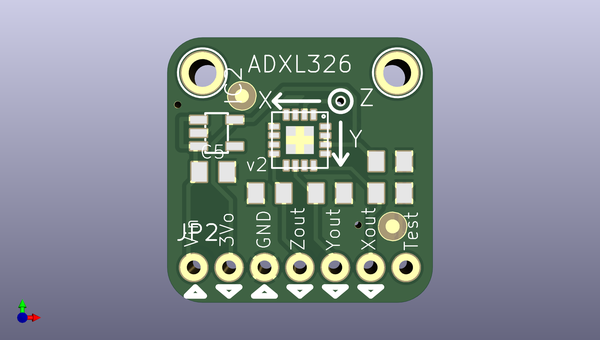
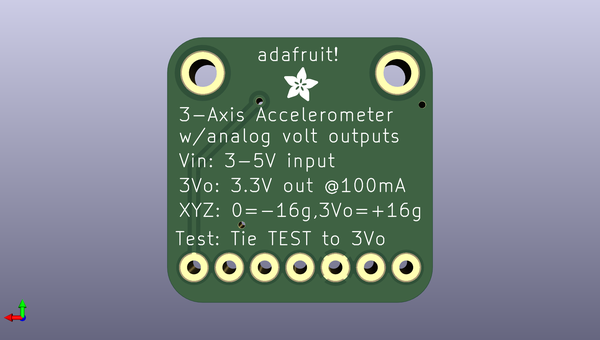

# adafruit_analog_accelerometers_pcbs
 
## summary 
* id: adafruit_adafruit_analog_accelerometers_pcbs_adafruit_adxl377
* user: adafruit
* name: adafruit_analog_accelerometers_pcbs
* board: adafruit_adxl377
* repo: https://github.com/adafruit/Adafruit-Analog-Accelerometers-PCBs

* src_file_repo_sch: 
* src_file_repo_sch_link: https://github.com/adafruit/Adafruit-Analog-Accelerometers-PCBs/tree/master/

## schematic  
  
[schematic (pdf)](working_schematic.pdf)  

## pcb  
 
  
  
  
[board (pdf)](working.pdf)  

## working_bom
| Id | Designator | Footprint | Quantity | Designation | Supplier and ref |  | None | 
| --- | --- | --- | --- | --- | --- | --- | --- | 
| 1 | C2,C3,C4 | C0805K | 3 | 0.1uF |  |  | [''] | 
| 2 | C5,C1 | C0805K | 2 | 10uF |  |  | [''] | 
| 3 | JP2 | 1X07_ROUND_76 | 1 |  |  |  | [''] | 
| 4 | U$5,U$8 | MOUNTINGHOLE_2.0_PLATED | 2 | MOUNTINGHOLE2.0 |  |  | [''] | 
| 5 | IC1 | 16LCSP | 1 | ADXL33X |  |  | [''] | 
| 6 | U$1,U$2 | FIDUCIAL_1MM | 2 | FIDUCIAL |  |  | [''] | 
| 7 | IC2 | SOT23-5L | 1 | LP298XS |  |  | [''] | 
| 8 | U$4 | ADAFRUIT_2.5MM | 1 |  |  |  | [''] | 

## bom_schematic
| Ref | Qnty | Value | Cmp name | Footprint | Description | Vendor | DNP | 
| --- | --- | --- | --- | --- | --- | --- | --- | 
| C1, C5 | 2 | 10uF | C-USC0805K | working:C0805K |  |  |  | 
| C2, C3, C4 | 3 | 0.1uF | C-USC0805K | working:C0805K |  |  |  | 
| IC1 | 1 | ADXL33X | ADXL33X | working:16LCSP |  |  |  | 
| IC2 | 1 | LP298XS | LP298XS | working:SOT23-5L |  |  |  | 
| JP2 | 1 | HEADER-1X7THICKER | HEADER-1X7THICKER | working:1X07_ROUND_76 |  |  |  | 
| U$1, U$2 | 2 | FIDUCIAL | FIDUCIAL | working:FIDUCIAL_1MM |  |  |  | 
| U$5, U$8 | 2 | MOUNTINGHOLE2.0 | MOUNTINGHOLE2.0 | working:MOUNTINGHOLE_2.0_PLATED |  |  |  | 

## mounting_holes
| x | y | package | value | ref | size | 
| --- | --- | --- | --- | --- | --- | 
| 13.969999999999999 | 0.0 | MOUNTINGHOLE_2.0_PLATED | MOUNTINGHOLE2.0 | U$5 | m3 | 
| 0.0 | 0.0 | MOUNTINGHOLE_2.0_PLATED | MOUNTINGHOLE2.0 | U$8 | m3 | 

