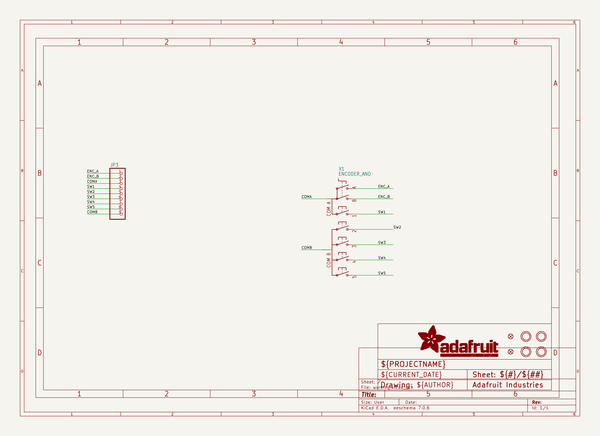
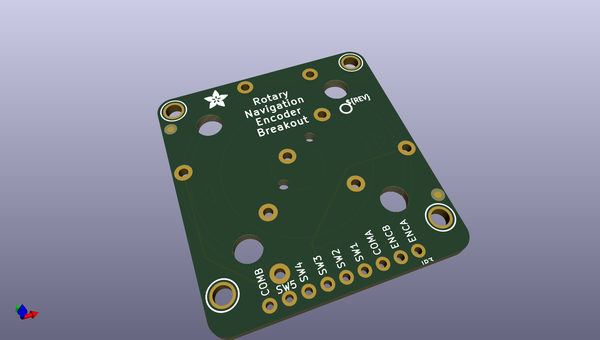
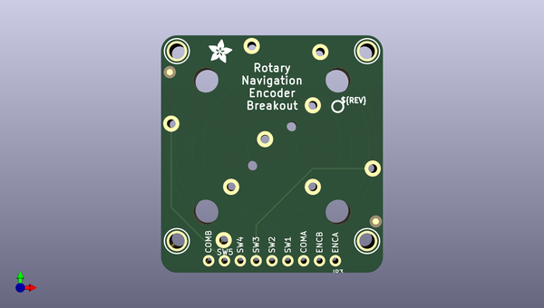
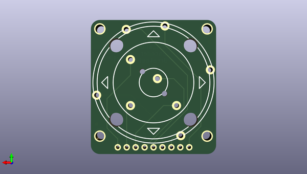

# adafruit_ano_rotary_navigation_encoder_breakout_pcb
 
## summary 
* id: adafruit_adafruit_ano_rotary_navigation_encoder_breakout_pcb_adafruit_ano_rotary_encoder_breakout
* user: adafruit
* name: adafruit_ano_rotary_navigation_encoder_breakout_pcb
* board: adafruit_ano_rotary_encoder_breakout
* repo: https://github.com/adafruit/Adafruit-ANO-Rotary-Navigation-Encoder-Breakout-PCB

* src_file_repo_sch: 
* src_file_repo_sch_link: https://github.com/adafruit/Adafruit-ANO-Rotary-Navigation-Encoder-Breakout-PCB/tree/main/

## schematic  
  
[schematic (pdf)](working_schematic.pdf)  

## pcb  
 
  
  
  
[board (pdf)](working.pdf)  

## working_bom
| Id | Designator | Footprint | Quantity | Designation | Supplier and ref |  | None | 
| --- | --- | --- | --- | --- | --- | --- | --- | 
| 1 | U$33 | PCBFEAT-REV-040 | 1 |  |  |  | [''] | 
| 2 | FID3,FID4 | FIDUCIAL_1MM | 2 | FIDUCIAL_1MM |  |  | [''] | 
| 3 | U$27,U$25,U$30,U$29 | MOUNTINGHOLE_2.5_PLATED | 4 | MOUNTINGHOLE2.5 |  |  | [''] | 
| 4 | JP3 | 1X09_ROUND_70 | 1 |  |  |  | [''] | 
| 5 | U$32 | ADAFRUIT_3.5MM | 1 |  |  |  | [''] | 
| 6 | X1 | ENCODER_ANO | 1 | ENCODER_ANO |  |  | [''] | 

## bom_schematic
| Ref | Qnty | Value | Cmp name | Footprint | Description | Vendor | DNP | 
| --- | --- | --- | --- | --- | --- | --- | --- | 
| FID3, FID4 | 2 | FIDUCIAL_1MM | FIDUCIAL_1MM | working:FIDUCIAL_1MM |  |  |  | 
| JP3 | 1 | HEADER-1X970MIL | HEADER-1X970MIL | working:1X09_ROUND_70 |  |  |  | 
| U$25, U$27, U$29, U$30 | 4 | MOUNTINGHOLE2.5 | MOUNTINGHOLE2.5 | working:MOUNTINGHOLE_2.5_PLATED |  |  |  | 
| X1 | 1 | ENCODER_ANO | ENCODER_ANO | working:ENCODER_ANO |  |  |  | 

## mounting_holes
| x | y | package | value | ref | size | 
| --- | --- | --- | --- | --- | --- | 
| 30.47999999999999 | 0.0 | MOUNTINGHOLE_2.5_PLATED | MOUNTINGHOLE2.5 | U$25 | m3 | 
| 0.0 | 0.0 | MOUNTINGHOLE_2.5_PLATED | MOUNTINGHOLE2.5 | U$27 | m3 | 
| 30.47999999999999 | 30.480000000000004 | MOUNTINGHOLE_2.5_PLATED | MOUNTINGHOLE2.5 | U$29 | m3 | 
| 0.0 | 30.480000000000004 | MOUNTINGHOLE_2.5_PLATED | MOUNTINGHOLE2.5 | U$30 | m3 | 

