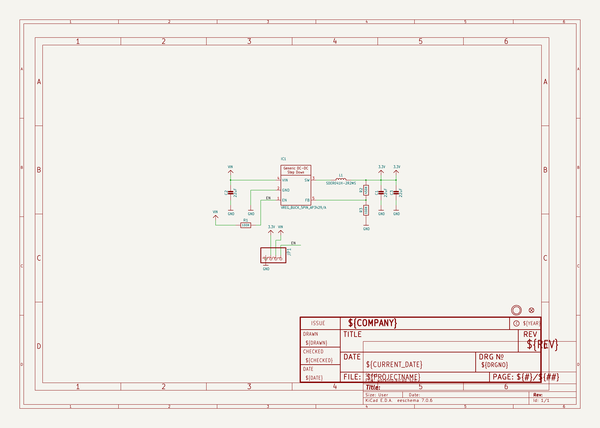

# adafruit_ap3429a_pcb
 
## summary 
* id: adafruit_adafruit_ap3429a_pcb_ap3429_3_3_buck_rev_a
* user: adafruit
* name: adafruit_ap3429a_pcb
* board: ap3429_3_3_buck_rev_a
* repo: https://github.com/adafruit/Adafruit-AP3429A-PCB

* src_file_repo_sch: 
* src_file_repo_sch_link: https://github.com/adafruit/Adafruit-AP3429A-PCB/tree/main/

## schematic  
  
[schematic (pdf)](working_schematic.pdf)  

## bom_schematic
| Ref | Qnty | Value | Cmp name | Footprint | Description | Vendor | DNP | 
| --- | --- | --- | --- | --- | --- | --- | --- | 
| C1, C2, C3 | 3 | 22uF | CAP_CERAMIC0805-NOOUTLINE | working:0805-NO |  |  |  | 
| FID1 | 1 | FIDUCIAL_1MM | FIDUCIAL_1MM | working:FIDUCIAL_1MM |  |  |  | 
| IC1 | 1 | VREG_BUCK_5PIN_AP3429/A | VREG_BUCK_5PIN_AP3429/A | working:SOT23-5 |  |  |  | 
| JP1 | 1 | HEADER-1X4ROUND | HEADER-1X4ROUND | working:1X04_ROUND |  |  |  | 
| L1 | 1 | SDER041H-2R2MS | INDUCTORNRH2412T | working:INDUCTOR_TAIYOYUDEN_NRH2412T |  |  |  | 
| R1, R3 | 2 | 100K | RESISTOR_0603_NOOUT | working:0603-NO |  |  |  | 
| R2 | 1 | 450K | RESISTOR_0603_NOOUT | working:0603-NO |  |  |  | 
| U$9 | 1 | MOUNTINGHOLE2.5 | MOUNTINGHOLE2.5 | working:MOUNTINGHOLE_2.5_PLATED |  |  |  | 

