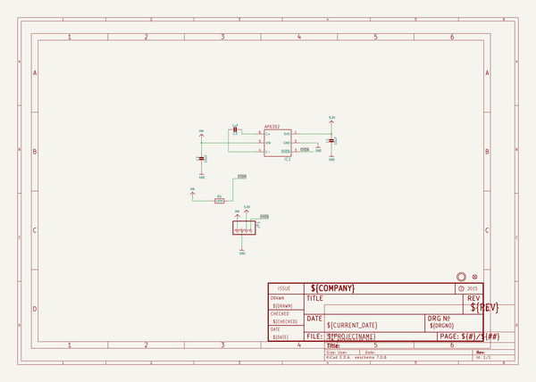
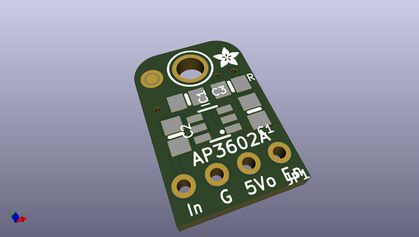
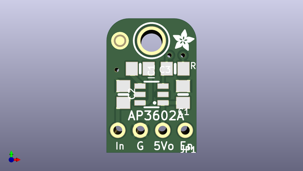
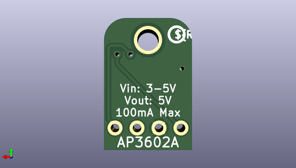

# adafruit_ap3602a_pcb
 
## summary 
* id: adafruit_adafruit_ap3602a_pcb_adafruit_ap6302
* user: adafruit
* name: adafruit_ap3602a_pcb
* board: adafruit_ap6302
* repo: https://github.com/adafruit/Adafruit-AP3602A-PCB

* src_file_repo_sch: 
* src_file_repo_sch_link: https://github.com/adafruit/Adafruit-AP3602A-PCB/tree/master/

## schematic  
  
[schematic (pdf)](working_schematic.pdf)  

## pcb  
 
  
  
  
[board (pdf)](working.pdf)  

## working_bom
| Id | Designator | Footprint | Quantity | Designation | Supplier and ref |  | None | 
| --- | --- | --- | --- | --- | --- | --- | --- | 
| 1 | C3 | 0805-NO | 1 | 1uF |  |  | [''] | 
| 2 | C2,C1 | 0805-NO | 2 | 10uF |  |  | [''] | 
| 3 | JP1 | 1X04_ROUND | 1 |  |  |  | [''] | 
| 4 | U$9 | MOUNTINGHOLE_2.5_PLATED | 1 | MOUNTINGHOLE2.5 |  |  | [''] | 
| 5 | FID1 | FIDUCIAL_1MM | 1 | FIDUCIAL" |  |  | [''] | 
| 6 | U$11 | ADAFRUIT_2.5MM | 1 |  |  |  | [''] | 
| 7 | IC1 | SOT23-6 | 1 | AP3602 |  |  | [''] | 
| 8 | R1 | 0805-NO | 1 | 100K |  |  | [''] | 
| 9 | U$10 | PCBFEAT-REV-040 | 1 |  |  |  | [''] | 

## bom_schematic
| Ref | Qnty | Value | Cmp name | Footprint | Description | Vendor | DNP | 
| --- | --- | --- | --- | --- | --- | --- | --- | 
| C1, C2 | 2 | 10uF | CAP_CERAMIC0805-NOOUTLINE | working:0805-NO |  |  |  | 
| C3 | 1 | 1uF | CAP_CERAMIC0805-NOOUTLINE | working:0805-NO |  |  |  | 
| FID1 | 1 | FIDUCIAL"" | FIDUCIAL{dblquote}{dblquote} | working:FIDUCIAL_1MM |  |  |  | 
| IC1 | 1 | AP3602 | AP3602 | working:SOT23-6 |  |  |  | 
| JP1 | 1 | HEADER-1X4ROUND | HEADER-1X4ROUND | working:1X04_ROUND |  |  |  | 
| R1 | 1 | 100K | RESISTOR0805_NOOUTLINE | working:0805-NO |  |  |  | 
| U$9 | 1 | MOUNTINGHOLE2.5 | MOUNTINGHOLE2.5 | working:MOUNTINGHOLE_2.5_PLATED |  |  |  | 

## mounting_holes
| x | y | package | value | ref | size | 
| --- | --- | --- | --- | --- | --- | 
| 0.0 | 0.0 | MOUNTINGHOLE_2.5_PLATED | MOUNTINGHOLE2.5 | U$9 | m3 | 

