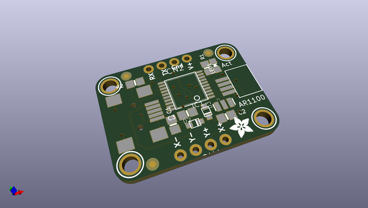
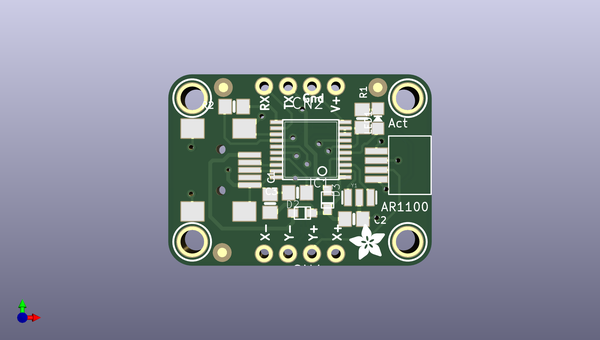

# adafruit_ar1100_resistive_touch_controller_pcb
 
## summary 
* id: adafruit_adafruit_ar1100_resistive_touch_controller_pcb_adafruit_ar1100
* user: adafruit
* name: adafruit_ar1100_resistive_touch_controller_pcb
* board: adafruit_ar1100
* repo: https://github.com/adafruit/Adafruit-AR1100-Resistive-Touch-Controller-PCB

* src_file_repo_sch: 
*
 src_file_repo_sch_link: https://github.com/adafruit/Adafruit-AR1100-Resistive-Touch-Controller-PCB/tree/master/
* full details link: https://github.com/oomlout/oomlout_oomp_project_bot_v_2/tree/main/projects/adafruit_adafruit_ar1100_resistive_touch_controller_pcb_adafruit_ar1100/current_version/working  

## schematic  
  
[schematic (pdf)](working_schematic.pdf)  

## pcb  
 
  
  
  
[board (pdf)](working.pdf)  

## working_bom
| Id | Designator | Footprint | Quantity | Designation | Supplier and ref |  | None | 
| --- | --- | --- | --- | --- | --- | --- | --- | 
| 1 | FID1,FID3,FID2 | FIDUCIAL_1MM | 3 | FIDUCIAL" |  |  | [''] | 
| 2 | U$6,U$5,U$4,U$2 | MOUNTINGHOLE_2.5_PLATED | 4 | MOUNTINGHOLE2.5 |  |  | [''] | 
| 3 | D2,D3 | SOD-323F | 2 | 1N4148 |  |  | [''] | 
| 4 | IC1 | TSSOP20-5.3MMBODY | 1 | AR1100_SSOP |  |  | [''] | 
| 5 | C1 | 0805-NO | 1 | 0.1uF |  |  | [''] | 
| 6 | LED1 | CHIPLED_0805_NOOUTLINE | 1 | RED |  |  | [''] | 
| 7 | U$7 | FPC_CONN_1MM_DUAL_4P | 1 | FPC_4PIN_12969 |  |  | [''] | 
| 8 | X1 | USB-MINIB | 1 |  |  |  | [''] | 
| 9 | C2,C3 | 0805-NO | 2 | 10uF |  |  | [''] | 
| 10 | CN2,CN1 | 1X04-CLEANBIG | 2 | 1X4-CLEANBIG |  |  | [''] | 
| 11 | U$14 | ADAFRUIT_3.5MM | 1 |  |  |  | [''] | 
| 12 | R2 | 0805-NO | 1 | 20K |  |  | [''] | 
| 13 | R1 | 0805-NO | 1 | 470 |  |  | [''] | 
| 14 | Y1 | RESONATOR-SMD | 1 | 12MHz |  |  | [''] | 
| 15 | U$17 | ADAFRUIT_TEXT_20MM | 1 |  |  |  | [''] | 

## mounting_holes
| x | y | package | value | ref | size | 
| --- | --- | --- | --- | --- | --- | 
| 0.0 | 0.0 | MOUNTINGHOLE_2.5_PLATED | MOUNTINGHOLE2.5 | U$2 | m3 | 
| 0.0 | 15.24 | MOUNTINGHOLE_2.5_PLATED | MOUNTINGHOLE2.5 | U$4 | m3 | 
| 22.86 | 15.24 | MOUNTINGHOLE_2.5_PLATED | MOUNTINGHOLE2.5 | U$5 | m3 | 
| 22.86 | 0.0 | MOUNTINGHOLE_2.5_PLATED | MOUNTINGHOLE2.5 | U$6 | m3 | 

