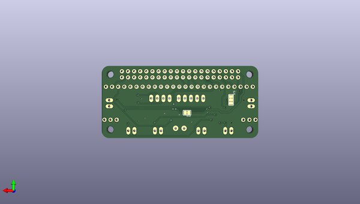

# adafruit_arcade_bonnet_pcb
 
## summary 
* id: adafruit_adafruit_arcade_bonnet_pcb_adafruit_arcade_bonnet
* user: adafruit
* name: adafruit_arcade_bonnet_pcb
* board: adafruit_arcade_bonnet
* repo: https://github.com/adafruit/Adafruit-Arcade-Bonnet-PCB

* src_file_repo_sch: 
*
 src_file_repo_sch_link: https://github.com/adafruit/Adafruit-Arcade-Bonnet-PCB/tree/master/
* full details link: https://github.com/oomlout/oomlout_oomp_project_bot_v_2/tree/main/projects/adafruit_adafruit_arcade_bonnet_pcb_adafruit_arcade_bonnet/current_version/working  

## schematic  
  
[schematic (pdf)](working_schematic.pdf)  

## pcb  
 
  
  
  
[board (pdf)](working.pdf)  

## working_bom
| Id | Designator | Footprint | Quantity | Designation | Supplier and ref |  | None | 
| --- | --- | --- | --- | --- | --- | --- | --- | 
| 1 | U$11 | PCBFEAT-REV-040 | 1 |  |  |  | [''] | 
| 2 | B4,B3,B0,B5,B2,B1 | JST-XH-2-SM4 | 6 | CON_JST_XH_2PIN-SM4 |  |  | [''] | 
| 3 | R3,R2 | 0805-NO | 2 | 10K |  |  | [''] | 
| 4 | U1 | QFN16_3MM | 1 | MAX98357A |  |  | [''] | 
| 5 | JP8,JP9,JP10,JP7,JP4,JP6 | 1X02_OVAL | 6 |  |  |  | [''] | 
| 6 | RPI1 | PI_BONNET | 1 | RASPBERRYPI_BPLUS_PHAT |  |  | [''] | 
| 7 | R4 | 0603-NO | 1 | 1M |  |  | [''] | 
| 8 | JP2,JP3 | 1X03_ROUND | 2 |  |  |  | [''] | 
| 9 | IC1 | QFN28-ML_6X6MM | 1 | MCP23017ML |  |  | [''] | 
| 10 | SPKR0 | TERMBLOCK_1X2-3.5MM | 1 | 3.5mm |  |  | [''] | 
| 11 | FID2,FID3 | FIDUCIAL_1MM | 2 | FIDUCIAL" |  |  | [''] | 
| 12 | R1 | 0805_10MGAP | 1 | 10K |  |  | [''] | 
| 13 | JP1 | 1X04_OVAL | 1 |  |  |  | [''] | 
| 14 | D1 | CHIPLED_0805_NOOUTLINE | 1 | red |  |  | [''] | 
| 15 | R5 | 0603-NO | 1 | 1K |  |  | [''] | 
| 16 | IC2 | TSSOP14 | 1 | LM339P |  |  | [''] | 
| 17 | U$19 | BONNET_ARCADE_REVB_TOP | 1 |  |  |  | [''] | 
| 18 | C2 | 0805-NO | 1 | 10uF |  |  | [''] | 
| 19 | JOY1 | 1X05_OVAL | 1 |  |  |  | [''] | 
| 20 | C1 | 0603-NO | 1 | 0.1uF |  |  | [''] | 
| 21 | CONN1 | 1X25_ROUND_70MIL | 1 | HEADER-1X25 |  |  | [''] | 
| 22 | SJ1 | SOLDERJUMPER_2WAY_OPEN_NOPASTE | 1 | ADDR |  |  | [''] | 
| 23 | U$20 | BONNET_ARCADE_REVB_BOT | 1 |  |  |  | [''] | 
| 24 | SJ2 | SOLDERJUMPER_CLOSEDWIRE | 1 |  |  |  | [''] | 

## bom_schematic
| Ref | Qnty | Value | Cmp name | Footprint | Description | Vendor | DNP | 
| --- | --- | --- | --- | --- | --- | --- | --- | 
| B0, B1, B2, B3, B4, B5 | 6 | CON_JST_XH_2PIN-SM4 | CON_JST_XH_2PIN-SM4 | working:JST-XH-2-SM4 |  |  |  | 
| C1 | 1 | 0.1uF | CAP_CERAMIC0603_NO | working:0603-NO |  |  |  | 
| C2 | 1 | 10uF | CAP_CERAMIC0805-NOOUTLINE | working:0805-NO |  |  |  | 
| CONN1 | 1 | HEADER-1X25 | HEADER-1X25 | working:1X25_ROUND_70MIL |  |  |  | 
| D1 | 1 | red | LED0805_NOOUTLINE | working:CHIPLED_0805_NOOUTLINE |  |  |  | 
| FID2, FID3 | 2 | FIDUCIAL"" | FIDUCIAL{dblquote}{dblquote} | working:FIDUCIAL_1MM |  |  |  | 
| IC1 | 1 | MCP23017ML | MCP23017ML | working:QFN28-ML_6X6MM |  |  |  | 
| IC2 | 1 | LM339P | LM339P | working:TSSOP14 |  |  |  | 
| JOY1 | 1 | HEADER-1X5 | HEADER-1X5 | working:1X05_OVAL |  |  |  | 
| JP1 | 1 | HEADER-1X4 | HEADER-1X4 | working:1X04_OVAL |  |  |  | 
| JP2, JP3 | 2 | HEADER-1X3ROUND | HEADER-1X3ROUND | working:1X03_ROUND |  |  |  | 
| JP4, JP6, JP7, JP8, JP9, JP10 | 6 | HEADER-1X2 | HEADER-1X2 | working:1X02_OVAL |  |  |  | 
| R1 | 1 | 10K | RESISTOR0805_10MGAP | working:0805_10MGAP |  |  |  | 
| R2, R3 | 2 | 10K | RESISTOR0805_NOOUTLINE | working:0805-NO |  |  |  | 
| R4 | 1 | 1M | RESISTOR_0603_NOOUT | working:0603-NO |  |  |  | 
| R5 | 1 | 1K | RESISTOR_0603_NOOUT | working:0603-NO |  |  |  | 
| RPI1 | 1 | RASPBERRYPI_BPLUS_PHAT | RASPBERRYPI_BPLUS_PHAT | working:PI_BONNET |  |  |  | 
| SJ1 | 1 | ADDR | SOLDERJUMPER_2WAY | working:SOLDERJUMPER_2WAY_OPEN_NOPASTE |  |  |  | 
| SJ2 | 1 | SOLDERJUMPERCLOSED | SOLDERJUMPERCLOSED | working:SOLDERJUMPER_CLOSEDWIRE |  |  |  | 
| SPKR0 | 1 | 3.5mm | TERMBLOCK_1X2 | working:TERMBLOCK_1X2-3.5MM |  |  |  | 
| U1 | 1 | MAX98357A | AUDIOAMP_MAX98357 | working:QFN16_3MM |  |  |  | 

