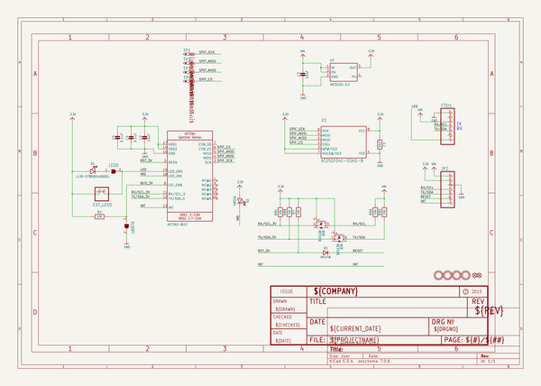
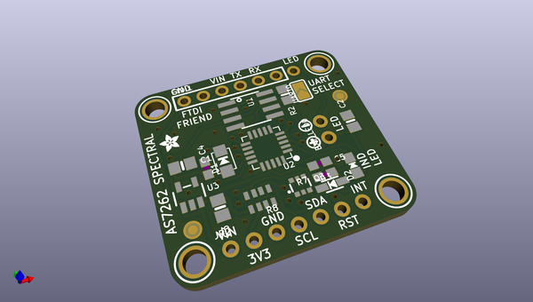
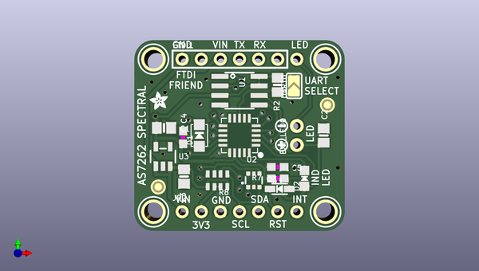
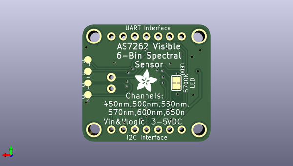

# adafruit_as7262_breakout_pcb
 
## summary 
* id: adafruit_adafruit_as7262_breakout_pcb_as726x_spectral_rev_d
* user: adafruit
* name: adafruit_as7262_breakout_pcb
* board: as726x_spectral_rev_d
* repo: https://github.com/adafruit/Adafruit-AS7262-Breakout-PCB

* src_file_repo_sch: 
*
 src_file_repo_sch_link: https://github.com/adafruit/Adafruit-AS7262-Breakout-PCB/tree/master/
* full details link: https://github.com/oomlout/oomlout_oomp_project_bot_v_2/tree/main/projects/adafruit_adafruit_as7262_breakout_pcb_as726x_spectral_rev_d/current_version/working  

## schematic  
  
[schematic (pdf)](working_schematic.pdf)  

## pcb  
 
  
  
  
[board (pdf)](working.pdf)  

## working_bom
| Id | Designator | Footprint | Quantity | Designation | Supplier and ref |  | None | 
| --- | --- | --- | --- | --- | --- | --- | --- | 
| 1 | U$2,U$22,U$3,U$23 | MOUNTINGHOLE_2.5_PLATED | 4 | MOUNTINGHOLE2.5 |  |  | [''] | 
| 2 | U$25 | SYMBOL_PLUS | 1 |  |  |  | [''] | 
| 3 | R2 | 0805-NO | 1 | 10K |  |  | [''] | 
| 4 | D1 | EVERLIGHT_45-21 | 1 | L130-5780001400001 |  |  | [''] | 
| 5 | U2 | AS726X_LGA20 | 1 | AS7262-BLGT |  |  | [''] | 
| 6 | R8 | RESPACK_4X0603_NO | 1 | 10k |  |  | [''] | 
| 7 | EXT_LED0 | 1X02_ROUND | 1 |  |  |  | [''] | 
| 8 | C3,C1,C2 | 0805-NO | 3 | 10uF |  |  | [''] | 
| 9 | UART0 | SOLDERJUMPER_ARROW_NOPASTE | 1 |  |  |  | [''] | 
| 10 | R7 | 0603-NO | 1 | 10K |  |  | [''] | 
| 11 | C4,C5 | 0603-NO | 2 | 0.1uF |  |  | [''] | 
| 12 | Q3 | SOT363 | 1 | BSS138 |  |  | [''] | 
| 13 | D2 | CHIPLED_0805_NOOUTLINE | 1 | GREEN |  |  | [''] | 
| 14 | U3 | SOT23-5 | 1 | MIC5225-3.3 |  |  | [''] | 
| 15 | U1 | SOIC8_150MIL | 1 | AT25SF041-SSHD-B |  |  | [''] | 
| 16 | FID3,FID2 | FIDUCIAL_1MM | 2 | FIDUCIAL_1MM |  |  | [''] | 
| 17 | JP2,FTDI1 | 1X07_ROUND | 2 |  |  |  | [''] | 
| 18 | U$26 | SYMBOL_MINUS | 1 |  |  |  | [''] | 
| 19 | D3 | SOD-323 | 1 | IN4148 |  |  | [''] | 
| 20 | U$21 | ADAFRUIT_2.5MM | 1 |  |  |  | [''] | 
| 21 | TP1,TP3,TP2,TP4 | TP15R | 4 | PTR1TP15R |  |  | [''] | 
| 22 | U$9 | ADAFRUIT_5MM | 1 |  |  |  | [''] | 
| 23 | LED0 | SOLDERJUMPER_CLOSEDWIRE | 1 |  |  |  | [''] | 

## bom_schematic
| Ref | Qnty | Value | Cmp name | Footprint | Description | Vendor | DNP | 
| --- | --- | --- | --- | --- | --- | --- | --- | 
| C1, C2, C3 | 3 | 10uF | CAP_CERAMIC0805-NOOUTLINE | working:0805-NO |  |  |  | 
| C4, C5 | 2 | 0.1uF | CAP_CERAMIC0603_NO | working:0603-NO |  |  |  | 
| D1 | 1 | L130-5780001400001 | LEDEV45-21 | working:EVERLIGHT_45-21 |  |  |  | 
| D2 | 1 | GREEN | LED0805_NOOUTLINE | working:CHIPLED_0805_NOOUTLINE |  |  |  | 
| D3 | 1 | IN4148 | DIODESOD-323 | working:SOD-323 |  |  |  | 
| EXT_LED0 | 1 | HEADER-1X2ROUND | HEADER-1X2ROUND | working:1X02_ROUND |  |  |  | 
| FID2, FID3 | 2 | FIDUCIAL_1MM | FIDUCIAL_1MM | working:FIDUCIAL_1MM |  |  |  | 
| FTDI1 | 1 | HEADER-1X7ROUND | HEADER-1X7ROUND | working:1X07_ROUND |  |  |  | 
| JP2 | 1 | HEADER-1X7ROUND | HEADER-1X7ROUND | working:1X07_ROUND |  |  |  | 
| LED0 | 1 | SOLDERJUMPERCLOSED | SOLDERJUMPERCLOSED | working:SOLDERJUMPER_CLOSEDWIRE |  |  |  | 
| Q3 | 1 | BSS138 | MOSFET-N_DUAL | working:SOT363 |  |  |  | 
| R2 | 1 | 10K | RESISTOR0805_NOOUTLINE | working:0805-NO |  |  |  | 
| R7 | 1 | 10K | microbuilder_09_Nov_2015_RESISTOR_0603_NOOUT | working:0603-NO |  |  |  | 
| R8 | 1 | 10k | RESISTOR_4PACK_NO | working:RESPACK_4X0603_NO |  |  |  | 
| TP1, TP2, TP3, TP4 | 4 | PTR1TP15R | PTR1TP15R | working:TP15R |  |  |  | 
| U1 | 1 | AT25SF041-SSHD-B | SPIFLASH_SOIC8 | working:SOIC8_150MIL |  |  |  | 
| U2 | 1 | AS7262-BLGT | AS726X_SPECTRAL | working:AS726X_LGA20 |  |  |  | 
| U3 | 1 | MIC5225-3.3 | VREG_SOT23-5 | working:SOT23-5 |  |  |  | 
| U$2, U$3, U$22, U$23 | 4 | MOUNTINGHOLE2.5 | MOUNTINGHOLE2.5 | working:MOUNTINGHOLE_2.5_PLATED |  |  |  | 
| UART0 | 1 | SOLDERJUMPER | SOLDERJUMPER | working:SOLDERJUMPER_ARROW_NOPASTE |  |  |  | 

## mounting_holes
| x | y | package | value | ref | size | 
| --- | --- | --- | --- | --- | --- | 
| 22.859999999999985 | 0.0 | MOUNTINGHOLE_2.5_PLATED | MOUNTINGHOLE2.5 | U$2 | m3 | 
| 0.0 | 0.0 | MOUNTINGHOLE_2.5_PLATED | MOUNTINGHOLE2.5 | U$3 | m3 | 
| 22.859999999999985 | 20.320000000000007 | MOUNTINGHOLE_2.5_PLATED | MOUNTINGHOLE2.5 | U$22 | m3 | 
| 0.0 | 20.320000000000007 | MOUNTINGHOLE_2.5_PLATED | MOUNTINGHOLE2.5 | U$23 | m3 | 

