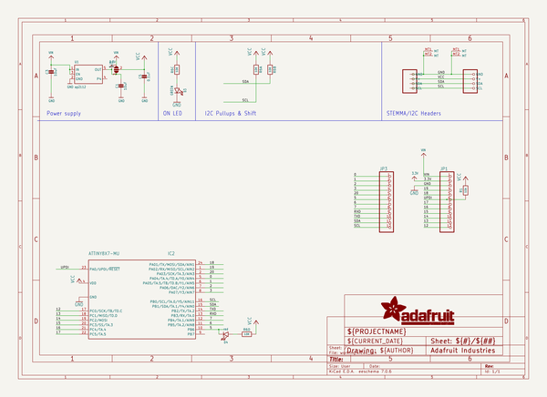
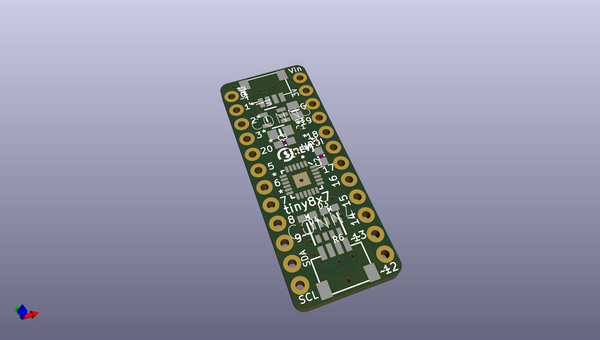
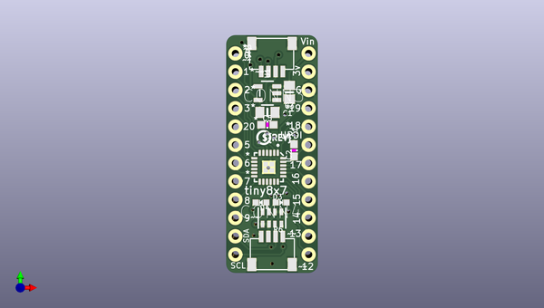
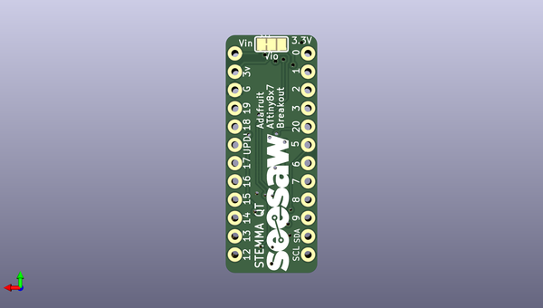

# adafruit_attiny8x7_breakout_pcb
 
## summary 
* id: adafruit_adafruit_attiny8x7_breakout_pcb_adafruit_attiny8x7_breakout
* user: adafruit
* name: adafruit_attiny8x7_breakout_pcb
* board: adafruit_attiny8x7_breakout
* repo: https://github.com/adafruit/Adafruit-ATtiny8x7-Breakout-PCB

* src_file_repo_sch: 
*
 src_file_repo_sch_link: https://github.com/adafruit/Adafruit-ATtiny8x7-Breakout-PCB/tree/main/
* full details link: https://github.com/oomlout/oomlout_oomp_project_bot_v_2/tree/main/projects/adafruit_adafruit_attiny8x7_breakout_pcb_adafruit_attiny8x7_breakout/current_version/working  

## schematic  
  
[schematic (pdf)](working_schematic.pdf)  

## pcb  
 
  
  
  
[board (pdf)](working.pdf)  

## working_bom
| Id | Designator | Footprint | Quantity | Designation | Supplier and ref |  | None | 
| --- | --- | --- | --- | --- | --- | --- | --- | 
| 1 | C5 | 0603-NO | 1 | 0.1uF |  |  | [''] | 
| 2 | U1 | SOT23-5 | 1 | ap2112 |  |  | [''] | 
| 3 | JP3,JP1 | 1X12_ROUND_76MIL | 2 |  |  |  | [''] | 
| 4 | C1 | 0805_10MGAP | 1 | 10uF |  |  | [''] | 
| 5 | R6 | RESPACK_4X0603 | 1 | 10K |  |  | [''] | 
| 6 | D3 | CHIPLED_0603_NOOUTLINE | 1 | GREEN |  |  | [''] | 
| 7 | C3 | 0805-NO | 1 | 10uF |  |  | [''] | 
| 8 | IC2 | QFN24_4MM | 1 | ATTINY8X7-MU |  |  | [''] | 
| 9 | U$12 | PCBFEAT-REV-040 | 1 |  |  |  | [''] | 
| 10 | R1 | 0603-NO | 1 | 10k |  |  | [''] | 
| 11 | CONN3,CONN4 | JST_SH4 | 2 | STEMMA_I2C_QT |  |  | [''] | 
| 12 | D4 | CHIPLED_0603_NOOUTLINE | 1 | red |  |  | [''] | 
| 13 | U$7 | SEESAW_LOGO | 1 |  |  |  | [''] | 
| 14 | SJ1 | SOLDERJUMPER_2WAY_OPEN_NOPASTE | 1 |  |  |  | [''] | 

## bom_schematic
| Ref | Qnty | Value | Cmp name | Footprint | Description | Vendor | DNP | 
| --- | --- | --- | --- | --- | --- | --- | --- | 
| C1 | 1 | 10uF | CAP_CERAMIC0805_10MGAP | working:0805_10MGAP |  |  |  | 
| C3 | 1 | 10uF | CAP_CERAMIC0805-NOOUTLINE | working:0805-NO |  |  |  | 
| C5 | 1 | 0.1uF | CAP_CERAMIC0603_NO | working:0603-NO |  |  |  | 
| CONN3, CONN4 | 2 | STEMMA_I2C_QT | STEMMA_I2C_QT | working:JST_SH4 |  |  |  | 
| D3 | 1 | GREEN | LED0603_NOOUTLINE | working:CHIPLED_0603_NOOUTLINE |  |  |  | 
| D4 | 1 | red | LED0603_NOOUTLINE | working:CHIPLED_0603_NOOUTLINE |  |  |  | 
| IC2 | 1 | ATTINY8X7-MU | ATTINY8X7-MU | working:QFN24_4MM |  |  |  | 
| JP1, JP3 | 2 | HEADER-1X1276MIL | HEADER-1X1276MIL | working:1X12_ROUND_76MIL |  |  |  | 
| R1 | 1 | 10k | RESISTOR_0603_NOOUT | working:0603-NO |  |  |  | 
| R6 | 1 | 10K | RESISTOR_4PACK | working:RESPACK_4X0603 |  |  |  | 
| SJ1 | 1 | SOLDERJUMPER_2WAY | SOLDERJUMPER_2WAY | working:SOLDERJUMPER_2WAY_OPEN_NOPASTE |  |  |  | 
| U1 | 1 | ap2112 | VREG_SOT23-5 | working:SOT23-5 |  |  |  | 

