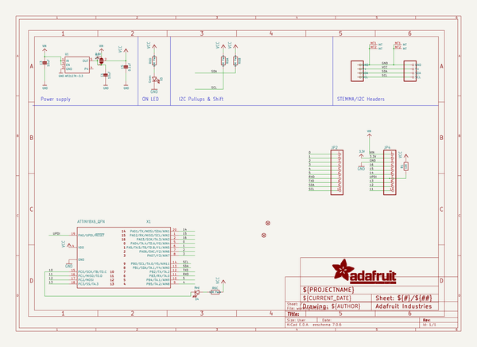
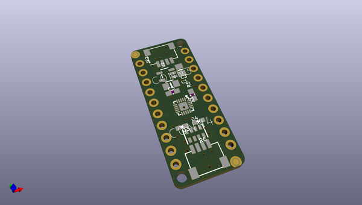
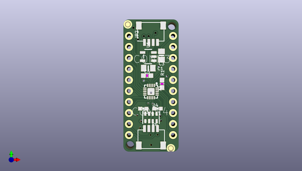
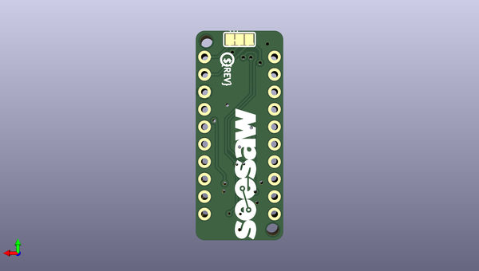

# adafruit_attinyx16_breakouts_pcb
 
## summary 
* id: adafruit_adafruit_attinyx16_breakouts_pcb_adafruit_attiny816_breakout
* user: adafruit
* name: adafruit_attinyx16_breakouts_pcb
* board: adafruit_attiny816_breakout
* repo: https://github.com/adafruit/Adafruit-ATtinyx16-Breakouts-PCB

* src_file_repo_sch: 
*
 src_file_repo_sch_link: https://github.com/adafruit/Adafruit-ATtinyx16-Breakouts-PCB/tree/main/
* full details link: https://github.com/oomlout/oomlout_oomp_project_bot_v_2/tree/main/projects/adafruit_adafruit_attinyx16_breakouts_pcb_adafruit_attiny816_breakout/current_version/working  

## schematic  
  
[schematic (pdf)](working_schematic.pdf)  

## pcb  
 
  
  
  
[board (pdf)](working.pdf)  

## working_bom
| Id | Designator | Footprint | Quantity | Designation | Supplier and ref |  | None | 
| --- | --- | --- | --- | --- | --- | --- | --- | 
| 1 | JP2,JP4 | 1X10_ROUND70 | 2 |  |  |  | [''] | 
| 2 | PLABEL14 | PLABEL14 | 1 |  |  |  | [''] | 
| 3 | PLABEL20 | PLABEL20 | 1 |  |  |  | [''] | 
| 4 | PLABEL18 | PLABEL18 | 1 |  |  |  | [''] | 
| 5 | U1 | SOT23-5 | 1 | AP2127K-3.3 |  |  | [''] | 
| 6 | FID1,FID2 | FIDUCIAL_1MM | 2 | FIDUCIAL_1MM |  |  | [''] | 
| 7 | PLABEL5 | PLABEL5 | 1 |  |  |  | [''] | 
| 8 | PLABEL2 | PLABEL2 | 1 |  |  |  | [''] | 
| 9 | PLABEL100 | PLABEL100 | 1 |  |  |  | [''] | 
| 10 | D3 | CHIPLED_0603_NOOUTLINE | 1 | Green |  |  | [''] | 
| 11 | C1 | 0805_10MGAP | 1 | 10uF |  |  | [''] | 
| 12 | PLABEL23 | PLABEL23 | 1 |  |  |  | [''] | 
| 13 | PLABEL7 | PLABEL7 | 1 |  |  |  | [''] | 
| 14 | R6 | RESPACK_4X0603 | 1 | 10K Pack |  |  | [''] | 
| 15 | PLABEL32 | PLABEL32 | 1 |  |  |  | [''] | 
| 16 | PLABEL28 | PLABEL28 | 1 |  |  |  | [''] | 
| 17 | PLABEL21 | PLABEL21 | 1 |  |  |  | [''] | 
| 18 | PLABEL11 | PLABEL11 | 1 |  |  |  | [''] | 
| 19 | PLABEL27 | PLABEL27 | 1 |  |  |  | [''] | 
| 20 | PLABEL8 | PLABEL8 | 1 |  |  |  | [''] | 
| 21 | C3 | 0805-NO | 1 | 10uF |  |  | [''] | 
| 22 | PLABEL24 | PLABEL24 | 1 |  |  |  | [''] | 
| 23 | PLABEL19 | PLABEL19 | 1 |  |  |  | [''] | 
| 24 | CONN4,CONN3 | JST_SH4 | 2 | STEMMA_I2C_QT |  |  | [''] | 
| 25 | PLABEL6 | PLABEL6 | 1 |  |  |  | [''] | 
| 26 | PLABEL1 | PLABEL1 | 1 |  |  |  | [''] | 
| 27 | PLABEL22 | PLABEL22 | 1 |  |  |  | [''] | 
| 28 | X1 | QFN20_3MM | 1 | ATTINY8X6_QFN |  |  | [''] | 
| 29 | PLABEL25 | PLABEL25 | 1 |  |  |  | [''] | 
| 30 | PLABEL30 | PLABEL30 | 1 |  |  |  | [''] | 
| 31 | @HOLE0,@HOLE1 |  | 2 |  |  |  | [''] | 
| 32 | PLABEL17 | PLABEL17 | 1 |  |  |  | [''] | 
| 33 | PLABEL13 | PLABEL13 | 1 |  |  |  | [''] | 
| 34 | PLABEL15 | PLABEL15 | 1 |  |  |  | [''] | 
| 35 | PLABEL31 | PLABEL31 | 1 |  |  |  | [''] | 
| 36 | PLABEL29 | PLABEL29 | 1 |  |  |  | [''] | 
| 37 | PLABEL9 | PLABEL9 | 1 |  |  |  | [''] | 
| 38 | PLABEL4 | PLABEL4 | 1 |  |  |  | [''] | 
| 39 | PLABEL3 | PLABEL3 | 1 |  |  |  | [''] | 
| 40 | PLABEL26 | PLABEL26 | 1 |  |  |  | [''] | 
| 41 | PLABEL12 | PLABEL12 | 1 |  |  |  | [''] | 
| 42 | D4 | CHIPLED_0603_NOOUTLINE | 1 | Red |  |  | [''] | 
| 43 | PLABEL0 | PLABEL0 | 1 |  |  |  | [''] | 
| 44 | C5 | 0603-NO | 1 | 0.1uF |  |  | [''] | 
| 45 | PLABEL33 | PLABEL33 | 1 |  |  |  | [''] | 
| 46 | R1 | 0603-NO | 1 | 10K |  |  | [''] | 
| 47 | PLABEL10 | PLABEL10 | 1 |  |  |  | [''] | 
| 48 | PLABEL54 | PLABEL54 | 1 |  |  |  | [''] | 
| 49 | PLABEL46 | PLABEL46 | 1 |  |  |  | [''] | 
| 50 | PLABEL49 | PLABEL49 | 1 |  |  |  | [''] | 
| 51 | PLABEL35 | PLABEL35 | 1 |  |  |  | [''] | 
| 52 | PLABEL41 | PLABEL41 | 1 |  |  |  | [''] | 
| 53 | PLABEL101 | PLABEL101 | 1 |  |  |  | [''] | 
| 54 | PLABEL39 | PLABEL39 | 1 |  |  |  | [''] | 
| 55 | PLABEL53 | PLABEL53 | 1 |  |  |  | [''] | 
| 56 | U$7 | SEESAW_LOGO | 1 |  |  |  | [''] | 
| 57 | PLABEL56 | PLABEL56 | 1 |  |  |  | [''] | 
| 58 | PLABEL40 | PLABEL40 | 1 |  |  |  | [''] | 
| 59 | SJ1 | SOLDERJUMPER_2WAY_OPEN_NOPASTE | 1 |  |  |  | [''] | 
| 60 | PLABEL50 | PLABEL50 | 1 |  |  |  | [''] | 
| 61 | PLABEL52 | PLABEL52 | 1 |  |  |  | [''] | 
| 62 | U$12 | PCBFEAT-REV-040 | 1 |  |  |  | [''] | 
| 63 | PLABEL44 | PLABEL44 | 1 |  |  |  | [''] | 
| 64 | PLABEL36 | PLABEL36 | 1 |  |  |  | [''] | 
| 65 | PLABEL48 | PLABEL48 | 1 |  |  |  | [''] | 
| 66 | PLABEL58 | PLABEL58 | 1 |  |  |  | [''] | 
| 67 | PLABEL42 | PLABEL42 | 1 |  |  |  | [''] | 
| 68 | PLABEL57 | PLABEL57 | 1 |  |  |  | [''] | 
| 69 | PLABEL45 | PLABEL45 | 1 |  |  |  | [''] | 
| 70 | PLABEL55 | PLABEL55 | 1 |  |  |  | [''] | 
| 71 | PLABEL43 | PLABEL43 | 1 |  |  |  | [''] | 
| 72 | PLABEL38 | PLABEL38 | 1 |  |  |  | [''] | 
| 73 | PLABEL47 | PLABEL47 | 1 |  |  |  | [''] | 
| 74 | PLABEL37 | PLABEL37 | 1 |  |  |  | [''] | 
| 75 | PLABEL51 | PLABEL51 | 1 |  |  |  | [''] | 

## bom_schematic
| Ref | Qnty | Value | Cmp name | Footprint | Description | Vendor | DNP | 
| --- | --- | --- | --- | --- | --- | --- | --- | 
| C1 | 1 | 10uF | CAP_CERAMIC0805_10MGAP | working:0805_10MGAP |  |  |  | 
| C3 | 1 | 10uF | CAP_CERAMIC0805-NOOUTLINE | working:0805-NO |  |  |  | 
| C5 | 1 | 0.1uF | CAP_CERAMIC0603_NO | working:0603-NO |  |  |  | 
| CONN3, CONN4 | 2 | STEMMA_I2C_QT | STEMMA_I2C_QT | working:JST_SH4 |  |  |  | 
| D3 | 1 | Green | LED0603_NOOUTLINE | working:CHIPLED_0603_NOOUTLINE |  |  |  | 
| D4 | 1 | Red | LED0603_NOOUTLINE | working:CHIPLED_0603_NOOUTLINE |  |  |  | 
| FID1, FID2 | 2 | FIDUCIAL_1MM | FIDUCIAL_1MM | working:FIDUCIAL_1MM |  |  |  | 
| JP2, JP4 | 2 | HEADER-1X1070MIL | HEADER-1X1070MIL | working:1X10_ROUND70 |  |  |  | 
| R1 | 1 | 10K | RESISTOR_0603_NOOUT | working:0603-NO |  |  |  | 
| R6 | 1 | 10K Pack | RESISTOR_4PACK | working:RESPACK_4X0603 |  |  |  | 
| SJ1 | 1 | SOLDERJUMPER_2WAY | SOLDERJUMPER_2WAY | working:SOLDERJUMPER_2WAY_OPEN_NOPASTE |  |  |  | 
| U1 | 1 | AP2127K-3.3 | VREG_SOT23-5 | working:SOT23-5 |  |  |  | 
| X1 | 1 | ATTINY8X6_QFN | ATTINY8X6_QFN | working:QFN20_3MM |  |  |  | 

