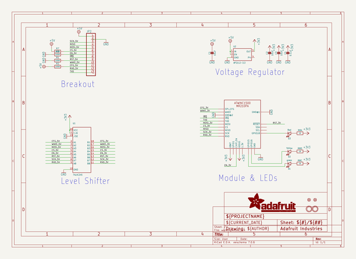
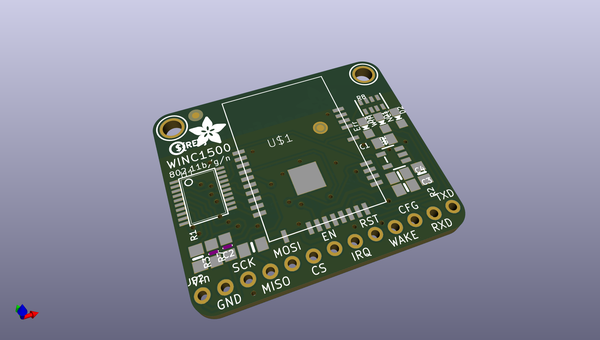
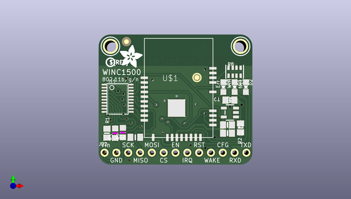
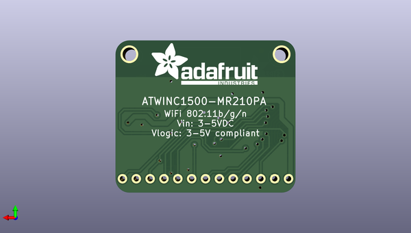

# adafruit_atwinc1500_wifi_breakout_pcb
 
## summary 
* id: adafruit_adafruit_atwinc1500_wifi_breakout_pcb_adafruit_winc1500_breakout
* user: adafruit
* name: adafruit_atwinc1500_wifi_breakout_pcb
* board: adafruit_winc1500_breakout
* repo: https://github.com/adafruit/Adafruit-ATWINC1500-WiFi-Breakout-PCB

* src_file_repo_sch: 
*
 src_file_repo_sch_link: https://github.com/adafruit/Adafruit-ATWINC1500-WiFi-Breakout-PCB/tree/master/
* full details link: https://github.com/oomlout/oomlout_oomp_project_bot_v_2/tree/main/projects/adafruit_adafruit_atwinc1500_wifi_breakout_pcb_adafruit_winc1500_breakout/current_version/working  

## schematic  
  
[schematic (pdf)](working_schematic.pdf)  

## pcb  
 
  
  
  
[board (pdf)](working.pdf)  

## working_bom
| Id | Designator | Footprint | Quantity | Designation | Supplier and ref |  | None | 
| --- | --- | --- | --- | --- | --- | --- | --- | 
| 1 | U1 | TSSOP20 | 1 | 74LVC245 |  |  | [''] | 
| 2 | U$4 | ADAFRUIT_5MM | 1 |  |  |  | [''] | 
| 3 | U$1 | ATWINC1500_MR210PA | 1 | ATWINC1500_MR210PB |  |  | [''] | 
| 4 | C1,C3 | 0805-NO | 2 | 10uF |  |  | [''] | 
| 5 | R3,R7 | _0805MP | 2 | 100K |  |  | [''] | 
| 6 | R2,R1 | 0805-NO | 2 | 100K |  |  | [''] | 
| 7 | FID1,FID2 | FIDUCIAL_1MM | 2 | FIDUCIAL" |  |  | [''] | 
| 8 | U2 | SOT23-5 | 1 | AP2112-3.3 |  |  | [''] | 
| 9 | U$3,U$2 | MOUNTINGHOLE_2.5_PLATED | 2 | MOUNTINGHOLE2.5 |  |  | [''] | 
| 10 | JP2 | 1X13_ROUND_70 | 1 |  |  |  | [''] | 
| 11 | C2 | 0805_10MGAP | 1 | 10uF |  |  | [''] | 
| 12 | D1 | CHIPLED_0805_NOOUTLINE | 1 | green |  |  | [''] | 
| 13 | C4 | 0805-NO | 1 | 0.1uF |  |  | [''] | 
| 14 | D3 | CHIPLED_0805_NOOUTLINE | 1 | Red |  |  | [''] | 
| 15 | U$5 | PCBFEAT-REV-040 | 1 |  |  |  | [''] | 
| 16 | D2 | CHIPLED_0805_NOOUTLINE | 1 | Yellow |  |  | [''] | 
| 17 | R8 | RESPACK_4X0603 | 1 | 1K |  |  | [''] | 
| 18 | U$6 | ADAFRUIT_TEXT_20MM | 1 |  |  |  | [''] | 

## bom_schematic
| Ref | Qnty | Value | Cmp name | Footprint | Description | Vendor | DNP | 
| --- | --- | --- | --- | --- | --- | --- | --- | 
| C1, C3 | 2 | 10uF | CAP_CERAMIC0805-NOOUTLINE | working:0805-NO |  |  |  | 
| C2 | 1 | 10uF | CAP_CERAMIC0805_10MGAP | working:0805_10MGAP |  |  |  | 
| C4 | 1 | 0.1uF | CAP_CERAMIC0805-NOOUTLINE | working:0805-NO |  |  |  | 
| D1 | 1 | green | LED0805_NOOUTLINE | working:CHIPLED_0805_NOOUTLINE |  |  |  | 
| D2 | 1 | Yellow | LED0805_NOOUTLINE | working:CHIPLED_0805_NOOUTLINE |  |  |  | 
| D3 | 1 | Red | LED0805_NOOUTLINE | working:CHIPLED_0805_NOOUTLINE |  |  |  | 
| FID1, FID2 | 2 | FIDUCIAL"" | FIDUCIAL{dblquote}{dblquote} | working:FIDUCIAL_1MM |  |  |  | 
| JP2 | 1 | HEADER-1X13 | HEADER-1X13 | working:1X13_ROUND_70 |  |  |  | 
| R1, R2 | 2 | 100K | RESISTOR0805_NOOUTLINE | working:0805-NO |  |  |  | 
| R3, R7 | 2 | 100K | RESISTOR_0805MP | working:_0805MP |  |  |  | 
| R8 | 1 | 1K | RESISTOR_4PACK | working:RESPACK_4X0603 |  |  |  | 
| U1 | 1 | 74LVC245 | 74LCX245 | working:TSSOP20 |  |  |  | 
| U2 | 1 | AP2112-3.3 | VREG_SOT23-5 | working:SOT23-5 |  |  |  | 
| U$1 | 1 | ATWINC1500_MR210PA | ATWINC1500_MR210PA | working:ATWINC1500_MR210PA |  |  |  | 
| U$2, U$3 | 2 | MOUNTINGHOLE2.5 | MOUNTINGHOLE2.5 | working:MOUNTINGHOLE_2.5_PLATED |  |  |  | 

## mounting_holes
| x | y | package | value | ref | size | 
| --- | --- | --- | --- | --- | --- | 
| 0.0 | 0.0 | MOUNTINGHOLE_2.5_PLATED | MOUNTINGHOLE2.5 | U$2 | m3 | 
| 27.94 | 0.0 | MOUNTINGHOLE_2.5_PLATED | MOUNTINGHOLE2.5 | U$3 | m3 | 

