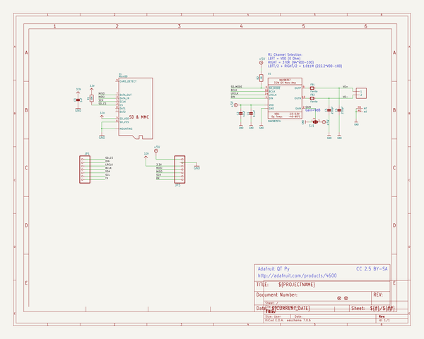
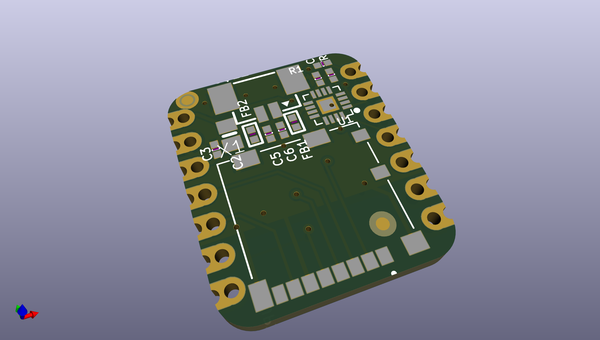
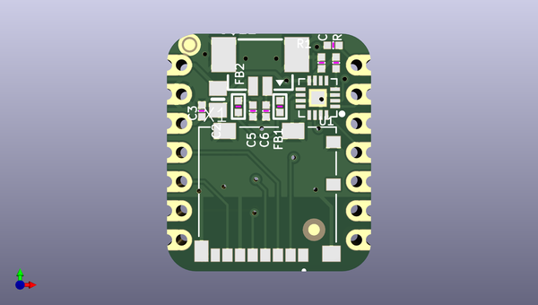
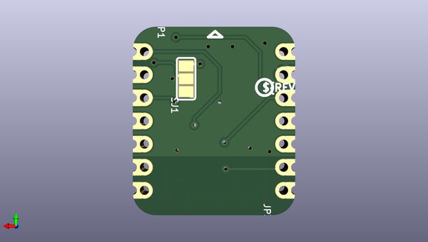

# adafruit_audio_bff_pcb
 
## summary 
* id: adafruit_adafruit_audio_bff_pcb_adafruit_audio_bff_pcb
* user: adafruit
* name: adafruit_audio_bff_pcb
* board: adafruit_audio_bff_pcb
* repo: https://github.com/adafruit/Adafruit-Audio-BFF-PCB

* src_file_repo_sch: 
*
 src_file_repo_sch_link: https://github.com/adafruit/Adafruit-Audio-BFF-PCB/tree/main/
* full details link: https://github.com/oomlout/oomlout_oomp_project_bot_v_2/tree/main/projects/adafruit_adafruit_audio_bff_pcb_adafruit_audio_bff_pcb/current_version/working  

## schematic  
  
[schematic (pdf)](working_schematic.pdf)  

## pcb  
 
  
  
  
[board (pdf)](working.pdf)  

## working_bom
| Id | Designator | Footprint | Quantity | Designation | Supplier and ref |  | None | 
| --- | --- | --- | --- | --- | --- | --- | --- | 
| 1 | PLABEL8 | PLABEL8 | 1 |  |  |  | [''] | 
| 2 | R2 | _0402NO | 1 | 1M |  |  | [''] | 
| 3 | PLABEL7 | PLABEL7 | 1 |  |  |  | [''] | 
| 4 | PLABEL10 | PLABEL10 | 1 |  |  |  | [''] | 
| 5 | C1 | _0402NO | 1 | 0.1uF |  |  | [''] | 
| 6 | C3 | _0402NO | 1 | 1uF |  |  | [''] | 
| 7 | U1 | QFN16_3MM | 1 | MAX98357A |  |  | [''] | 
| 8 | C5,C6 | _0402NO | 2 | 220pF |  |  | [''] | 
| 9 | X1 | MOLEX_104031-0811 | 1 | MicroSD |  |  | [''] | 
| 10 | R1 | _0402NO | 1 | 10K |  |  | [''] | 
| 11 | U$12 | 53398-0271 | 1 | CON_MOLEX_2P |  |  | [''] | 
| 12 | U$6,U$8 | FIDUCIAL_1MM | 2 | FIDUCIAL_1MM |  |  | [''] | 
| 13 | FB1,FB2 | _0402 | 2 | Ferrite |  |  | [''] | 
| 14 | C2 | 0805-NO | 1 | 10uF |  |  | [''] | 
| 15 | PLABEL9 | PLABEL9 | 1 |  |  |  | [''] | 
| 16 | PLABEL11 | PLABEL11 | 1 |  |  |  | [''] | 
| 17 | PLABEL14 | PLABEL14 | 1 |  |  |  | [''] | 
| 18 | PLABEL15 | PLABEL15 | 1 |  |  |  | [''] | 
| 19 | PLABEL17 | PLABEL17 | 1 |  |  |  | [''] | 
| 20 | PLABEL12 | PLABEL12 | 1 |  |  |  | [''] | 
| 21 | U$3 | PCBFEAT-REV-040 | 1 |  |  |  | [''] | 
| 22 | JP3,JP1 | 1X07_CASTEL | 2 |  |  |  | [''] | 
| 23 | PLABEL6 | PLABEL6 | 1 |  |  |  | [''] | 
| 24 | PLABEL13 | PLABEL13 | 1 |  |  |  | [''] | 
| 25 | PLABEL16 | PLABEL16 | 1 |  |  |  | [''] | 
| 26 | SJ1 | SOLDERJUMPER_2WAY_OPEN_NOPASTE | 1 |  |  |  | [''] | 

## bom_schematic
| Ref | Qnty | Value | Cmp name | Footprint | Description | Vendor | DNP | 
| --- | --- | --- | --- | --- | --- | --- | --- | 
| C1 | 1 | 0.1uF | CAP_CERAMIC_0402NO | working:_0402NO |  |  |  | 
| C2 | 1 | 10uF | CAP_CERAMIC0805-NOOUTLINE | working:0805-NO |  |  |  | 
| C3 | 1 | 1uF | CAP_CERAMIC_0402NO | working:_0402NO |  |  |  | 
| C5, C6 | 2 | 220pF | CAP_CERAMIC_0402NO | working:_0402NO |  |  |  | 
| FB1, FB2 | 2 | Ferrite | FERRITE_0402 | working:_0402 |  |  |  | 
| JP1, JP3 | 2 | HEADER-1X7_CASTEL | HEADER-1X7_CASTEL | working:1X07_CASTEL |  |  |  | 
| R1 | 1 | 10K | RESISTOR_0402NO | working:_0402NO |  |  |  | 
| R2 | 1 | 1M | RESISTOR_0402NO | working:_0402NO |  |  |  | 
| SJ1 | 1 | SOLDERJUMPER_2WAY | SOLDERJUMPER_2WAY | working:SOLDERJUMPER_2WAY_OPEN_NOPASTE |  |  |  | 
| U1 | 1 | MAX98357A | AUDIOAMP_MAX98357 | working:QFN16_3MM |  |  |  | 
| U$6, U$8 | 2 | FIDUCIAL_1MM | FIDUCIAL_1MM | working:FIDUCIAL_1MM |  |  |  | 
| U$12 | 1 | CON_MOLEX_2P | CON_MOLEX_2P | working:53398-0271 |  |  |  | 
| X1 | 1 | MicroSD | MICROSD104031-0811 | working:MOLEX_104031-0811 |  |  |  | 

