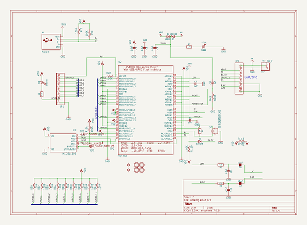
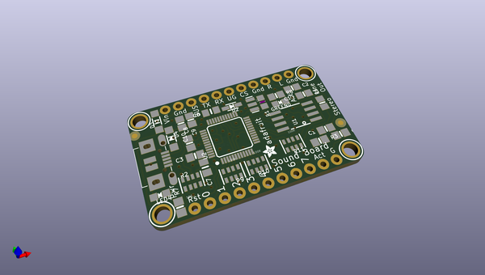
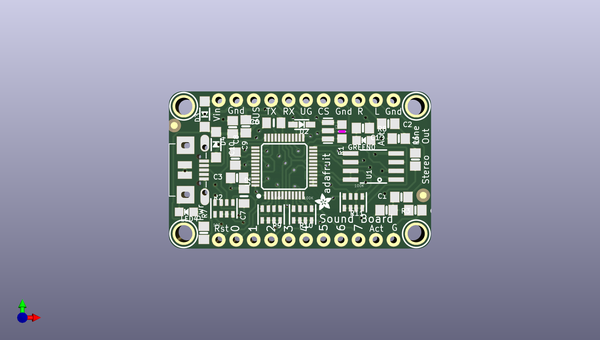
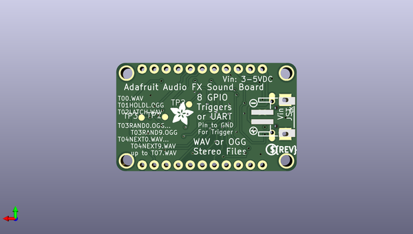

# adafruit_audio_fx_sound_board_pcbs
 
## summary 
* id: adafruit_adafruit_audio_fx_sound_board_pcbs_adafruit_ez_sfx_mini
* user: adafruit
* name: adafruit_audio_fx_sound_board_pcbs
* board: adafruit_ez_sfx_mini
* repo: https://github.com/adafruit/Adafruit-Audio-FX-Sound-Board-PCBs

* src_file_repo_sch: 
*
 src_file_repo_sch_link: https://github.com/adafruit/Adafruit-Audio-FX-Sound-Board-PCBs/tree/master/
* full details link: https://github.com/oomlout/oomlout_oomp_project_bot_v_2/tree/main/projects/adafruit_adafruit_audio_fx_sound_board_pcbs_adafruit_ez_sfx_mini/current_version/working  

## schematic  
  
[schematic (pdf)](working_schematic.pdf)  

## pcb  
 
  
  
  
[board (pdf)](working.pdf)  

## working_bom
| Id | Designator | Footprint | Quantity | Designation | Supplier and ref |  | None | 
| --- | --- | --- | --- | --- | --- | --- | --- | 
| 1 | R9,R2,R11,R10 | RESPACK_4X0603 | 4 | 100K |  |  | [''] | 
| 2 | D2 | SOD-323 | 1 | 1N4148 |  |  | [''] | 
| 3 | FID2,FID1 | FIDUCIAL_1MM | 2 | FIDUCIAL" |  |  | [''] | 
| 4 | U$5,U$8,U$6,U$7 | MOUNTINGHOLE_2.5_PLATED | 4 | MOUNTINGHOLE2.5 |  |  | [''] | 
| 5 | R6,R7,R8,R3 | 0805-NO | 4 | 470 |  |  | [''] | 
| 6 | X1 | 4UCONN_20329_V2 | 1 | Micro B |  |  | [''] | 
| 7 | C1,C9,C2,C8 | 0805-NO | 4 | 10uF |  |  | [''] | 
| 8 | C6,C7 | 0805_10MGAP | 2 | 10uF |  |  | [''] | 
| 9 | C11,C12 | 0805-NO | 2 | 4.7nF |  |  | [''] | 
| 10 | JP1,JP2 | 1X11_ROUND_76 | 2 |  |  |  | [''] | 
| 11 | LED4 | CHIPLED_0805_NOOUTLINE | 1 | Green |  |  | [''] | 
| 12 | Y2 | RESONATOR-SMD | 1 | 12MHz |  |  | [''] | 
| 13 | R1 | _0805MP | 1 | 1M |  |  | [''] | 
| 14 | C10,C3 | 0805-NO | 2 | 1uF |  |  | [''] | 
| 15 | D4,D3 | SOD-123 | 2 | MBR120 |  |  | [''] | 
| 16 | U$11 | ADAFRUIT_2.5MM | 1 |  |  |  | [''] | 
| 17 | GREEN0 | CHIPLED_0805_NOOUTLINE | 1 | RED |  |  | [''] | 
| 18 | U2 | LQFP48 | 1 | VS1000 |  |  | [''] | 
| 19 | U1 | SOIC8_208MIL | 1 |  MX25L1606 |  |  | [''] | 
| 20 | U$15 | PCBFEAT-REV-056 | 1 |  |  |  | [''] | 
| 21 | TP2,TP3,TP1 | B1,27 | 3 | TPB1,27 |  |  | [''] | 
| 22 | X2 | JSTPH2 | 1 | JST_PH_2 |  |  | [''] | 
| 23 | U$14 | ADAFRUIT_5MM | 1 |  |  |  | [''] | 
| 24 | U$13 | SYMBOL_MINUS | 1 |  |  |  | [''] | 
| 25 | U$12 | SYMBOL_PLUS | 1 |  |  |  | [''] | 

## bom_schematic
| Ref | Qnty | Value | Cmp name | Footprint | Description | Vendor | DNP | 
| --- | --- | --- | --- | --- | --- | --- | --- | 
| C1, C2, C8, C9 | 4 | 10uF | CAP_CERAMIC0805-NOOUTLINE | working:0805-NO |  |  |  | 
| C3, C10 | 2 | 1uF | CAP_CERAMIC0805-NOOUTLINE | working:0805-NO |  |  |  | 
| C6, C7 | 2 | 10uF | CAP_CERAMIC0805_10MGAP | working:0805_10MGAP |  |  |  | 
| C11, C12 | 2 | 4.7nF | CAP_CERAMIC0805-NOOUTLINE | working:0805-NO |  |  |  | 
| D2 | 1 | 1N4148 | DIODESOD-323 | working:SOD-323 |  |  |  | 
| D3, D4 | 2 | MBR120 | DIODE-SCHOTTKYSOD-123 | working:SOD-123 |  |  |  | 
| FID1, FID2 | 2 | FIDUCIAL"" | FIDUCIAL{dblquote}{dblquote} | working:FIDUCIAL_1MM |  |  |  | 
| GREEN0 | 1 | RED | LED0805_NOOUTLINE | working:CHIPLED_0805_NOOUTLINE |  |  |  | 
| JP1, JP2 | 2 | HEADER-1X1176MIL | HEADER-1X1176MIL | working:1X11_ROUND_76 |  |  |  | 
| LED4 | 1 | Green | LED0805_NOOUTLINE | working:CHIPLED_0805_NOOUTLINE |  |  |  | 
| R1 | 1 | 1M | RESISTOR_0805MP | working:_0805MP |  |  |  | 
| R2, R9, R10, R11 | 4 | 100K | RESISTOR_4PACK_US | working:RESPACK_4X0603 |  |  |  | 
| R3, R6, R7, R8 | 4 | 470 | RESISTOR0805_NOOUTLINE | working:0805-NO |  |  |  | 
| TP1, TP2, TP3 | 3 | TPB1,27 | TPB1,27 | working:B1,27 |  |  |  | 
| U1 | 1 |  MX25L1606 | SPIFLASH_SOIC8208MIL | working:SOIC8_208MIL |  |  |  | 
| U2 | 1 | VS1000 | VS1000 | working:LQFP48 |  |  |  | 
| U$5, U$6, U$7, U$8 | 4 | MOUNTINGHOLE2.5 | MOUNTINGHOLE2.5 | working:MOUNTINGHOLE_2.5_PLATED |  |  |  | 
| X1 | 1 | Micro B | USB_MICRO_20329_V2 | working:4UCONN_20329_V2 |  |  |  | 
| X2 | 1 | JST_PH_2 | CON_JST_PH_2PIN | working:JSTPH2 |  |  |  | 
| Y2 | 1 | RESONATORSMD | RESONATORSMD | working:RESONATOR-SMD |  |  |  | 

## mounting_holes
| x | y | package | value | ref | size | 
| --- | --- | --- | --- | --- | --- | 
| 0.0 | 18.54 | MOUNTINGHOLE_2.5_PLATED | MOUNTINGHOLE2.5 | U$5 | m3 | 
| 0.0 | 0.0 | MOUNTINGHOLE_2.5_PLATED | MOUNTINGHOLE2.5 | U$6 | m3 | 
| 33.78 | 18.54 | MOUNTINGHOLE_2.5_PLATED | MOUNTINGHOLE2.5 | U$7 | m3 | 
| 33.78 | 0.0 | MOUNTINGHOLE_2.5_PLATED | MOUNTINGHOLE2.5 | U$8 | m3 | 

