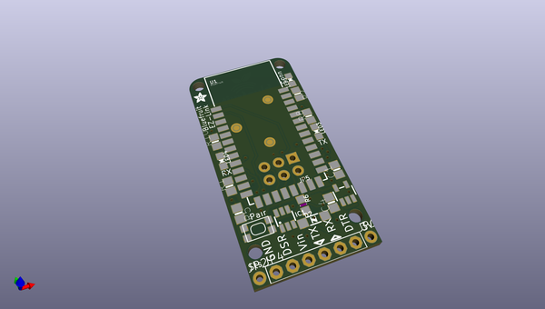

# adafruit_bluefruit_classic_pcbs
 
## summary 
* id: adafruit_adafruit_bluefruit_classic_pcbs_adafruit_ez_link_breakout
* user: adafruit
* name: adafruit_bluefruit_classic_pcbs
* board: adafruit_ez_link_breakout
* repo: https://github.com/adafruit/Adafruit-Bluefruit-Classic-PCBs

* src_file_repo_sch: 
*
 src_file_repo_sch_link: https://github.com/adafruit/Adafruit-Bluefruit-Classic-PCBs/tree/master/
* full details link: https://github.com/oomlout/oomlout_oomp_project_bot_v_2/tree/main/projects/adafruit_adafruit_bluefruit_classic_pcbs_adafruit_ez_link_breakout/current_version/working  

## schematic  
  
[schematic (pdf)](working_schematic.pdf)  

## pcb  
 
  
  
  
[board (pdf)](working.pdf)  

## working_bom
| Id | Designator | Footprint | Quantity | Designation | Supplier and ref |  | None | 
| --- | --- | --- | --- | --- | --- | --- | --- | 
| 1 | @HOLE2,@HOLE1,@HOLE3,@HOLE0 |  | 4 |  |  |  | [''] | 
| 2 | FID1,FID3,FID2 | FIDUCIAL_1MM | 3 | FIDUCIAL" |  |  | [''] | 
| 3 | JP1,JP2 | 1X01-CLEANBIG | 2 |  |  |  | [''] | 
| 4 | LED1 | CHIPLED_0805_NOOUTLINE | 1 | RED |  |  | [''] | 
| 5 | JP4 | 1X06-BIG | 1 |  |  |  | [''] | 
| 6 | LED3,LED4 | CHIPLED_0805_NOOUTLINE | 2 | Blue |  |  | [''] | 
| 7 | R2 | 0805-NO | 1 | 470 |  |  | [''] | 
| 8 | U1 | BLUETOOTH_MODULE | 1 | BlueFruit |  |  | [''] | 
| 9 | R1 | 0805-NO | 1 | 10K |  |  | [''] | 
| 10 | R5 | 0805-NO | 1 | 2.2K |  |  | [''] | 
| 11 | D2 | SOD-123 | 1 | MBR120 |  |  | [''] | 
| 12 | U2 | SOT23-5 | 1 | MIC5225-3.3 |  |  | [''] | 
| 13 | C1,C4 | 0805-NO | 2 | 10uF |  |  | [''] | 
| 14 | IC1 | SOT23-6 | 1 | 74LVC2G34DBVR |  |  | [''] | 
| 15 | R10,R8 | 0805-NO | 2 | 220 |  |  | [''] | 
| 16 | SW1 | KMR2 | 1 | SPST_TACT-KMR2 |  |  | [''] | 
| 17 | JP5 | 2X03_ROUND_70MIL | 1 |  |  |  | [''] | 
| 18 | R6 | _0805MP | 1 | 10K |  |  | [''] | 
| 19 | U$3 | ADAFRUIT_2.5MM | 1 |  |  |  | [''] | 
| 20 | U$4 | BLUEFRUITLOGO_100MM | 1 |  |  |  | [''] | 
| 21 | U$2 | ADAFRUIT_5MM | 1 |  |  |  | [''] | 
| 22 | VBAT0 | JST-PH-2-SMT-RA | 1 | JST-2PH |  |  | [''] | 
| 23 | SJ1 | SOLDERJUMPER_2WAY_OPEN_NOPASTE | 1 |  |  |  | [''] | 

## bom_schematic
| Ref | Qnty | Value | Cmp name | Footprint | Description | Vendor | DNP | 
| --- | --- | --- | --- | --- | --- | --- | --- | 
| C1, C4 | 2 | 10uF | CAP_CERAMIC0805-NOOUTLINE | working:0805-NO |  |  |  | 
| D2 | 1 | MBR120 | DIODESOD-123 | working:SOD-123 |  |  |  | 
| FID1, FID2, FID3 | 3 | FIDUCIAL"" | FIDUCIAL{dblquote}{dblquote} | working:FIDUCIAL_1MM |  |  |  | 
| IC1 | 1 | 74LVC2G34DBVR | 74LVC2G34DBVR | working:SOT23-6 |  |  |  | 
| JP1, JP2 | 2 | PINHD-1X1CB | PINHD-1X1CB | working:1X01-CLEANBIG |  |  |  | 
| JP4 | 1 | PINHD-1X6B | PINHD-1X6B | working:1X06-BIG |  |  |  | 
| JP5 | 1 | HEADER-2X3 | HEADER-2X3 | working:2X03_ROUND_70MIL |  |  |  | 
| LED1 | 1 | RED | LED0805_NOOUTLINE | working:CHIPLED_0805_NOOUTLINE |  |  |  | 
| LED3, LED4 | 2 | Blue | LED0805_NOOUTLINE | working:CHIPLED_0805_NOOUTLINE |  |  |  | 
| R1 | 1 | 10K | RESISTOR0805_NOOUTLINE | working:0805-NO |  |  |  | 
| R2 | 1 | 470 | RESISTOR0805_NOOUTLINE | working:0805-NO |  |  |  | 
| R5 | 1 | 2.2K | RESISTOR0805_NOOUTLINE | working:0805-NO |  |  |  | 
| R6 | 1 | 10K | RESISTOR_0805MP | working:_0805MP |  |  |  | 
| R8, R10 | 2 | 220 | RESISTOR0805_NOOUTLINE | working:0805-NO |  |  |  | 
| SJ1 | 1 | SOLDERJUMPER_2WAY | SOLDERJUMPER_2WAY | working:SOLDERJUMPER_2WAY_OPEN_NOPASTE |  |  |  | 
| SW1 | 1 | SPST_TACT-KMR2 | SPST_TACT-KMR2 | working:KMR2 |  |  |  | 
| U1 | 1 | BlueFruit | BLUETOOTH_MODULE | working:BLUETOOTH_MODULE |  |  |  | 
| U2 | 1 | MIC5225-3.3 | VREG_SOT23-5 | working:SOT23-5 |  |  |  | 
| VBAT0 | 1 | JST-2PH | JST_2PIN-SMT-RA | working:JST-PH-2-SMT-RA |  |  |  | 

