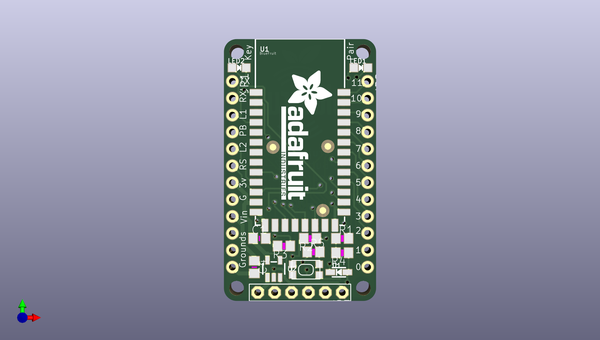

# adafruit_bluefruit_ez_key_pcb
 
## summary 
* id: adafruit_adafruit_bluefruit_ez_key_pcb_adafruit_bluefruit_ez_key
* user: adafruit
* name: adafruit_bluefruit_ez_key_pcb
* board: adafruit_bluefruit_ez_key
* repo: https://github.com/adafruit/Adafruit-Bluefruit-EZ-Key-PCB

* src_file_repo_sch: 
*
 src_file_repo_sch_link: https://github.com/adafruit/Adafruit-Bluefruit-EZ-Key-PCB/tree/master/
* full details link: https://github.com/oomlout/oomlout_oomp_project_bot_v_2/tree/main/projects/adafruit_adafruit_bluefruit_ez_key_pcb_adafruit_bluefruit_ez_key/current_version/working  

## schematic  
  
[schematic (pdf)](working_schematic.pdf)  

## pcb  
 
  
  
  
[board (pdf)](working.pdf)  

## working_bom
| Id | Designator | Footprint | Quantity | Designation | Supplier and ref |  | None | 
| --- | --- | --- | --- | --- | --- | --- | --- | 
| 1 | LED1 | CHIPLED_0805_NOOUTLINE | 1 | RED |  |  | [''] | 
| 2 | R3,R2 | R0805 | 2 | 1K |  |  | [''] | 
| 3 | JP3 | 1X06-BIG | 1 |  |  |  | [''] | 
| 4 | C4,C1 | C0805 | 2 | 10uF |  |  | [''] | 
| 5 | JP1,JP2 | 1X12-CB | 2 |  |  |  | [''] | 
| 6 | U2 | SOT23-5 | 1 | MIC5225 |  |  | [''] | 
| 7 | @HOLE2,@HOLE0,@HOLE1,@HOLE3 |  | 4 |  |  |  | [''] | 
| 8 | R4,R1 | R0805 | 2 | 10K |  |  | [''] | 
| 9 | SW1 | KMR2 | 1 | SPST_TACT-KMR2 |  |  | [''] | 
| 10 | R5 | R0805 | 1 | 2.2K |  |  | [''] | 
| 11 | D1 | SOD-323 | 1 | 1N4148 |  |  | [''] | 
| 12 | FID1,FID2,FID3 | FIDUCIAL_1MM | 3 | FIDUCIAL" |  |  | [''] | 
| 13 | LED2 | CHIPLED_0805_NOOUTLINE | 1 | GREEN |  |  | [''] | 
| 14 | U$4 | ADAFRUIT_TEXT_20MM | 1 |  |  |  | [''] | 
| 15 | U1 | BLUETOOTH_MODULE | 1 | BlueFruit |  |  | [''] | 
| 16 | U$3 | ADAFRUIT_3.5MM | 1 |  |  |  | [''] | 
| 17 | U$2 | BLUEFRUITLOGO_150MM | 1 |  |  |  | [''] | 

## bom_schematic
| Ref | Qnty | Value | Cmp name | Footprint | Description | Vendor | DNP | 
| --- | --- | --- | --- | --- | --- | --- | --- | 
| C1, C4 | 2 | 10uF | C-USC0805 | working:C0805 |  |  |  | 
| D1 | 1 | 1N4148 | DIODESOD-323 | working:SOD-323 |  |  |  | 
| FID1, FID2, FID3 | 3 | FIDUCIAL"" | FIDUCIAL{dblquote}{dblquote} | working:FIDUCIAL_1MM |  |  |  | 
| JP1, JP2 | 2 | PINHD-1X12-CB | PINHD-1X12-CB | working:1X12-CB |  |  |  | 
| JP3 | 1 | PINHD-1X6B | PINHD-1X6B | working:1X06-BIG |  |  |  | 
| LED1 | 1 | RED | LED0805_NOOUTLINE | working:CHIPLED_0805_NOOUTLINE |  |  |  | 
| LED2 | 1 | GREEN | LED0805_NOOUTLINE | working:CHIPLED_0805_NOOUTLINE |  |  |  | 
| R1, R4 | 2 | 10K | R-US_R0805 | working:R0805 |  |  |  | 
| R2, R3 | 2 | 1K | R-US_R0805 | working:R0805 |  |  |  | 
| R5 | 1 | 2.2K | R-US_R0805 | working:R0805 |  |  |  | 
| SW1 | 1 | SPST_TACT-KMR2 | SPST_TACT-KMR2 | working:KMR2 |  |  |  | 
| U1 | 1 | BlueFruit | BLUETOOTH_MODULE | working:BLUETOOTH_MODULE |  |  |  | 
| U2 | 1 | MIC5225 | VREG_SOT23-5 | working:SOT23-5 |  |  |  | 

