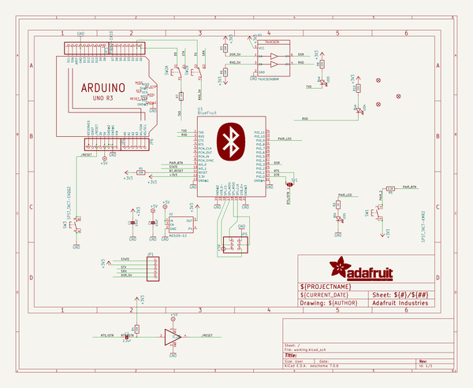
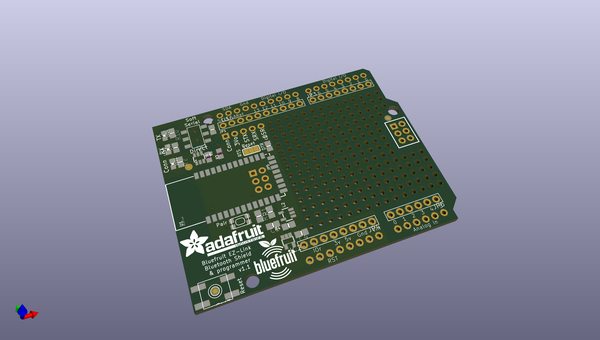
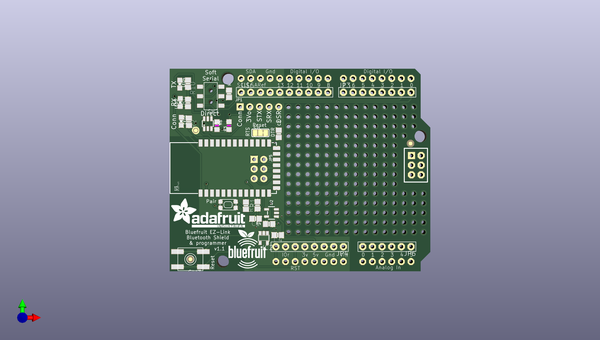
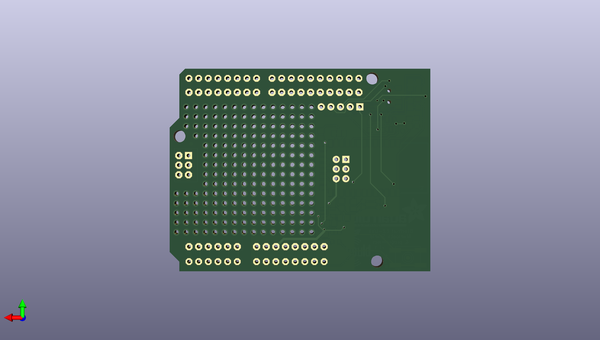

# adafruit_bluefruit_ez_link_shield_pcb
 
## summary 
* id: adafruit_adafruit_bluefruit_ez_link_shield_pcb_adafruit_ez_link_shield
* user: adafruit
* name: adafruit_bluefruit_ez_link_shield_pcb
* board: adafruit_ez_link_shield
* repo: https://github.com/adafruit/Adafruit-Bluefruit-EZ-Link-Shield-PCB

* src_file_repo_sch: 
*
 src_file_repo_sch_link: https://github.com/adafruit/Adafruit-Bluefruit-EZ-Link-Shield-PCB/tree/master/
* full details link: https://github.com/oomlout/oomlout_oomp_project_bot_v_2/tree/main/projects/adafruit_adafruit_bluefruit_ez_link_shield_pcb_adafruit_ez_link_shield/current_version/working  

## schematic  
  
[schematic (pdf)](working_schematic.pdf)  

## pcb  
 
  
  
  
[board (pdf)](working.pdf)  

## working_bom
| Id | Designator | Footprint | Quantity | Designation | Supplier and ref |  | None | 
| --- | --- | --- | --- | --- | --- | --- | --- | 
| 1 | IC2 | SOT23-5 | 1 | 74AHC1G07DBV |  |  | [''] | 
| 2 | U2 | SOT23-5 | 1 | MIC5225-3.3 |  |  | [''] | 
| 3 | JP4,JP3 | 1X08-BIG | 2 |  |  |  | [''] | 
| 4 | R8,R10 | 0805-NO | 2 | 220 |  |  | [''] | 
| 5 | @HOLE0,@HOLE2,@HOLE1 |  | 3 |  |  |  | [''] | 
| 6 | C2 | 0805-NO | 1 | 2.2uF |  |  | [''] | 
| 7 | U$6 | 1X10-BIG | 1 | PINHD-1X10 |  |  | [''] | 
| 8 | R1,R4 | 0805-NO | 2 | 10K |  |  | [''] | 
| 9 | SW3 | EVQ-Q2 | 1 | SPST_TACT-EVQQ2 |  |  | [''] | 
| 10 | SW2 | EG1390 | 1 |  |  |  | [''] | 
| 11 | U$7 | ADAFRUIT_TEXT_20MM | 1 |  |  |  | [''] | 
| 12 | LED3,LED4 | CHIPLED_0805_NOOUTLINE | 2 | Blue |  |  | [''] | 
| 13 | IC1 | SOT23-6 | 1 | 74LVC2G34DBVR |  |  | [''] | 
| 14 | C1,C4 | 0805-NO | 2 | 10uF |  |  | [''] | 
| 15 | R6,R3 | _0805MP | 2 | 10K |  |  | [''] | 
| 16 | FID2,FID1,FID3 | FIDUCIAL_1MM | 3 | FIDUCIAL" |  |  | [''] | 
| 17 | SJ1 | SOLDERJUMPER_2WAY_OPEN_NOPASTE | 1 |  |  |  | [''] | 
| 18 | JP6 | 1X06-BIG | 1 |  |  |  | [''] | 
| 19 | LED1 | CHIPLED_0805_NOOUTLINE | 1 | RED |  |  | [''] | 
| 20 | R7 | 0805-NO | 1 | 47 ohm |  |  | [''] | 
| 21 | R5 | 0805-NO | 1 | 2.2K |  |  | [''] | 
| 22 | U$5 | ARDUINOR3_ICSP | 1 | ARDUINO_R3_ICSP |  |  | [''] | 
| 23 | U$4 | BLUEFRUITLOGO_100MM | 1 |  |  |  | [''] | 
| 24 | U1 | BLUETOOTH_MODULE | 1 | BlueFruit |  |  | [''] | 
| 25 | R2 | 0805-NO | 1 | 1K |  |  | [''] | 
| 26 | JP5 | 2X03_ROUND_70MIL | 1 |  |  |  | [''] | 
| 27 | JP1 | 1X05_ROUND_70 | 1 |  |  |  | [''] | 
| 28 | SW1 | KMR2 | 1 | SPST_TACT-KMR2 |  |  | [''] | 

## bom_schematic
| Ref | Qnty | Value | Cmp name | Footprint | Description | Vendor | DNP | 
| --- | --- | --- | --- | --- | --- | --- | --- | 
| C1, C4 | 2 | 10uF | CAP_CERAMIC0805-NOOUTLINE | working:0805-NO |  |  |  | 
| C2 | 1 | 2.2uF | CAP_CERAMIC0805-NOOUTLINE | working:0805-NO |  |  |  | 
| FID1, FID2, FID3 | 3 | FIDUCIAL"" | FIDUCIAL{dblquote}{dblquote} | working:FIDUCIAL_1MM |  |  |  | 
| IC1 | 1 | 74LVC2G34DBVR | 74LVC2G34DBVR | working:SOT23-6 |  |  |  | 
| IC2 | 1 | 741G07DBV | 741G07DBV | working:SOT23-5 |  |  |  | 
| JP1 | 1 | HEADER-1X570MIL | HEADER-1X570MIL | working:1X05_ROUND_70 |  |  |  | 
| JP3, JP4 | 2 | PINHD-1X8BIG | PINHD-1X8BIG | working:1X08-BIG |  |  |  | 
| JP5 | 1 | HEADER-2X3 | HEADER-2X3 | working:2X03_ROUND_70MIL |  |  |  | 
| JP6 | 1 | PINHD-1X6B | PINHD-1X6B | working:1X06-BIG |  |  |  | 
| LED1 | 1 | RED | LED0805_NOOUTLINE | working:CHIPLED_0805_NOOUTLINE |  |  |  | 
| LED3, LED4 | 2 | Blue | LED0805_NOOUTLINE | working:CHIPLED_0805_NOOUTLINE |  |  |  | 
| R1, R4 | 2 | 10K | RESISTOR0805_NOOUTLINE | working:0805-NO |  |  |  | 
| R2 | 1 | 1K | RESISTOR0805_NOOUTLINE | working:0805-NO |  |  |  | 
| R3, R6 | 2 | 10K | RESISTOR_0805MP | working:_0805MP |  |  |  | 
| R5 | 1 | 2.2K | RESISTOR0805_NOOUTLINE | working:0805-NO |  |  |  | 
| R7 | 1 | 47 ohm | RESISTOR0805_NOOUTLINE | working:0805-NO |  |  |  | 
| R8, R10 | 2 | 220 | RESISTOR0805_NOOUTLINE | working:0805-NO |  |  |  | 
| SJ1 | 1 | SOLDERJUMPER_2WAY | SOLDERJUMPER_2WAY | working:SOLDERJUMPER_2WAY_OPEN_NOPASTE |  |  |  | 
| SW1 | 1 | SPST_TACT-KMR2 | SPST_TACT-KMR2 | working:KMR2 |  |  |  | 
| SW2 | 1 | DPDT-EG1390 | DPDT-EG1390 | working:EG1390 |  |  |  | 
| SW3 | 1 | SPST_TACT-EVQQ2 | SPST_TACT-EVQQ2 | working:EVQ-Q2 |  |  |  | 
| U1 | 1 | BlueFruit | BLUETOOTH_MODULE | working:BLUETOOTH_MODULE |  |  |  | 
| U2 | 1 | MIC5225-3.3 | VREG_SOT23-5 | working:SOT23-5 |  |  |  | 
| U$5 | 1 | ARDUINO_R3_ICSP | ARDUINO_R3_ICSP | working:ARDUINOR3_ICSP |  |  |  | 
| U$6 | 1 | PINHD-1X10 | PINHD-1X10 | working:1X10-BIG |  |  |  | 

