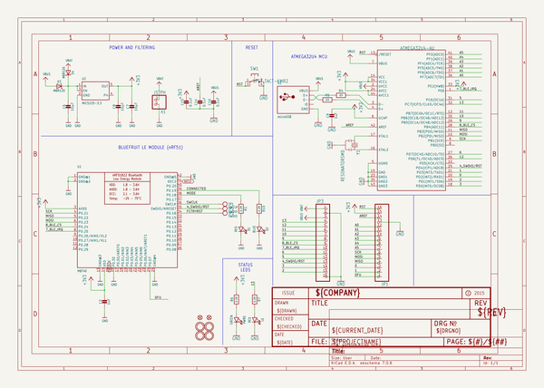
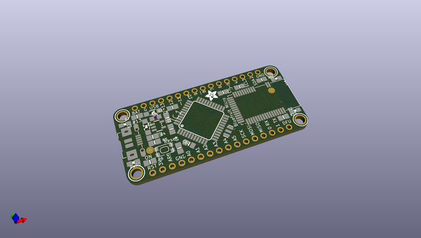
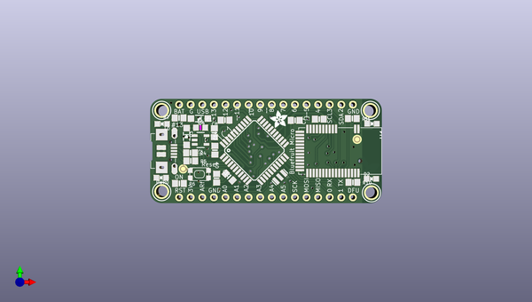
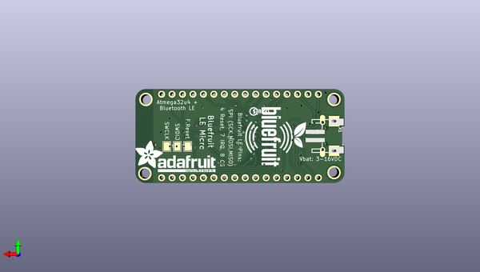

# adafruit_bluefruit_le_micro_pcb
 
## summary 
* id: adafruit_adafruit_bluefruit_le_micro_pcb_adafruit_bluefruit_le_micro_rev_b
* user: adafruit
* name: adafruit_bluefruit_le_micro_pcb
* board: adafruit_bluefruit_le_micro_rev_b
* repo: https://github.com/adafruit/Adafruit-Bluefruit-LE-Micro-PCB

* src_file_repo_sch: 
*
 src_file_repo_sch_link: https://github.com/adafruit/Adafruit-Bluefruit-LE-Micro-PCB/tree/master/
* full details link: https://github.com/oomlout/oomlout_oomp_project_bot_v_2/tree/main/projects/adafruit_adafruit_bluefruit_le_micro_pcb_adafruit_bluefruit_le_micro_rev_b/current_version/working  

## schematic  
  
[schematic (pdf)](working_schematic.pdf)  

## pcb  
 
  
  
  
[board (pdf)](working.pdf)  

## working_bom
| Id | Designator | Footprint | Quantity | Designation | Supplier and ref |  | None | 
| --- | --- | --- | --- | --- | --- | --- | --- | 
| 1 | D3,D4 | SOD-123 | 2 | MBR120 |  |  | [''] | 
| 2 | C2,C9 | 0805-NO | 2 | 1uF |  |  | [''] | 
| 3 | R1,R10,R6,R7 | 0805-NO | 4 | 2.2K |  |  | [''] | 
| 4 | C15,C14 | 0805-NO | 2 | 0.1uF |  |  | [''] | 
| 5 | R5,R4 | 0805-NO | 2 | 22 |  |  | [''] | 
| 6 | PWR0 | CHIPLED_0805_NOOUTLINE | 1 | GREEN |  |  | [''] | 
| 7 | L0,D1 | CHIPLED_0805_NOOUTLINE | 2 | RED |  |  | [''] | 
| 8 | U$31,U$24,U$6,U$32 | MOUNTINGHOLE_2.5_PLATED | 4 | MOUNTINGHOLE2.5 |  |  | [''] | 
| 9 | D2 | CHIPLED_0805_NOOUTLINE | 1 | BLUE |  |  | [''] | 
| 10 | U1 | BLE_MODULE_RAYTAC_MDBT40 | 1 | MBT40 |  |  | [''] | 
| 11 | Y1 | RESONATOR-SMD | 1 | 8MHz |  |  | [''] | 
| 12 | SW1 | KMR2 | 1 | SPST_TACT-KMR2 |  |  | [''] | 
| 13 | U$35,U$34 | FIDUCIAL_1MM | 2 | FIDUCIAL" |  |  | [''] | 
| 14 | IC1 | TQFP44 | 1 | ATMEGA32U4-AU |  |  | [''] | 
| 15 | JP3,JP1 | 1X16_ROUND | 2 |  |  |  | [''] | 
| 16 | C8,C7 | 0805-NO | 2 | 10µF |  |  | [''] | 
| 17 | U$7 | ADAFRUIT_3.5MM | 1 |  |  |  | [''] | 
| 18 | C10 | 0805_10MGAP | 1 | 0.1uF |  |  | [''] | 
| 19 | U2 | SOT23-5 | 1 | MIC5225-3.3 |  |  | [''] | 
| 20 | X3 | 4UCONN_20329 | 1 | microUSB |  |  | [''] | 
| 21 | C6 | _0805MP | 1 | 10µF |  |  | [''] | 
| 22 | X1 | JSTPH2 | 1 | JSTPH |  |  | [''] | 
| 23 | U$15 | BLUEFRUITLOGO_150MM | 1 |  |  |  | [''] | 
| 24 | TP3,TP2 | PAD-1.5X2.0 | 2 | SWDIO |  |  | [''] | 
| 25 | U$9 | ADAFRUIT_TEXT_20MM | 1 |  |  |  | [''] | 
| 26 | U$23 | PCBFEAT-REV-040 | 1 |  |  |  | [''] | 
| 27 | TP1 | PAD-1.5X2.0 | 1 | SWCLK |  |  | [''] | 

## bom_schematic
| Ref | Qnty | Value | Cmp name | Footprint | Description | Vendor | DNP | 
| --- | --- | --- | --- | --- | --- | --- | --- | 
| C2, C9 | 2 | 1uF | CAP_CERAMIC0805-NOOUTLINE | working:0805-NO |  |  |  | 
| C6 | 1 | 10µF | CAP_CERAMIC_0805MP | working:_0805MP |  |  |  | 
| C7, C8 | 2 | 10µF | CAP_CERAMIC0805-NOOUTLINE | working:0805-NO |  |  |  | 
| C10 | 1 | 0.1uF | CAP_CERAMIC0805_10MGAP | working:0805_10MGAP |  |  |  | 
| C14, C15 | 2 | 0.1uF | CAP_CERAMIC0805-NOOUTLINE | working:0805-NO |  |  |  | 
| D1 | 1 | RED | LED0805_NOOUTLINE | working:CHIPLED_0805_NOOUTLINE |  |  |  | 
| D2 | 1 | BLUE | LED0805_NOOUTLINE | working:CHIPLED_0805_NOOUTLINE |  |  |  | 
| D3, D4 | 2 | MBR120 | DIODE-SCHOTTKYSOD-123 | working:SOD-123 |  |  |  | 
| IC1 | 1 | ATMEGA32U4-AU | ATMEGA32U4-AU | working:TQFP44 |  |  |  | 
| JP1, JP3 | 2 | HEADER-1X16ROUND | HEADER-1X16ROUND | working:1X16_ROUND |  |  |  | 
| L0 | 1 | RED | LED0805_NOOUTLINE | working:CHIPLED_0805_NOOUTLINE |  |  |  | 
| PWR0 | 1 | GREEN | LED0805_NOOUTLINE | working:CHIPLED_0805_NOOUTLINE |  |  |  | 
| R1, R6, R7, R10 | 4 | 2.2K | RESISTOR0805_NOOUTLINE | working:0805-NO |  |  |  | 
| R4, R5 | 2 | 22 | RESISTOR0805_NOOUTLINE | working:0805-NO |  |  |  | 
| SW1 | 1 | SPST_TACT-KMR2 | SPST_TACT-KMR2 | working:KMR2 |  |  |  | 
| TP1 | 1 | SWCLK | TESTPOINT1.5X2.0MM_NOCREAM | working:PAD-1.5X2.0 |  |  |  | 
| TP2, TP3 | 2 | SWDIO | TESTPOINT1.5X2.0MM_NOCREAM | working:PAD-1.5X2.0 |  |  |  | 
| U1 | 1 | MBT40 | NRF51822_MODULE_MDBT40 | working:BLE_MODULE_RAYTAC_MDBT40 |  |  |  | 
| U2 | 1 | MIC5225-3.3 | VREG_SOT23-5 | working:SOT23-5 |  |  |  | 
| U$6, U$24, U$31, U$32 | 4 | MOUNTINGHOLE2.5 | MOUNTINGHOLE2.5 | working:MOUNTINGHOLE_2.5_PLATED |  |  |  | 
| U$34, U$35 | 2 | FIDUCIAL"" | FIDUCIAL{dblquote}{dblquote} | working:FIDUCIAL_1MM |  |  |  | 
| X1 | 1 | JSTPH | CON_JST_PH_2PIN | working:JSTPH2 |  |  |  | 
| X3 | 1 | microUSB | USBMICRO_20329 | working:4UCONN_20329 |  |  |  | 
| Y1 | 1 | RESONATORSMD | RESONATORSMD | working:RESONATOR-SMD |  |  |  | 

## mounting_holes
| x | y | package | value | ref | size | 
| --- | --- | --- | --- | --- | --- | 
| 45.72 | 18.033999999999992 | MOUNTINGHOLE_2.5_PLATED | MOUNTINGHOLE2.5 | U$6 | m3 | 
| 45.97400000000002 | 0.0 | MOUNTINGHOLE_2.5_PLATED | MOUNTINGHOLE2.5 | U$24 | m3 | 
| 0.0 | 18.033999999999992 | MOUNTINGHOLE_2.5_PLATED | MOUNTINGHOLE2.5 | U$31 | m3 | 
| 0.0 | 0.2539999999999907 | MOUNTINGHOLE_2.5_PLATED | MOUNTINGHOLE2.5 | U$32 | m3 | 

