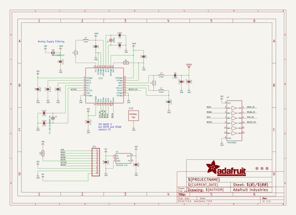
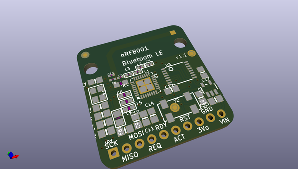
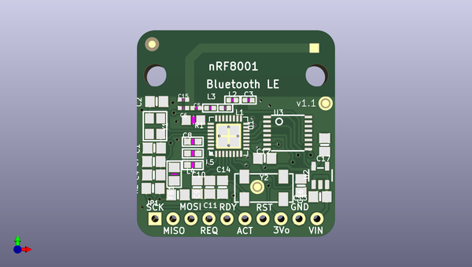
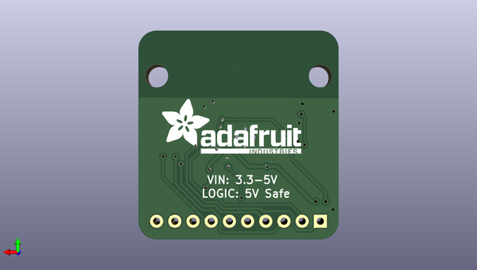

# adafruit_bluefruit_le_nrf8001_pcb
 
## summary 
* id: adafruit_adafruit_bluefruit_le_nrf8001_pcb_adafruit_bluefruit_le_nrf8001_v2
* user: adafruit
* name: adafruit_bluefruit_le_nrf8001_pcb
* board: adafruit_bluefruit_le_nrf8001_v2
* repo: https://github.com/adafruit/Adafruit-Bluefruit-LE-nRF8001-PCB

* src_file_repo_sch: 
*
 src_file_repo_sch_link: https://github.com/adafruit/Adafruit-Bluefruit-LE-nRF8001-PCB/tree/master/
* full details link: https://github.com/oomlout/oomlout_oomp_project_bot_v_2/tree/main/projects/adafruit_adafruit_bluefruit_le_nrf8001_pcb_adafruit_bluefruit_le_nrf8001_v2/current_version/working  

## schematic  
  
[schematic (pdf)](working_schematic.pdf)  

## pcb  
 
  
  
  
[board (pdf)](working.pdf)  

## working_bom
| Id | Designator | Footprint | Quantity | Designation | Supplier and ref |  | None | 
| --- | --- | --- | --- | --- | --- | --- | --- | 
| 1 | U$28 | ANT_PCB_2.4GHZ_NRF8001_1.6MM_1OZ | 1 |  |  |  | [''] | 
| 2 | U3 | TSSOP16 | 1 | 74HC4050D |  |  | [''] | 
| 3 | C4,C12 | 0805-NO | 2 | 0.1µF |  |  | [''] | 
| 4 | L3 | _0402 | 1 | 3.9nH |  |  | [''] | 
| 5 | C9,C16,C17 | 0805-NO | 3 | 10µF |  |  | [''] | 
| 6 | FID1,FID3,FID2 | FIDUCIAL_1MM | 3 | FIDUCIAL" |  |  | [''] | 
| 7 | C11 | 0805-NO | 1 | 33nF |  |  | [''] | 
| 8 | L1 | _0402 | 1 | 8.2nH |  |  | [''] | 
| 9 | C6 | _0402MP | 1 | 1.2pF |  |  | [''] | 
| 10 | C7 | 0805-NO | 1 | 1µF |  |  | [''] | 
| 11 | C10 | 0805-NO | 1 | 0.1uF |  |  | [''] | 
| 12 | C3 | _0402 | 1 | 2.2nF |  |  | [''] | 
| 13 | R2 | 0805-NO | 1 | 10K |  |  | [''] | 
| 14 | C1,C14,C2,C13 | 0805-NO | 4 | 15pF |  |  | [''] | 
| 15 | L4 | _0603 | 1 | 10µH |  |  | [''] | 
| 16 | JP1 | 1X10_ROUND70 | 1 |  |  |  | [''] | 
| 17 | R1 | _0805MP | 1 | 22K |  |  | [''] | 
| 18 | FB1 | 0805 | 1 | MMZ1608B121C |  |  | [''] | 
| 19 | L5 | _0603 | 1 | 15nH |  |  | [''] | 
| 20 | Y1 | CRYSTAL_3.2X2.5 | 1 | 16MHz |  |  | [''] | 
| 21 | C8 | _0603 | 1 | 1nF |  |  | [''] | 
| 22 | L2 | _0402 | 1 | 5.6nH |  |  | [''] | 
| 23 | Y2 | CRYSTAL_8X3.8 | 1 | FC-255 32.7680K-A3 |  |  | [''] | 
| 24 | U1 | QFN32_5MM | 1 | nRF8001 |  |  | [''] | 
| 25 | U2 | SOT23-5 | 1 | MIC5225-3.3v |  |  | [''] | 
| 26 | C5 | _0402MP | 1 | 1.8pF |  |  | [''] | 
| 27 | C15 | _0402MP | 1 | 1.5pF |  |  | [''] | 
| 28 | @HOLE1,@HOLE0 |  | 2 |  |  |  | [''] | 
| 29 | U$22 | ADAFRUIT_TEXT_20MM | 1 |  |  |  | [''] | 

## bom_schematic
| Ref | Qnty | Value | Cmp name | Footprint | Description | Vendor | DNP | 
| --- | --- | --- | --- | --- | --- | --- | --- | 
| C1, C2, C13, C14 | 4 | 15pF | CAP_CERAMIC0805-NOOUTLINE | working:0805-NO |  |  |  | 
| C3 | 1 | 2.2nF | CAP_CERAMIC_0402 | working:_0402 |  |  |  | 
| C4, C12 | 2 | 0.1µF | CAP_CERAMIC0805-NOOUTLINE | working:0805-NO |  |  |  | 
| C5 | 1 | 1.8pF | CAP_CERAMIC_0402MP | working:_0402MP |  |  |  | 
| C6 | 1 | 1.2pF | CAP_CERAMIC_0402MP | working:_0402MP |  |  |  | 
| C7 | 1 | 1µF | CAP_CERAMIC0805-NOOUTLINE | working:0805-NO |  |  |  | 
| C8 | 1 | 1nF | CAP_CERAMIC_0603 | working:_0603 |  |  |  | 
| C9, C16, C17 | 3 | 10µF | CAP_CERAMIC0805-NOOUTLINE | working:0805-NO |  |  |  | 
| C10 | 1 | 0.1uF | CAP_CERAMIC0805-NOOUTLINE | working:0805-NO |  |  |  | 
| C11 | 1 | 33nF | CAP_CERAMIC0805-NOOUTLINE | working:0805-NO |  |  |  | 
| C15 | 1 | 1.5pF | CAP_CERAMIC_0402MP | working:_0402MP |  |  |  | 
| FB1 | 1 | MMZ1608B121C | FERRITE0805 | working:0805 |  |  |  | 
| FID1, FID2, FID3 | 3 | FIDUCIAL"" | FIDUCIAL{dblquote}{dblquote} | working:FIDUCIAL_1MM |  |  |  | 
| JP1 | 1 | HEADER-1X1070MIL | HEADER-1X1070MIL | working:1X10_ROUND70 |  |  |  | 
| L1 | 1 | 8.2nH | INDUCTOR_0402 | working:_0402 |  |  |  | 
| L2 | 1 | 5.6nH | INDUCTOR_0402 | working:_0402 |  |  |  | 
| L3 | 1 | 3.9nH | INDUCTOR_0402 | working:_0402 |  |  |  | 
| L4 | 1 | 10µH | INDUCTOR_0603 | working:_0603 |  |  |  | 
| L5 | 1 | 15nH | INDUCTOR_0603 | working:_0603 |  |  |  | 
| R1 | 1 | 22K | RESISTOR_0805MP | working:_0805MP |  |  |  | 
| R2 | 1 | 10K | RESISTOR0805_NOOUTLINE | working:0805-NO |  |  |  | 
| U1 | 1 | nRF8001 | NRF8001 | working:QFN32_5MM |  |  |  | 
| U2 | 1 | MIC5225-3.3v | VREG_SOT23-5 | working:SOT23-5 |  |  |  | 
| U3 | 1 | 74HC4050D | 74HC4050DTSSOP | working:TSSOP16 |  |  |  | 
| U$28 | 1 | ANTENNA_PCBNRF8001_1.6MM | ANTENNA_PCBNRF8001_1.6MM | working:ANT_PCB_2.4GHZ_NRF8001_1.6MM_1OZ |  |  |  | 
| Y1 | 1 | 16MHz | CRYSTAL3.2X2.5 | working:CRYSTAL_3.2X2.5 |  |  |  | 
| Y2 | 1 | FC-255 32.7680K-A3 | CRYSTAL8.0X3.8 | working:CRYSTAL_8X3.8 |  |  |  | 

