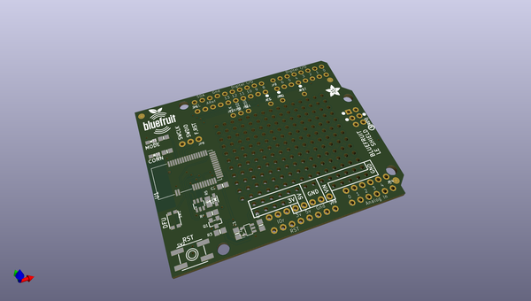
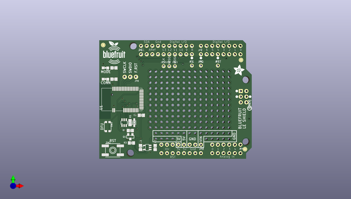
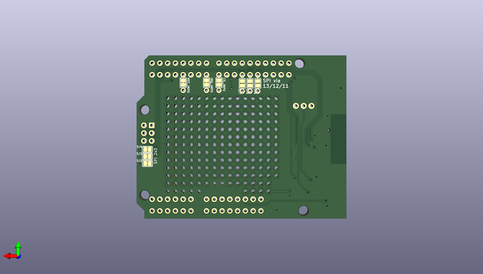

# adafruit_bluefruit_le_shield_pcb
 
## summary 
* id: adafruit_adafruit_bluefruit_le_shield_pcb_adafruit_bluefruit_le_shield
* user: adafruit
* name: adafruit_bluefruit_le_shield_pcb
* board: adafruit_bluefruit_le_shield
* repo: https://github.com/adafruit/Adafruit-Bluefruit-LE-Shield-PCB

* src_file_repo_sch: 
*
 src_file_repo_sch_link: https://github.com/adafruit/Adafruit-Bluefruit-LE-Shield-PCB/tree/master/
* full details link: https://github.com/oomlout/oomlout_oomp_project_bot_v_2/tree/main/projects/adafruit_adafruit_bluefruit_le_shield_pcb_adafruit_bluefruit_le_shield/current_version/working  

## schematic  
  
[schematic (pdf)](working_schematic.pdf)  

## pcb  
 
  
  
  
[board (pdf)](working.pdf)  

## working_bom
| Id | Designator | Footprint | Quantity | Designation | Supplier and ref |  | None | 
| --- | --- | --- | --- | --- | --- | --- | --- | 
| 1 | @HOLE1,@HOLE0,@HOLE2,@HOLE3 |  | 4 |  |  |  | [''] | 
| 2 | SW1 | BTN_KMR2_4.6X2.8 | 1 | KMR2 |  |  | [''] | 
| 3 | IC1 | SOT23-6 | 1 | 74LVC2G34DBVR |  |  | [''] | 
| 4 | U$8 | BLUEFRUITLOGO_100MM | 1 |  |  |  | [''] | 
| 5 | R3,R4,R5 | 0805-NO | 3 | 100K |  |  | [''] | 
| 6 | SW2 | EVQ-Q2 | 1 | Tactile |  |  | [''] | 
| 7 | IC4 | SOT23-5L | 1 | MIC5225-3.3 |  |  | [''] | 
| 8 | JP7,JP9,JP10,JP1,JP6,JP11 | 1X01_ROUND | 6 |  |  |  | [''] | 
| 9 | C3,C1 | 0805-NO | 2 | 10uF |  |  | [''] | 
| 10 | M1 | ARDUINOR3_ICSP_NODIM | 1 | ARDUINO_R3_ICSP_NODIM |  |  | [''] | 
| 11 | R1,R10 | 0805-NO | 2 | 2K |  |  | [''] | 
| 12 | JP8 | 1X03_ROUND_76 | 1 | SWDIO |  |  | [''] | 
| 13 | FID1,FID2,FID3 | FIDUCIAL_1MM | 3 | FIDUCIAL" |  |  | [''] | 
| 14 | U$21 | PCBFEAT-REV-040 | 1 |  |  |  | [''] | 
| 15 | U1 | BLE_MODULE_RAYTAC_MDBT40 | 1 | MBT40 |  |  | [''] | 
| 16 | U$9 | ADAFRUIT_5MM | 1 |  |  |  | [''] | 
| 17 | D3 | SOD-323 | 1 | 1N4148 |  |  | [''] | 
| 18 | JP4 | 1X06_ROUND_70 | 1 |  |  |  | [''] | 
| 19 | C2 | 0805-NO | 1 | 1.0uF |  |  | [''] | 
| 20 | JP5 | 1X10_ROUND70 | 1 |  |  |  | [''] | 
| 21 | Q1 | SOT23-WIDE | 1 | BSS138 |  |  | [''] | 
| 22 | JP2,JP3 | 1X08_ROUND_70 | 2 |  |  |  | [''] | 
| 23 | D2 | CHIPLED_0805_NOOUTLINE | 1 | BLUE |  |  | [''] | 
| 24 | D1 | CHIPLED_0805_NOOUTLINE | 1 | RED |  |  | [''] | 
| 25 | CS_JMP0,IRQ_JMP0,RST_JMP0 | SOLDERJUMPER_CLOSEDWIRE | 3 |  |  |  | [''] | 
| 26 | SJ6 | SOLDERJUMPER_REFLOW_NOPASTE | 1 | D13_SCLK |  |  | [''] | 
| 27 | SJ7 | SOLDERJUMPER_REFLOW_NOPASTE | 1 | D11_MOSI |  |  | [''] | 
| 28 | SJ5 | SOLDERJUMPER_REFLOW_NOPASTE | 1 | D12_MISO |  |  | [''] | 
| 29 | SJ2 | SOLDERJUMPER_CLOSEDWIRE | 1 | ICSP_MISO |  |  | [''] | 
| 30 | SJ3 | SOLDERJUMPER_CLOSEDWIRE | 1 | ISCP_SCLK |  |  | [''] | 
| 31 | SJ4 | SOLDERJUMPER_CLOSEDWIRE | 1 | ICSP_MOSI |  |  | [''] | 

## bom_schematic
| Ref | Qnty | Value | Cmp name | Footprint | Description | Vendor | DNP | 
| --- | --- | --- | --- | --- | --- | --- | --- | 
| C1, C3 | 2 | 10uF | CAP_CERAMIC0805-NOOUTLINE | working:0805-NO |  |  |  | 
| C2 | 1 | 1.0uF | CAP_CERAMIC0805-NOOUTLINE | working:0805-NO |  |  |  | 
| CS_JMP0 | 1 | SOLDERJUMPERCLOSED | SOLDERJUMPERCLOSED | working:SOLDERJUMPER_CLOSEDWIRE |  |  |  | 
| D1 | 1 | RED | LED0805_NOOUTLINE | working:CHIPLED_0805_NOOUTLINE |  |  |  | 
| D2 | 1 | BLUE | LED0805_NOOUTLINE | working:CHIPLED_0805_NOOUTLINE |  |  |  | 
| D3 | 1 | 1N4148 | DIODESOD-323 | working:SOD-323 |  |  |  | 
| FID1, FID2, FID3 | 3 | FIDUCIAL"" | FIDUCIAL{dblquote}{dblquote} | working:FIDUCIAL_1MM |  |  |  | 
| IC1 | 1 | 74LVC2G34DBVR | 74LVC2G34DBVR | working:SOT23-6 |  |  |  | 
| IC4 | 1 | LP298XS | LP298XS | working:SOT23-5L |  |  |  | 
| IRQ_JMP0 | 1 | SOLDERJUMPERCLOSED | SOLDERJUMPERCLOSED | working:SOLDERJUMPER_CLOSEDWIRE |  |  |  | 
| JP1, JP6, JP7, JP9, JP10, JP11 | 6 | HEADER-1X1ROUND | HEADER-1X1ROUND | working:1X01_ROUND |  |  |  | 
| JP2, JP3 | 2 | HEADER-1X870MIL | HEADER-1X870MIL | working:1X08_ROUND_70 |  |  |  | 
| JP4 | 1 | HEADER-1X670MIL | HEADER-1X670MIL | working:1X06_ROUND_70 |  |  |  | 
| JP5 | 1 | HEADER-1X1070MIL | HEADER-1X1070MIL | working:1X10_ROUND70 |  |  |  | 
| JP8 | 1 | SWDIO | HEADER-1X376MIL | working:1X03_ROUND_76 |  |  |  | 
| M1 | 1 | ARDUINO_R3_ICSP_NODIM | ARDUINO_R3_ICSP_NODIM | working:ARDUINOR3_ICSP_NODIM |  |  |  | 
| Q1 | 1 | BSS138 | MOSFET-NWIDE | working:SOT23-WIDE |  |  |  | 
| R1, R10 | 2 | 2K | RESISTOR0805_NOOUTLINE | working:0805-NO |  |  |  | 
| R3, R4, R5 | 3 | 100K | RESISTOR0805_NOOUTLINE | working:0805-NO |  |  |  | 
| RST_JMP0 | 1 | SOLDERJUMPERCLOSED | SOLDERJUMPERCLOSED | working:SOLDERJUMPER_CLOSEDWIRE |  |  |  | 
| SJ2 | 1 | ICSP_MISO | SOLDERJUMPERCLOSED | working:SOLDERJUMPER_CLOSEDWIRE |  |  |  | 
| SJ3 | 1 | ISCP_SCLK | SOLDERJUMPERCLOSED | working:SOLDERJUMPER_CLOSEDWIRE |  |  |  | 
| SJ4 | 1 | ICSP_MOSI | SOLDERJUMPERCLOSED | working:SOLDERJUMPER_CLOSEDWIRE |  |  |  | 
| SJ5 | 1 | D12_MISO | SOLDERJUMPERREFLOW_NOPASTE | working:SOLDERJUMPER_REFLOW_NOPASTE |  |  |  | 
| SJ6 | 1 | D13_SCLK | SOLDERJUMPERREFLOW_NOPASTE | working:SOLDERJUMPER_REFLOW_NOPASTE |  |  |  | 
| SJ7 | 1 | D11_MOSI | SOLDERJUMPERREFLOW_NOPASTE | working:SOLDERJUMPER_REFLOW_NOPASTE |  |  |  | 
| SW1 | 1 | KMR2 | SWITCH_TACT_SMT4.6X2.8 | working:BTN_KMR2_4.6X2.8 |  |  |  | 
| SW2 | 1 | Tactile | SWITCH_TACT_SMT | working:EVQ-Q2 |  |  |  | 
| U1 | 1 | MBT40 | NRF51822_MODULE_MDBT40 | working:BLE_MODULE_RAYTAC_MDBT40 |  |  |  | 

