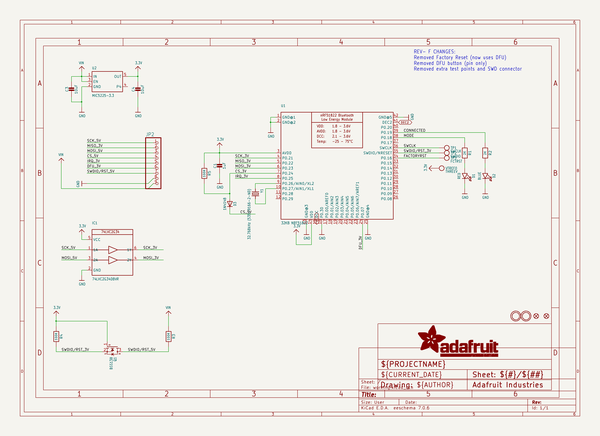
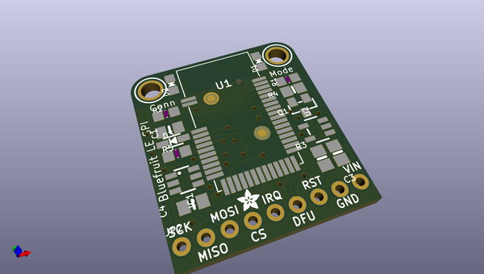
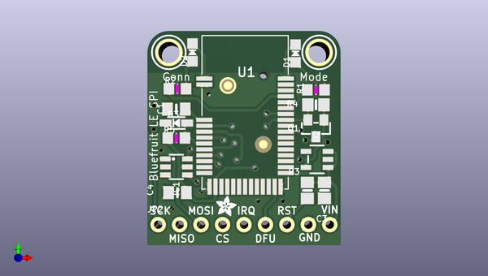
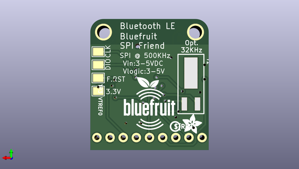

# adafruit_bluefruit_le_spi_friend_pcb
 
## summary 
* id: adafruit_adafruit_bluefruit_le_spi_friend_pcb_adafruit_bluefruit_le_spi_friend
* user: adafruit
* name: adafruit_bluefruit_le_spi_friend_pcb
* board: adafruit_bluefruit_le_spi_friend
* repo: https://github.com/adafruit/Adafruit-Bluefruit-LE-SPI-Friend-PCB

* src_file_repo_sch: 
*
 src_file_repo_sch_link: https://github.com/adafruit/Adafruit-Bluefruit-LE-SPI-Friend-PCB/tree/master/
* full details link: https://github.com/oomlout/oomlout_oomp_project_bot_v_2/tree/main/projects/adafruit_adafruit_bluefruit_le_spi_friend_pcb_adafruit_bluefruit_le_spi_friend/current_version/working  

## schematic  
  
[schematic (pdf)](working_schematic.pdf)  

## pcb  
 
  
  
  
[board (pdf)](working.pdf)  

## working_bom
| Id | Designator | Footprint | Quantity | Designation | Supplier and ref |  | None | 
| --- | --- | --- | --- | --- | --- | --- | --- | 
| 1 | U1 | BLE_MODULE_RAYTAC_MDBT40 | 1 | 32KB NRF51822 |  |  | [''] | 
| 2 | R1,R2 | _0805MP | 2 | 2K |  |  | [''] | 
| 3 | D1 | CHIPLED_0805_NOOUTLINE | 1 | RED |  |  | [''] | 
| 4 | D2 | CHIPLED_0805_NOOUTLINE | 1 | BLUE |  |  | [''] | 
| 5 | U$28,U$29 | MOUNTINGHOLE_2.5_PLATED | 2 | MOUNTINGHOLE2.5 |  |  | [''] | 
| 6 | IC1 | SOT23-6 | 1 | 74LVC2G34DBVR |  |  | [''] | 
| 7 | JP2 | 1X09_ROUND_70 | 1 |  |  |  | [''] | 
| 8 | FID3,FID1 | FIDUCIAL_1MM | 2 | FIDUCIAL" |  |  | [''] | 
| 9 | D3 | SOD-323 | 1 | 1N4148 |  |  | [''] | 
| 10 | U2 | SOT23-5 | 1 | MIC5225-3.3 |  |  | [''] | 
| 11 | C1 | 0805_10MGAP | 1 | 1uF |  |  | [''] | 
| 12 | R3,R4 | 0805-NO | 2 | 100K |  |  | [''] | 
| 13 | C4 | 0805_10MGAP | 1 | 10uF |  |  | [''] | 
| 14 | U$3 | ADAFRUIT_2.5MM | 1 |  |  |  | [''] | 
| 15 | R5 | _0805MP | 1 | 100K |  |  | [''] | 
| 16 | Q1 | SOT23-WIDE@1 | 1 | BSS138 |  |  | [''] | 
| 17 | C3 | 0805-NO | 1 | 10uF |  |  | [''] | 
| 18 | U$17 | ADAFRUIT_3.5MM | 1 |  |  |  | [''] | 
| 19 | TP2 | PAD-1.5X2.0 | 1 | SWDIO |  |  | [''] | 
| 20 | U$18 | PCBFEAT-REV-040 | 1 |  |  |  | [''] | 
| 21 | TP1 | PAD-1.5X2.0 | 1 | SWCLK |  |  | [''] | 
| 22 | TP3 | PAD-1.5X2.0 | 1 | FCTRST |  |  | [''] | 
| 23 | U$9 | BLUEFRUITLOGO_100MM | 1 |  |  |  | [''] | 
| 24 | VTREF0 | PAD-1.5X2.0 | 1 | THREEV |  |  | [''] | 
| 25 | Y1 | CRYSTAL_CYL_2X6MM_SMT | 1 | 32.768kHz (535-9166-2-ND) |  |  | [''] | 

## bom_schematic
| Ref | Qnty | Value | Cmp name | Footprint | Description | Vendor | DNP | 
| --- | --- | --- | --- | --- | --- | --- | --- | 
| C1 | 1 | 1uF | CAP_CERAMIC0805_10MGAP | working:0805_10MGAP |  |  |  | 
| C3 | 1 | 10uF | CAP_CERAMIC0805-NOOUTLINE | working:0805-NO |  |  |  | 
| C4 | 1 | 10uF | CAP_CERAMIC0805_10MGAP | working:0805_10MGAP |  |  |  | 
| D1 | 1 | RED | LED0805_NOOUTLINE | working:CHIPLED_0805_NOOUTLINE |  |  |  | 
| D2 | 1 | BLUE | LED0805_NOOUTLINE | working:CHIPLED_0805_NOOUTLINE |  |  |  | 
| D3 | 1 | 1N4148 | DIODESOD-323 | working:SOD-323 |  |  |  | 
| FID1, FID3 | 2 | FIDUCIAL"" | FIDUCIAL{dblquote}{dblquote} | working:FIDUCIAL_1MM |  |  |  | 
| IC1 | 1 | 74LVC2G34DBVR | 74LVC2G34DBVR | working:SOT23-6 |  |  |  | 
| JP2 | 1 | HEADER-1X970MIL | HEADER-1X970MIL | working:1X09_ROUND_70 |  |  |  | 
| Q1 | 1 | BSS138 | MOSFET-NWIDE | working:SOT23-WIDE@1 |  |  |  | 
| R1, R2 | 2 | 2K | RESISTOR_0805MP | working:_0805MP |  |  |  | 
| R3, R4 | 2 | 100K | RESISTOR0805_NOOUTLINE | working:0805-NO |  |  |  | 
| R5 | 1 | 100K | RESISTOR_0805MP | working:_0805MP |  |  |  | 
| TP1 | 1 | SWCLK | TESTPOINT1.5X2.0MM_NOCREAM | working:PAD-1.5X2.0 |  |  |  | 
| TP2 | 1 | SWDIO | TESTPOINT1.5X2.0MM_NOCREAM | working:PAD-1.5X2.0 |  |  |  | 
| TP3 | 1 | FCTRST | TESTPOINT1.5X2.0MM_NOCREAM | working:PAD-1.5X2.0 |  |  |  | 
| U1 | 1 | 32KB NRF51822 | NRF51822_MODULE_MDBT40 | working:BLE_MODULE_RAYTAC_MDBT40 |  |  |  | 
| U2 | 1 | MIC5225-3.3 | VREG_SOT23-5 | working:SOT23-5 |  |  |  | 
| U$28, U$29 | 2 | MOUNTINGHOLE2.5 | MOUNTINGHOLE2.5 | working:MOUNTINGHOLE_2.5_PLATED |  |  |  | 
| VTREF0 | 1 | THREEV | TESTPOINT1.5X2.0MM_NOCREAM | working:PAD-1.5X2.0 |  |  |  | 
| Y1 | 1 | 32.768kHz (535-9166-2-ND) | CRYSTAL2.0X6.0_32.768 | working:CRYSTAL_CYL_2X6MM_SMT |  |  |  | 

## mounting_holes
| x | y | package | value | ref | size | 
| --- | --- | --- | --- | --- | --- | 
| 17.78 | 0.0 | MOUNTINGHOLE_2.5_PLATED | MOUNTINGHOLE2.5 | U$28 | m3 | 
| 0.0 | 0.0 | MOUNTINGHOLE_2.5_PLATED | MOUNTINGHOLE2.5 | U$29 | m3 | 

