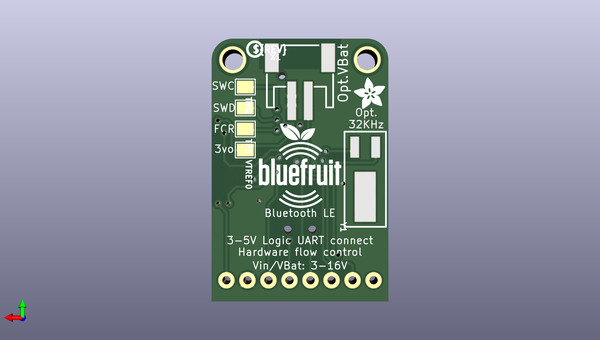

# adafruit_bluefruit_le_uart_friend_pcb
 
## summary 
* id: adafruit_adafruit_bluefruit_le_uart_friend_pcb_adafruit_bluefruit_le_uart_friend
* user: adafruit
* name: adafruit_bluefruit_le_uart_friend_pcb
* board: adafruit_bluefruit_le_uart_friend
* repo: https://github.com/adafruit/Adafruit-Bluefruit-LE-UART-Friend-PCB

* src_file_repo_sch: 
*
 src_file_repo_sch_link: https://github.com/adafruit/Adafruit-Bluefruit-LE-UART-Friend-PCB/tree/master/
* full details link: https://github.com/oomlout/oomlout_oomp_project_bot_v_2/tree/main/projects/adafruit_adafruit_bluefruit_le_uart_friend_pcb_adafruit_bluefruit_le_uart_friend/current_version/working  

## schematic  
  
[schematic (pdf)](working_schematic.pdf)  

## pcb  
 
  
  
  
[board (pdf)](working.pdf)  

## working_bom
| Id | Designator | Footprint | Quantity | Designation | Supplier and ref |  | None | 
| --- | --- | --- | --- | --- | --- | --- | --- | 
| 1 | D3,D8 | SOD-123 | 2 | MBR120 |  |  | [''] | 
| 2 | D2 | CHIPLED_0805_NOOUTLINE | 1 | GREEN |  |  | [''] | 
| 3 | D6,D4,D5,D7 | SOD-323 | 4 | 1n4148 |  |  | [''] | 
| 4 | C2,C1 | 0805-NO | 2 | 1uF |  |  | [''] | 
| 5 | U$26 | ADAFRUIT_2.5MM | 1 |  |  |  | [''] | 
| 6 | C4,C3 | 0805-NO | 2 | 10uF |  |  | [''] | 
| 7 | R4,R3 | 0805-NO | 2 | 100K |  |  | [''] | 
| 8 | R7 | 0805-NO | 1 | 2K |  |  | [''] | 
| 9 | U2 | SOT23-5 | 1 | MIC5225-3.3 |  |  | [''] | 
| 10 | FID1,FID2 | FIDUCIAL_1MM | 2 | FIDUCIAL" |  |  | [''] | 
| 11 | U$28,U$29 | MOUNTINGHOLE_2.5_PLATED | 2 | MOUNTINGHOLE2.5 |  |  | [''] | 
| 12 | D1 | CHIPLED_0805_NOOUTLINE | 1 | RED |  |  | [''] | 
| 13 | R2,R1 | 0805-NO | 2 | 1K |  |  | [''] | 
| 14 | JP1 | 1X08_ROUND_76 | 1 |  |  |  | [''] | 
| 15 | U1 | BLE_MODULE_RAYTAC_MDBT40 | 1 |  |  |  | [''] | 
| 16 | SW1 | EG1390 | 1 | EG1319 |  |  | [''] | 
| 17 | TP2 | PAD-1.5X2.0 | 1 | SWDIO |  |  | [''] | 
| 18 | U$24 | PCBFEAT-REV-040 | 1 |  |  |  | [''] | 
| 19 | U$9 | BLUEFRUITLOGO_100MM | 1 |  |  |  | [''] | 
| 20 | VTREF0,TP3 | PAD-1.5X2.0 | 2 | FCTRST |  |  | [''] | 
| 21 | X1 | JSTPH2 | 1 | JST 2PH |  |  | [''] | 
| 22 | U$25 | ADAFRUIT_3.5MM | 1 |  |  |  | [''] | 
| 23 | Y1 | CRYSTAL_CYL_2X6MM_SMT | 1 | 32.768kHz (535-9166-2-ND) |  |  | [''] | 
| 24 | TP1 | PAD-1.5X2.0 | 1 | SWCLK |  |  | [''] | 

## bom_schematic
| Ref | Qnty | Value | Cmp name | Footprint | Description | Vendor | DNP | 
| --- | --- | --- | --- | --- | --- | --- | --- | 
| C1, C2 | 2 | 1uF | CAP_CERAMIC0805-NOOUTLINE | working:0805-NO |  |  |  | 
| C3, C4 | 2 | 10uF | CAP_CERAMIC0805-NOOUTLINE | working:0805-NO |  |  |  | 
| D1 | 1 | RED | LED0805_NOOUTLINE | working:CHIPLED_0805_NOOUTLINE |  |  |  | 
| D2 | 1 | GREEN | LED0805_NOOUTLINE | working:CHIPLED_0805_NOOUTLINE |  |  |  | 
| D3, D8 | 2 | MBR120 | DIODE-SCHOTTKYSOD-123 | working:SOD-123 |  |  |  | 
| D4, D5, D6, D7 | 4 | 1n4148 | DIODESOD-323 | working:SOD-323 |  |  |  | 
| FID1, FID2 | 2 | FIDUCIAL"" | FIDUCIAL{dblquote}{dblquote} | working:FIDUCIAL_1MM |  |  |  | 
| JP1 | 1 | HEADER-1X876MIL | HEADER-1X876MIL | working:1X08_ROUND_76 |  |  |  | 
| R1, R2 | 2 | 1K | RESISTOR0805_NOOUTLINE | working:0805-NO |  |  |  | 
| R3, R4 | 2 | 100K | RESISTOR0805_NOOUTLINE | working:0805-NO |  |  |  | 
| R7 | 1 | 2K | RESISTOR0805_NOOUTLINE | working:0805-NO |  |  |  | 
| SW1 | 1 | EG1319 | SWITCH_DPDTEG1390 | working:EG1390 |  |  |  | 
| TP1 | 1 | SWCLK | TESTPOINT1.5X2.0MM_NOCREAM | working:PAD-1.5X2.0 |  |  |  | 
| TP2 | 1 | SWDIO | TESTPOINT1.5X2.0MM_NOCREAM | working:PAD-1.5X2.0 |  |  |  | 
| TP3 | 1 | FCTRST | TESTPOINT1.5X2.0MM_NOCREAM | working:PAD-1.5X2.0 |  |  |  | 
| U1 | 1 | NRF51822_MODULE_MDBT40 | NRF51822_MODULE_MDBT40 | working:BLE_MODULE_RAYTAC_MDBT40 |  |  |  | 
| U2 | 1 | MIC5225-3.3 | VREG_SOT23-5 | working:SOT23-5 |  |  |  | 
| U$28, U$29 | 2 | MOUNTINGHOLE2.5 | MOUNTINGHOLE2.5 | working:MOUNTINGHOLE_2.5_PLATED |  |  |  | 
| VTREF0 | 1 | FCTRST | TESTPOINT1.5X2.0MM_NOCREAM | working:PAD-1.5X2.0 |  |  |  | 
| X1 | 1 | JST 2PH | CON_JST_PH_2PIN | working:JSTPH2 |  |  |  | 
| Y1 | 1 | 32.768kHz (535-9166-2-ND) | CRYSTAL2.0X6.0_32.768 | working:CRYSTAL_CYL_2X6MM_SMT |  |  |  | 

## mounting_holes
| x | y | package | value | ref | size | 
| --- | --- | --- | --- | --- | --- | 
| 16.256 | 0.0 | MOUNTINGHOLE_2.5_PLATED | MOUNTINGHOLE2.5 | U$28 | m3 | 
| 0.0 | 0.0 | MOUNTINGHOLE_2.5_PLATED | MOUNTINGHOLE2.5 | U$29 | m3 | 

