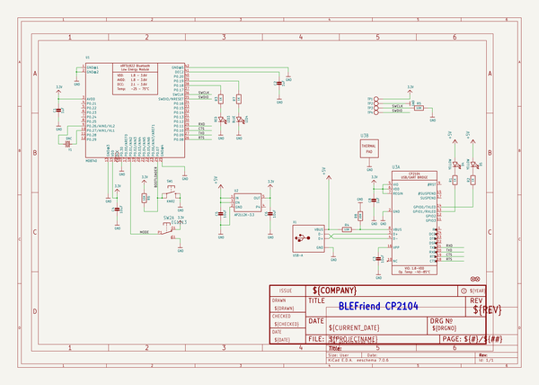
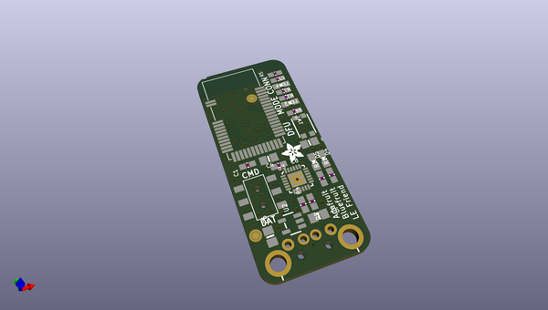
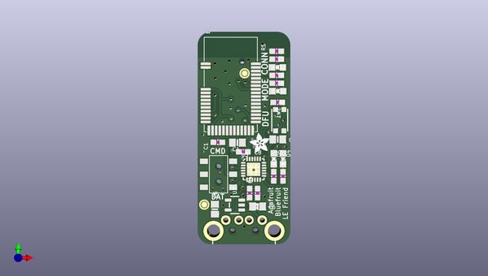
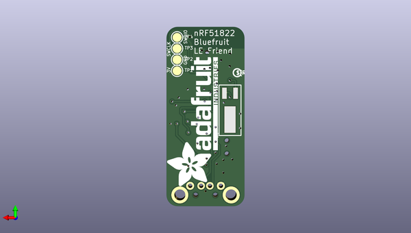

# adafruit_bluefruit_le_usb_friend_and_sniffer_pcb
 
## summary 
* id: adafruit_adafruit_bluefruit_le_usb_friend_and_sniffer_pcb_adafrruit_bluefruit_le_usb_friend_cp2102n
* user: adafruit
* name: adafruit_bluefruit_le_usb_friend_and_sniffer_pcb
* board: adafrruit_bluefruit_le_usb_friend_cp2102n
* repo: https://github.com/adafruit/Adafruit-Bluefruit-LE-USB-Friend-and-Sniffer-PCB

* src_file_repo_sch: 
*
 src_file_repo_sch_link: https://github.com/adafruit/Adafruit-Bluefruit-LE-USB-Friend-and-Sniffer-PCB/tree/master/
* full details link: https://github.com/oomlout/oomlout_oomp_project_bot_v_2/tree/main/projects/adafruit_adafruit_bluefruit_le_usb_friend_and_sniffer_pcb_adafrruit_bluefruit_le_usb_friend_cp2102n/current_version/working  

## schematic  
  
[schematic (pdf)](working_schematic.pdf)  

## pcb  
 
  
  
  
[board (pdf)](working.pdf)  

## working_bom
| Id | Designator | Footprint | Quantity | Designation | Supplier and ref |  | None | 
| --- | --- | --- | --- | --- | --- | --- | --- | 
| 1 | C5,C4,C6,C3 | 0805-NO | 4 | 10uF |  |  | [''] | 
| 2 | D5,D4 | CHIPLED_0805_NOOUTLINE | 2 | YELLOW |  |  | [''] | 
| 3 | C1,C8,C2 | 0603-NO | 3 | 1uF |  |  | [''] | 
| 4 | R4,R6,R5 | 0603-NO | 3 | 10K |  |  | [''] | 
| 5 | R7,R1,R3,R2 | 0603-NO | 4 | 1K |  |  | [''] | 
| 6 | SW1 | BTN_KMR2_4.6X2.8 | 1 | KMR2 |  |  | [''] | 
| 7 | U3 | QFN24_4MM_SMSC | 1 | CP210x |  |  | [''] | 
| 8 | LED3 | CHIPLED_0805_NOOUTLINE | 1 | RED |  |  | [''] | 
| 9 | X1 | USB_A-THM | 1 | USB-A |  |  | [''] | 
| 10 | FID1,FID2 | FIDUCIAL_1MM | 2 | FIDUCIAL_1MM |  |  | [''] | 
| 11 | LED4 | CHIPLED_0805_NOOUTLINE | 1 | BLUE |  |  | [''] | 
| 12 | U2 | SOT23-5 | 1 | AP2112K-3.3 |  |  | [''] | 
| 13 | U$31 | ADAFRUIT_3.5MM | 1 |  |  |  | [''] | 
| 14 | U1 | BLE_MODULE_RAYTAC_MDBT40 | 1 | MDBT40 |  |  | [''] | 
| 15 | SW2 | EG1390 | 1 | EG1213 |  |  | [''] | 
| 16 | R8 | 0603-NO | 1 | 20K |  |  | [''] | 
| 17 | U$22 | ADAFRUIT_TEXT_30MM | 1 |  |  |  | [''] | 
| 18 | TP2,TP4,TP3,TP1 | TESTPOINT_ROUND_2MM | 4 |  |  |  | [''] | 
| 19 | U$16 | PCBFEAT-REV-040 | 1 |  |  |  | [''] | 
| 20 | Y1 | CRYSTAL_CYL_2X6MM_SMT | 1 | DNC |  |  | [''] | 

## bom_schematic
| Ref | Qnty | Value | Cmp name | Footprint | Description | Vendor | DNP | 
| --- | --- | --- | --- | --- | --- | --- | --- | 
| C1, C2, C8 | 3 | 1uF | CAP_CERAMIC0603_NO | working:0603-NO |  |  |  | 
| C3, C4, C5, C6 | 4 | 10uF | CAP_CERAMIC0805-NOOUTLINE | working:0805-NO |  |  |  | 
| D4, D5 | 2 | YELLOW | LED0805_NOOUTLINE | working:CHIPLED_0805_NOOUTLINE |  |  |  | 
| FID1, FID2 | 2 | FIDUCIAL_1MM | FIDUCIAL_1MM | working:FIDUCIAL_1MM |  |  |  | 
| LED3 | 1 | RED | LED0805_NOOUTLINE | working:CHIPLED_0805_NOOUTLINE |  |  |  | 
| LED4 | 1 | BLUE | LED0805_NOOUTLINE | working:CHIPLED_0805_NOOUTLINE |  |  |  | 
| R1, R2, R3, R7 | 4 | 1K | RESISTOR_0603_NOOUT | working:0603-NO |  |  |  | 
| R4, R5, R6 | 3 | 10K | RESISTOR_0603_NOOUT | working:0603-NO |  |  |  | 
| R8 | 1 | 20K | RESISTOR_0603_NOOUT | working:0603-NO |  |  |  | 
| SW1 | 1 | KMR2 | SWITCH_TACT_SMT4.6X2.8 | working:BTN_KMR2_4.6X2.8 |  |  |  | 
| SW2 | 1 | EG1213 | DPDT-EG1390 | working:EG1390 |  |  |  | 
| TP1, TP2, TP3, TP4 | 4 | TESTPOINTROUND2MM | TESTPOINTROUND2MM | working:TESTPOINT_ROUND_2MM |  |  |  | 
| U1 | 1 | MDBT40 | NRF51822_MODULE_MDBT40 | working:BLE_MODULE_RAYTAC_MDBT40 |  |  |  | 
| U2 | 1 | AP2112K-3.3 | VREG_SOT23-5 | working:SOT23-5 |  |  |  | 
| U3 | 1 | CP210x | CP2104 | working:QFN24_4MM_SMSC |  |  |  | 
| X1 | 1 | USB-A | USB_TYPEA_CLIENTTHM | working:USB_A-THM |  |  |  | 
| Y1 | 1 | DNC | CRYSTAL2.0X6.0_32.768 | working:CRYSTAL_CYL_2X6MM_SMT |  |  |  | 

