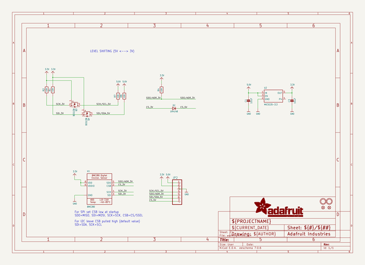
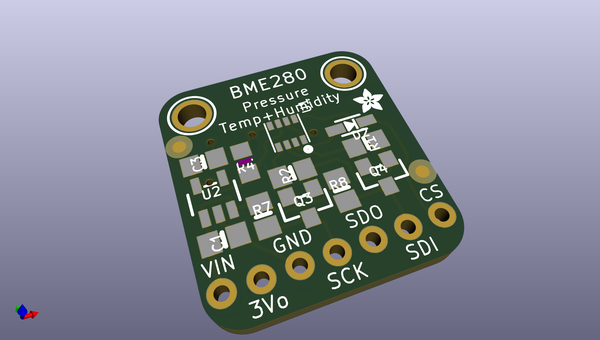
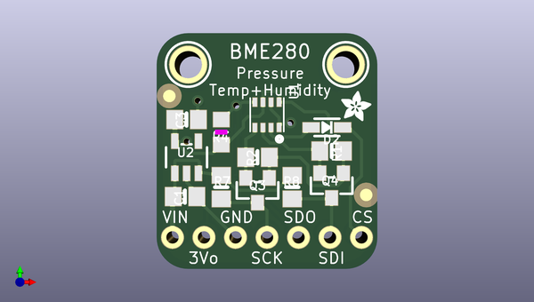
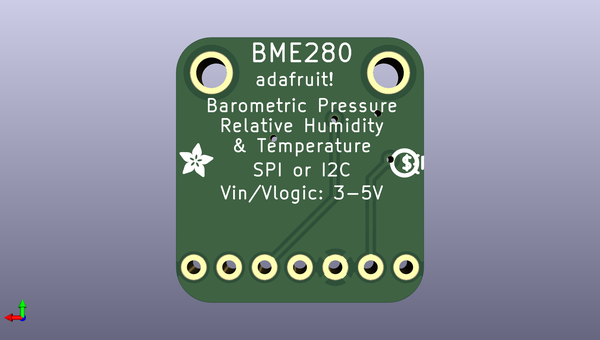

# adafruit_bme280_breakout_pcb
 
## summary 
* id: adafruit_adafruit_bme280_breakout_pcb_adafruit_bme280
* user: adafruit
* name: adafruit_bme280_breakout_pcb
* board: adafruit_bme280
* repo: https://github.com/adafruit/Adafruit-BME280-Breakout-PCB

* src_file_repo_sch: 
*
 src_file_repo_sch_link: https://github.com/adafruit/Adafruit-BME280-Breakout-PCB/tree/master/
* full details link: https://github.com/oomlout/oomlout_oomp_project_bot_v_2/tree/main/projects/adafruit_adafruit_bme280_breakout_pcb_adafruit_bme280/current_version/working  

## schematic  
  
[schematic (pdf)](working_schematic.pdf)  

## pcb  
 
  
  
  
[board (pdf)](working.pdf)  

## working_bom
| Id | Designator | Footprint | Quantity | Designation | Supplier and ref |  | None | 
| --- | --- | --- | --- | --- | --- | --- | --- | 
| 1 | C1,C3 | 0805-NO | 2 | 10uF |  |  | [''] | 
| 2 | JP2 | 1X07_ROUND_70 | 1 |  |  |  | [''] | 
| 3 | R4 | _0805MP | 1 | 10K |  |  | [''] | 
| 4 | D2 | SOD-323 | 1 | 1N4148 |  |  | [''] | 
| 5 | Q3,Q4 | SOT23-WIDE | 2 | BSS138 |  |  | [''] | 
| 6 | U$5,U$15 | FIDUCIAL_1MM | 2 | FIDUCIAL" |  |  | [''] | 
| 7 | U2 | SOT23-5 | 1 | MIC5225-3.3 |  |  | [''] | 
| 8 | R7,R2,R8,R1 | 0805-NO | 4 | 10K |  |  | [''] | 
| 9 | U$8,U$7 | MOUNTINGHOLE_2.0_PLATED | 2 | MOUNTINGHOLE2.0 |  |  | [''] | 
| 10 | U1 | BME280 | 1 | BME280 |  |  | [''] | 
| 11 | U$6,U$2 | ADAFRUIT_2.5MM | 2 |  |  |  | [''] | 
| 12 | U$20 | PCBFEAT-REV-040 | 1 |  |  |  | [''] | 

## bom_schematic
| Ref | Qnty | Value | Cmp name | Footprint | Description | Vendor | DNP | 
| --- | --- | --- | --- | --- | --- | --- | --- | 
| C1, C3 | 2 | 10uF | CAP_CERAMIC0805-NOOUTLINE | working:0805-NO |  |  |  | 
| D2 | 1 | 1N4148 | DIODESOD-323 | working:SOD-323 |  |  |  | 
| JP2 | 1 | HEADER-1X770MIL | HEADER-1X770MIL | working:1X07_ROUND_70 |  |  |  | 
| Q3, Q4 | 2 | BSS138 | MOSFET-NWIDE | working:SOT23-WIDE |  |  |  | 
| R1, R2, R7, R8 | 4 | 10K | RESISTOR0805_NOOUTLINE | working:0805-NO |  |  |  | 
| R4 | 1 | 10K | RESISTOR_0805MP | working:_0805MP |  |  |  | 
| U1 | 1 | BME280 | BME280 | working:BME280 |  |  |  | 
| U2 | 1 | MIC5225-3.3 | VREG_SOT23-5 | working:SOT23-5 |  |  |  | 
| U$5, U$15 | 2 | FIDUCIAL"" | FIDUCIAL{dblquote}{dblquote} | working:FIDUCIAL_1MM |  |  |  | 
| U$7, U$8 | 2 | MOUNTINGHOLE2.0 | MOUNTINGHOLE2.0 | working:MOUNTINGHOLE_2.0_PLATED |  |  |  | 

## mounting_holes
| x | y | package | value | ref | size | 
| --- | --- | --- | --- | --- | --- | 
| 0.0 | 0.0 | MOUNTINGHOLE_2.0_PLATED | MOUNTINGHOLE2.0 | U$7 | m3 | 
| 12.7 | 0.0 | MOUNTINGHOLE_2.0_PLATED | MOUNTINGHOLE2.0 | U$8 | m3 | 

