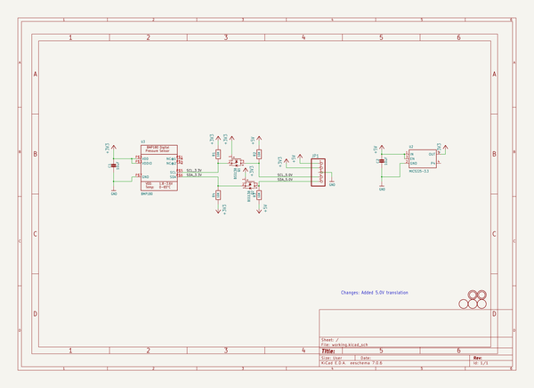
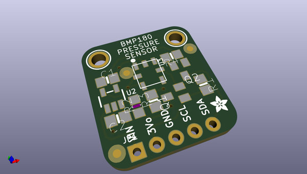
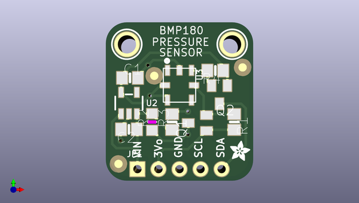
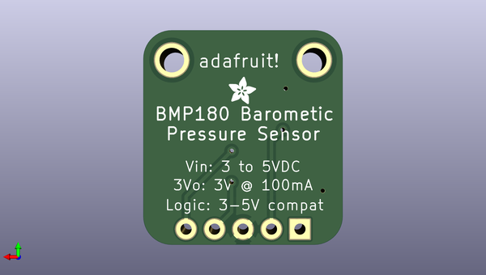

# adafruit_bmp180_pcb
 
## summary 
* id: adafruit_adafruit_bmp180_pcb_adafruit_bmp180
* user: adafruit
* name: adafruit_bmp180_pcb
* board: adafruit_bmp180
* repo: https://github.com/adafruit/Adafruit-BMP180-PCB

* src_file_repo_sch: 
*
 src_file_repo_sch_link: https://github.com/adafruit/Adafruit-BMP180-PCB/tree/master/
* full details link: https://github.com/oomlout/oomlout_oomp_project_bot_v_2/tree/main/projects/adafruit_adafruit_bmp180_pcb_adafruit_bmp180/current_version/working  

## schematic  
  
[schematic (pdf)](working_schematic.pdf)  

## pcb  
 
  
  
  
[board (pdf)](working.pdf)  

## working_bom
| Id | Designator | Footprint | Quantity | Designation | Supplier and ref |  | None | 
| --- | --- | --- | --- | --- | --- | --- | --- | 
| 1 | U$1,U$5,U$15 | FIDUCIAL_1MM | 3 | FIDUCIAL |  |  | [''] | 
| 2 | U$6,U$2 | ADAFRUIT_2.5MM | 2 |  |  |  | [''] | 
| 3 | U$7,U$8 | MOUNTINGHOLE_2.0_PLATED | 2 | MOUNTINGHOLE2.0 |  |  | [''] | 
| 4 | C2,C1 | 0805-NO | 2 | 10uF |  |  | [''] | 
| 5 | R4,R1,R3 | 0805-NO | 3 | 10K |  |  | [''] | 
| 6 | Q2,Q1 | SOT23 | 2 | BSS138 |  |  | [''] | 
| 7 | R2 | _0805MP | 1 | 10K |  |  | [''] | 
| 8 | U3 | BMP180_EXTENDED | 1 | BMP180 |  |  | [''] | 
| 9 | JP1 | 1X05_ROUND_70 | 1 |  |  |  | [''] | 
| 10 | U2 | SOT23-5 | 1 | MIC5225-3.3 |  |  | [''] | 

## bom_schematic
| Ref | Qnty | Value | Cmp name | Footprint | Description | Vendor | DNP | 
| --- | --- | --- | --- | --- | --- | --- | --- | 
| C1, C2 | 2 | 10uF | CAP_CERAMIC0805-NOOUTLINE | working:0805-NO |  |  |  | 
| JP1 | 1 | HEADER-1X570MIL | HEADER-1X570MIL | working:1X05_ROUND_70 |  |  |  | 
| Q1, Q2 | 2 | BSS138 | MOSFET-NREFLOW | working:SOT23 |  |  |  | 
| R1, R3, R4 | 3 | 10K | RESISTOR0805_NOOUTLINE | working:0805-NO |  |  |  | 
| R2 | 1 | 10K | RESISTOR_0805MP | working:_0805MP |  |  |  | 
| U2 | 1 | MIC5225-3.3 | VREG_SOT23-5 | working:SOT23-5 |  |  |  | 
| U3 | 1 | BMP180 | BMP180EXT | working:BMP180_EXTENDED |  |  |  | 
| U$1, U$5, U$15 | 3 | FIDUCIAL | FIDUCIAL | working:FIDUCIAL_1MM |  |  |  | 
| U$7, U$8 | 2 | MOUNTINGHOLE2.0 | MOUNTINGHOLE2.0 | working:MOUNTINGHOLE_2.0_PLATED |  |  |  | 

## mounting_holes
| x | y | package | value | ref | size | 
| --- | --- | --- | --- | --- | --- | 
| 0.0 | 0.0 | MOUNTINGHOLE_2.0_PLATED | MOUNTINGHOLE2.0 | U$7 | m3 | 
| 12.699999999999989 | 0.0 | MOUNTINGHOLE_2.0_PLATED | MOUNTINGHOLE2.0 | U$8 | m3 | 

