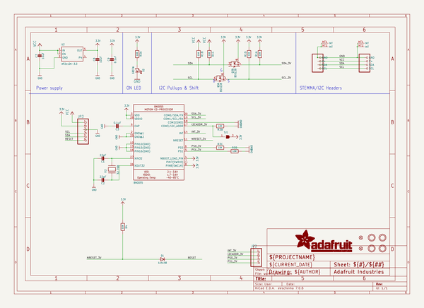
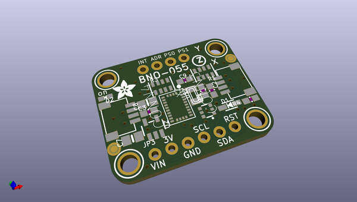
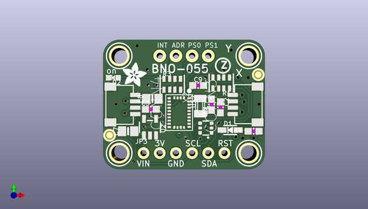
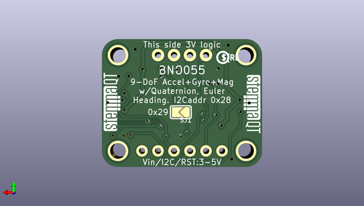

# adafruit_bno055_breakout_pcb
 
## summary 
* id: adafruit_adafruit_bno055_breakout_pcb_adafruit_bno055
* user: adafruit
* name: adafruit_bno055_breakout_pcb
* board: adafruit_bno055
* repo: https://github.com/adafruit/Adafruit-BNO055-Breakout-PCB

* src_file_repo_sch: 
*
 src_file_repo_sch_link: https://github.com/adafruit/Adafruit-BNO055-Breakout-PCB/tree/master/
* full details link: https://github.com/oomlout/oomlout_oomp_project_bot_v_2/tree/main/projects/adafruit_adafruit_bno055_breakout_pcb_adafruit_bno055/current_version/working  

## schematic  
  
[schematic (pdf)](working_schematic.pdf)  

## pcb  
 
  
  
  
[board (pdf)](working.pdf)  

## working_bom
| Id | Designator | Footprint | Quantity | Designation | Supplier and ref |  | None | 
| --- | --- | --- | --- | --- | --- | --- | --- | 
| 1 | FID4,FID3 | FIDUCIAL_1MM | 2 | FIDUCIAL_1MM |  |  | [''] | 
| 2 | C9,C3 | 0603-NO | 2 | 0.1uF |  |  | [''] | 
| 3 | JP3 | 1X06_ROUND_70 | 1 |  |  |  | [''] | 
| 4 | U$46,U$45,U$48,U$49 | MOUNTINGHOLE_2.5_PLATED | 4 | MOUNTINGHOLE2.5 |  |  | [''] | 
| 5 | D1 | SOD-323 | 1 | 1n4148 |  |  | [''] | 
| 6 | U2 | SOT23-5 | 1 | AP2112K-3.3 |  |  | [''] | 
| 7 | C1,C2 | 0603-NO | 2 | 22pF |  |  | [''] | 
| 8 | CONN3,CONN4 | JST_SH4 | 2 | STEMMA_I2C_QT |  |  | [''] | 
| 9 | R1,R3 | RESPACK_4X0603 | 2 | 10K |  |  | [''] | 
| 10 | X2 | XTAL3215 | 1 | 32.768 |  |  | [''] | 
| 11 | U$51 | ADAFRUIT_3.5MM | 1 |  |  |  | [''] | 
| 12 | C7,C8 | 0805-NO | 2 | 10uF |  |  | [''] | 
| 13 | D2 | CHIPLED_0603_NOOUTLINE | 1 | GREEN |  |  | [''] | 
| 14 | JP2 | 1X04_ROUND_76 | 1 |  |  |  | [''] | 
| 15 | R4 | 0603-NO | 1 | 10K |  |  | [''] | 
| 16 | Q3 | SOT363 | 1 | BSS138 |  |  | [''] | 
| 17 | U$2 | BNO055 | 1 | BNO055 |  |  | [''] | 
| 18 | U$53,U$54 | STEMMAQT | 2 |  |  |  | [''] | 
| 19 | SJ1 | SOLDERJUMPER_ARROW_NOPASTE | 1 |  |  |  | [''] | 
| 20 | U$52 | PCBFEAT-REV-040 | 1 |  |  |  | [''] | 

## bom_schematic
| Ref | Qnty | Value | Cmp name | Footprint | Description | Vendor | DNP | 
| --- | --- | --- | --- | --- | --- | --- | --- | 
| C1, C2 | 2 | 22pF | CAP_CERAMIC0603_NO | working:0603-NO |  |  |  | 
| C3, C9 | 2 | 0.1uF | CAP_CERAMIC0603_NO | working:0603-NO |  |  |  | 
| C7, C8 | 2 | 10uF | CAP_CERAMIC0805-NOOUTLINE | working:0805-NO |  |  |  | 
| CONN3, CONN4 | 2 | STEMMA_I2C_QT | STEMMA_I2C_QT | working:JST_SH4 |  |  |  | 
| D1 | 1 | 1n4148 | DIODESOD-323 | working:SOD-323 |  |  |  | 
| D2 | 1 | GREEN | LED0603_NOOUTLINE | working:CHIPLED_0603_NOOUTLINE |  |  |  | 
| FID3, FID4 | 2 | FIDUCIAL_1MM | FIDUCIAL_1MM | working:FIDUCIAL_1MM |  |  |  | 
| JP2 | 1 | HEADER-1X476MIL | HEADER-1X476MIL | working:1X04_ROUND_76 |  |  |  | 
| JP3 | 1 | HEADER-1X670MIL | HEADER-1X670MIL | working:1X06_ROUND_70 |  |  |  | 
| Q3 | 1 | BSS138 | MOSFET-N_DUAL | working:SOT363 |  |  |  | 
| R1, R3 | 2 | 10K | RESISTOR_4PACK | working:RESPACK_4X0603 |  |  |  | 
| R4 | 1 | 10K | RESISTOR_0603_NOOUT | working:0603-NO |  |  |  | 
| SJ1 | 1 | SOLDERJUMPER | SOLDERJUMPER | working:SOLDERJUMPER_ARROW_NOPASTE |  |  |  | 
| U2 | 1 | AP2112K-3.3 | VREG_SOT23-5 | working:SOT23-5 |  |  |  | 
| U$2 | 1 | BNO055 | BNO055 | working:BNO055 |  |  |  | 
| U$45, U$46, U$48, U$49 | 4 | MOUNTINGHOLE2.5 | MOUNTINGHOLE2.5 | working:MOUNTINGHOLE_2.5_PLATED |  |  |  | 
| X2 | 1 | 32.768 | XTAL-3.2X1.5 | working:XTAL3215 |  |  |  | 

## mounting_holes
| x | y | package | value | ref | size | 
| --- | --- | --- | --- | --- | --- | 
| 0.0 | 15.239999999999995 | MOUNTINGHOLE_2.5_PLATED | MOUNTINGHOLE2.5 | U$45 | m3 | 
| 20.319999999999993 | 15.239999999999995 | MOUNTINGHOLE_2.5_PLATED | MOUNTINGHOLE2.5 | U$46 | m3 | 
| 0.0 | 0.0 | MOUNTINGHOLE_2.5_PLATED | MOUNTINGHOLE2.5 | U$48 | m3 | 
| 20.319999999999993 | 0.0 | MOUNTINGHOLE_2.5_PLATED | MOUNTINGHOLE2.5 | U$49 | m3 | 

