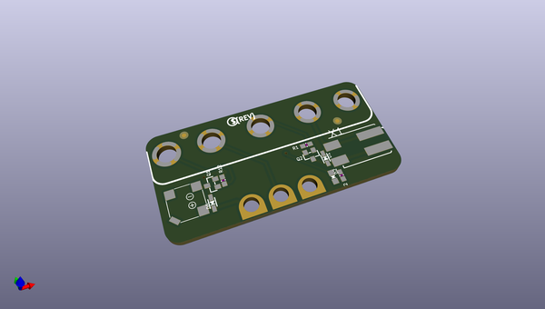

# adafruit_bonsai_buckaroo_pcb
 
## summary 
* id: adafruit_adafruit_bonsai_buckaroo_pcb_adafruit_bonsai_buckaroo
* user: adafruit
* name: adafruit_bonsai_buckaroo_pcb
* board: adafruit_bonsai_buckaroo
* repo: https://github.com/adafruit/Adafruit-Bonsai-Buckaroo-PCB

* src_file_repo_sch: 
*
 src_file_repo_sch_link: https://github.com/adafruit/Adafruit-Bonsai-Buckaroo-PCB/tree/master/
* full details link: https://github.com/oomlout/oomlout_oomp_project_bot_v_2/tree/main/projects/adafruit_adafruit_bonsai_buckaroo_pcb_adafruit_bonsai_buckaroo/current_version/working  

## schematic  
  
[schematic (pdf)](working_schematic.pdf)  

## pcb  
 
  
  
  
[board (pdf)](working.pdf)  

## working_bom
| Id | Designator | Footprint | Quantity | Designation | Supplier and ref |  | None | 
| --- | --- | --- | --- | --- | --- | --- | --- | 
| 1 | R1,R12 | 0603-NO | 2 | 10K |  |  | [''] | 
| 2 | D2 | CHIPLED_0805_NOOUTLINE | 1 | red |  |  | [''] | 
| 3 | FID1,FID2 | FIDUCIAL_1MM | 2 | FIDUCIAL_1MM |  |  | [''] | 
| 4 | MB2 | MICROBIT_5SMTNUT | 1 | MICROBIT_5PIN |  |  | [''] | 
| 5 | TP2,TP3,TP1 | PCB_ALLI | 3 | SEWTAPPCB_ALLIGATOR |  |  | [''] | 
| 6 | Q2,Q1 | SOT23-WIDE | 2 | BSS138 |  |  | [''] | 
| 7 | U$5 | BONSAI_TOP | 1 |  |  |  | [''] | 
| 8 | R2 | 0603-NO | 1 | 1K |  |  | [''] | 
| 9 | D6,D1 | SOD-323 | 2 | 1N4148 |  |  | [''] | 
| 10 | SP1 | BUZZER_SMT_7.5MM | 1 | SPEAKER_7.5MM |  |  | [''] | 
| 11 | U$10 | PCBFEAT-REV-056 | 1 |  |  |  | [''] | 
| 12 | X1 | P-2060-402_998-404 | 1 | 2060-402/998-404 |  |  | [''] | 
| 13 | U$4 | BONSAI_BOT | 1 |  |  |  | [''] | 

## bom_schematic
| Ref | Qnty | Value | Cmp name | Footprint | Description | Vendor | DNP | 
| --- | --- | --- | --- | --- | --- | --- | --- | 
| D1, D6 | 2 | 1N4148 | DIODESOD-323 | working:SOD-323 |  |  |  | 
| D2 | 1 | red | LED0805_NOOUTLINE | working:CHIPLED_0805_NOOUTLINE |  |  |  | 
| FID1, FID2 | 2 | FIDUCIAL_1MM | FIDUCIAL_1MM | working:FIDUCIAL_1MM |  |  |  | 
| MB2 | 1 | MICROBIT_5PIN | MICROBIT_5PIN | working:MICROBIT_5SMTNUT |  |  |  | 
| Q1, Q2 | 2 | BSS138 | MOSFET-NWIDE | working:SOT23-WIDE |  |  |  | 
| R1, R12 | 2 | 10K | RESISTOR_0603_NOOUT | working:0603-NO |  |  |  | 
| R2 | 1 | 1K | RESISTOR_0603_NOOUT | working:0603-NO |  |  |  | 
| SP1 | 1 | SPEAKER_7.5MM | SPEAKER_7.5MM | working:BUZZER_SMT_7.5MM |  |  |  | 
| TP1, TP2, TP3 | 3 | SEWTAPPCB_ALLIGATOR | SEWTAPPCB_ALLIGATOR | working:PCB_ALLI |  |  |  | 
| X1 | 1 | 2060-402/998-404 | 2060-402/998-404 | working:P-2060-402_998-404 |  |  |  | 

