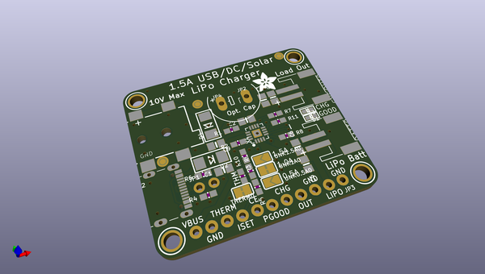

# adafruit_bq24074_pcb
 
## summary 
* id: adafruit_adafruit_bq24074_pcb_adafruit_bq24074
* user: adafruit
* name: adafruit_bq24074_pcb
* board: adafruit_bq24074
* repo: https://github.com/adafruit/Adafruit-BQ24074-PCB

* src_file_repo_sch: 
*
 src_file_repo_sch_link: https://github.com/adafruit/Adafruit-BQ24074-PCB/tree/master/
* full details link: https://github.com/oomlout/oomlout_oomp_project_bot_v_2/tree/main/projects/adafruit_adafruit_bq24074_pcb_adafruit_bq24074/current_version/working  

## schematic  
  
[schematic (pdf)](working_schematic.pdf)  

## pcb  
 
  
  
  
[board (pdf)](working.pdf)  

## working_bom
| Id | Designator | Footprint | Quantity | Designation | Supplier and ref |  | None | 
| --- | --- | --- | --- | --- | --- | --- | --- | 
| 1 | D2,D4 | SMADIODE | 2 | SK34A |  |  | [''] | 
| 2 | FID3,FID1,FID2 | FIDUCIAL_1MM | 3 | FIDUCIAL_1MM |  |  | [''] | 
| 3 | UNK0.5A0,UNK1.5A0 | SOLDERJUMPER_ARROW_NOPASTE | 2 |  |  |  | [''] | 
| 4 | R10,R8,R11,R2,R7 | 0603-NO | 5 | 10K |  |  | [''] | 
| 5 | JP3 | 1X11_ROUND_76 | 1 |  |  |  | [''] | 
| 6 | X2 | USB_C_CUSB31-CFM2AX-01-X | 1 | USB Type C |  |  | [''] | 
| 7 | R9,R1 | 0603-NO | 2 | 1K |  |  | [''] | 
| 8 | R6,R4 | 0603-NO | 2 | 5.1K |  |  | [''] | 
| 9 | SYSOUT0,BATT0 | JST-PH-2-SMT-RA | 2 | JST 2PH |  |  | [''] | 
| 10 | U$14 | ADAFRUIT_5MM | 1 |  |  |  | [''] | 
| 11 | THERM0,UNK1A0 | SOLDERJUMPER_CLOSEDWIRE | 2 |  |  |  | [''] | 
| 12 | C1,C9,C5,C3,C6,C2,C4 | 0805-NO | 7 | 10uF |  |  | [''] | 
| 13 | R5 | 0603-NO | 1 | 2K |  |  | [''] | 
| 14 | R3 | 0603-NO | 1 | 590 |  |  | [''] | 
| 15 | U$11,U$3,U$12,U$4 | MOUNTINGHOLE_2.5_PLATED | 4 | MOUNTINGHOLE2.5 |  |  | [''] | 
| 16 | X3 | DCJACK_2MM_SMT | 1 | 2.1mm DC |  |  | [''] | 
| 17 | JP2,JP4 | 1X01_OVAL | 2 |  |  |  | [''] | 
| 18 | D3 | CHIPLED_0603 | 1 | RED |  |  | [''] | 
| 19 | X4 | QFN16_3MM | 1 | BQ24074 |  |  | [''] | 
| 20 | JP1 | 1X02_ROUND | 1 |  |  |  | [''] | 
| 21 | D1 | CHIPLED_0603 | 1 | GREEN |  |  | [''] | 
| 22 | SJ2,SJ1 | SOLDERJUMPER_2WAY_OPEN_NOPASTE | 2 |  |  |  | [''] | 
| 23 | U$18 | PCBFEAT-REV-040 | 1 |  |  |  | [''] | 

## bom_schematic
| Ref | Qnty | Value | Cmp name | Footprint | Description | Vendor | DNP | 
| --- | --- | --- | --- | --- | --- | --- | --- | 
| BATT0 | 1 | JST 2PH | JST_2PIN-SMT-RA | working:JST-PH-2-SMT-RA |  |  |  | 
| C1, C2, C3, C4, C5, C6, C9 | 7 | 10uF | CAP_CERAMIC0805-NOOUTLINE | working:0805-NO |  |  |  | 
| D1 | 1 | GREEN | LED0603 | working:CHIPLED_0603 |  |  |  | 
| D2, D4 | 2 | SK34A | DIODE-SCHOTTKYSMA | working:SMADIODE |  |  |  | 
| D3 | 1 | RED | LED0603 | working:CHIPLED_0603 |  |  |  | 
| FID1, FID2, FID3 | 3 | FIDUCIAL_1MM | FIDUCIAL_1MM | working:FIDUCIAL_1MM |  |  |  | 
| JP1 | 1 | HEADER-1X2ROUND | HEADER-1X2ROUND | working:1X02_ROUND |  |  |  | 
| JP2, JP4 | 2 | HEADER-1X1 | HEADER-1X1 | working:1X01_OVAL |  |  |  | 
| JP3 | 1 | HEADER-1X1176MIL | HEADER-1X1176MIL | working:1X11_ROUND_76 |  |  |  | 
| R1, R9 | 2 | 1K | RESISTOR_0603_NOOUT | working:0603-NO |  |  |  | 
| R2, R7, R8, R10, R11 | 5 | 10K | RESISTOR_0603_NOOUT | working:0603-NO |  |  |  | 
| R3 | 1 | 590 | RESISTOR_0603_NOOUT | working:0603-NO |  |  |  | 
| R4, R6 | 2 | 5.1K | RESISTOR_0603_NOOUT | working:0603-NO |  |  |  | 
| R5 | 1 | 2K | RESISTOR_0603_NOOUT | working:0603-NO |  |  |  | 
| SJ1, SJ2 | 2 | SOLDERJUMPER_2WAY | SOLDERJUMPER_2WAY | working:SOLDERJUMPER_2WAY_OPEN_NOPASTE |  |  |  | 
| SYSOUT0 | 1 | JST 2PH | JST_2PIN-SMT-RA | working:JST-PH-2-SMT-RA |  |  |  | 
| THERM0 | 1 | SOLDERJUMPERCLOSED | SOLDERJUMPERCLOSED | working:SOLDERJUMPER_CLOSEDWIRE |  |  |  | 
| U$3, U$4, U$11, U$12 | 4 | MOUNTINGHOLE2.5 | MOUNTINGHOLE2.5 | working:MOUNTINGHOLE_2.5_PLATED |  |  |  | 
| UNK0.5A0 | 1 | SOLDERJUMPER | SOLDERJUMPER | working:SOLDERJUMPER_ARROW_NOPASTE |  |  |  | 
| UNK1.5A0 | 1 | SOLDERJUMPER | SOLDERJUMPER | working:SOLDERJUMPER_ARROW_NOPASTE |  |  |  | 
| UNK1A0 | 1 | SOLDERJUMPERCLOSED | SOLDERJUMPERCLOSED | working:SOLDERJUMPER_CLOSEDWIRE |  |  |  | 
| X2 | 1 | USB Type C | USB_C | working:USB_C_CUSB31-CFM2AX-01-X |  |  |  | 
| X3 | 1 | 2.1mm DC | DCBARRELSMT | working:DCJACK_2MM_SMT |  |  |  | 
| X4 | 1 | BQ24074 | BQ24074 | working:QFN16_3MM |  |  |  | 

## mounting_holes
| x | y | package | value | ref | size | 
| --- | --- | --- | --- | --- | --- | 
| 0.0 | 0.0 | MOUNTINGHOLE_2.5_PLATED | MOUNTINGHOLE2.5 | U$3 | m3 | 
| 0.0 | 27.939999999999998 | MOUNTINGHOLE_2.5_PLATED | MOUNTINGHOLE2.5 | U$4 | m3 | 
| 33.02000000000001 | 27.939999999999998 | MOUNTINGHOLE_2.5_PLATED | MOUNTINGHOLE2.5 | U$11 | m3 | 
| 33.02000000000001 | 0.0 | MOUNTINGHOLE_2.5_PLATED | MOUNTINGHOLE2.5 | U$12 | m3 | 

