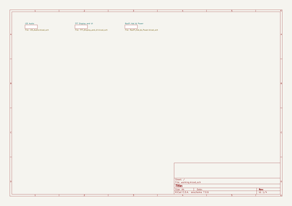
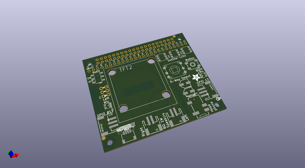
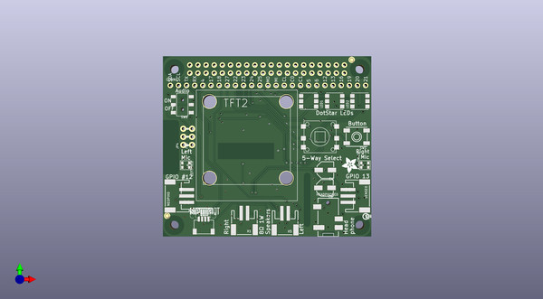
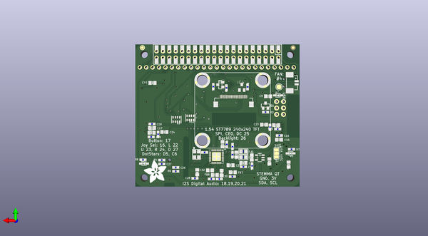

# adafruit_braincraft_hat_pcb
 
## summary 
* id: adafruit_adafruit_braincraft_hat_pcb_adafruit_braincraft_hat
* user: adafruit
* name: adafruit_braincraft_hat_pcb
* board: adafruit_braincraft_hat
* repo: https://github.com/adafruit/Adafruit-BrainCraft-HAT-PCB

* src_file_repo_sch: 
*
 src_file_repo_sch_link: https://github.com/adafruit/Adafruit-BrainCraft-HAT-PCB/tree/main/
* full details link: https://github.com/oomlout/oomlout_oomp_project_bot_v_2/tree/main/projects/adafruit_adafruit_braincraft_hat_pcb_adafruit_braincraft_hat/current_version/working  

## schematic  
  
[schematic (pdf)](working_schematic.pdf)  

## pcb  
 
  
  
  
[board (pdf)](working.pdf)  

## working_bom
| Id | Designator | Footprint | Quantity | Designation | Supplier and ref |  | None | 
| --- | --- | --- | --- | --- | --- | --- | --- | 
| 1 | FID2,FID1 | FIDUCIAL_1MM | 2 | FIDUCIAL_1MM |  |  | [''] | 
| 2 | U$72 | STEMMAQT | 1 |  |  |  | [''] | 
| 3 | U$11 | PCBFEAT-REV-040 | 1 |  |  |  | [''] | 
| 4 | HEADPHONE0 | 4UCONN_18510 | 1 |  |  |  | [''] | 
| 5 | SW1 | EVQ-Q2_SMALLER | 1 | EVQQ |  |  | [''] | 
| 6 | X5,X1 | JSTPH2 | 2 | JSTPH 2P |  |  | [''] | 
| 7 | SENSE0,NEOPIX0 | JSTPH3 | 2 | JST PH 3 |  |  | [''] | 
| 8 | SW6 | EG1390 | 1 | EG1390 |  |  | [''] | 
| 9 | LEFTMIC0,RIGHTMIC0 | SPW2430HR5H-B | 2 |  |  |  | [''] | 
| 10 | C4,C6 | PANASONIC_C | 2 | 100uF |  |  | [''] | 
| 11 | U$75 | ADAFRUIT_5MM | 1 |  |  |  | [''] | 
| 12 | LED2,LED1,LED3 | APA102 | 3 | SK6822 |  |  | [''] | 
| 13 | CONN3 | JST_SH4 | 1 | STEMMA_I2C_QT |  |  | [''] | 
| 14 | SW5 | SKQUBAE010 | 1 | NAVSWITCHSKQUABAUE010 |  |  | [''] | 
| 15 | RPI1 | PI_HAT_SMTTHM_SLOTS | 1 | RASPBERRYPI_BPLUS_HAT_SMTTHM_SLOTS |  |  | [''] | 
| 16 | JP4,JP5 | 1X03_ROUND_76 | 2 |  |  |  | [''] | 
| 17 | CONN1 | 1X25_ROUND_70MIL | 1 | HEADER-1X25 |  |  | [''] | 
| 18 | TFT2 | TFT_1.54IN_240X240_22PIN | 1 | DISP_TFT_1.54IN_240X240_22P |  |  | [''] | 
| 19 | D1,D2 | SOD-323 | 2 | 3.6V |  |  | [''] | 
| 20 | C1,C24,C9,C5,C11,C32,C23,C10,C17,C34,C33,C13,C15,C2 | 0805-NO | 14 | 10uF |  |  | [''] | 
| 21 | U$87 | ADAFRUIT_9MM | 1 |  |  |  | [''] | 
| 22 | Q3,Q1 | SOT23-WIDE | 2 | BSS138 |  |  | [''] | 
| 23 | R7,R8 | 0603-NO | 2 | 1K |  |  | [''] | 
| 24 | C3,C12,C7,C16,C18,C14,C8,C25 | 0603-NO | 8 | 0.1uF |  |  | [''] | 
| 25 | D3 | SOD-323 | 1 | 1N4148 |  |  | [''] | 
| 26 | C19,C21,C22,C20 | 0603-NO | 4 | 33pF |  |  | [''] | 
| 27 | FB2,FB1 | 0805 | 2 | Ferrite |  |  | [''] | 
| 28 | R1,R4,R2,R3 | 0603-NO | 4 | 10K |  |  | [''] | 
| 29 | IC4 | SOT23 | 1 | APX803-SAG |  |  | [''] | 
| 30 | R6 | 0603-NO | 1 | 10k |  |  | [''] | 
| 31 | TP2,TP3,TP1,TP4 | SMT_NUT_3MM | 4 | SEWTAP_SMTNUTM3 |  |  | [''] | 
| 32 | C27,C26 | 0603-NO | 2 | 220pF |  |  | [''] | 
| 33 | FB7,FB3,FB9,FB8,FB10 | 0805-NO | 5 | Ferrite |  |  | [''] | 
| 34 | U3 | SOT23-5 | 1 | AP2112-3.3K |  |  | [''] | 
| 35 | R5 | 0603-NO | 1 | 10 |  |  | [''] | 
| 36 | R10,R9 | RESPACK_4X0603 | 2 | 10K |  |  | [''] | 
| 37 | OSC1 | OSC_3.2X2.5MM | 1 | ECS-3225MV |  |  | [''] | 
| 38 | FB4 | 0805-NO | 1 | FERRITE |  |  | [''] | 
| 39 | C29,C30,C28,C31 | 0603-NO | 4 | 100pF |  |  | [''] | 
| 40 | SJ1 | SOLDERJUMPER_2WAY_OPEN_NOPASTE | 1 |  |  |  | [''] | 
| 41 | IC3 | QFN32_5MM | 1 | WM8960 |  |  | [''] | 
| 42 | TP6 | TESTPOINT_ROUND_2MM | 1 |  |  |  | [''] | 
| 43 | U$79 | BRAINPAD_1IN | 1 |  |  |  | [''] | 
| 44 | U$82 | FAN_30X30MM | 1 |  |  |  | [''] | 
| 45 | U$84 | 53398-0271 | 1 | CON_MOLEX_2P |  |  | [''] | 

## bom_schematic
no data

