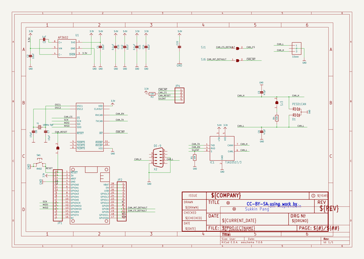
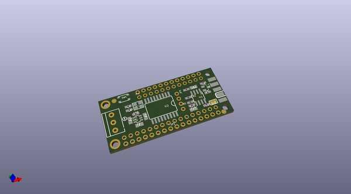
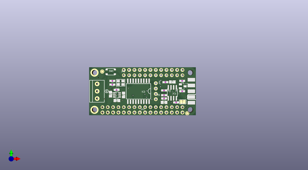
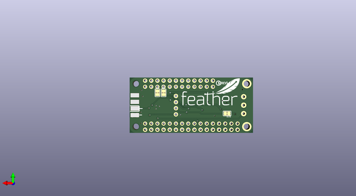

# adafruit_can_bus_featherwing_pcb
 
## summary 
* id: adafruit_adafruit_can_bus_featherwing_pcb_adafruit_can_bus_featherwing
* user: adafruit
* name: adafruit_can_bus_featherwing_pcb
* board: adafruit_can_bus_featherwing
* repo: https://github.com/adafruit/Adafruit-CAN-Bus-FeatherWing-PCB

* src_file_repo_sch: 
*
 src_file_repo_sch_link: https://github.com/adafruit/Adafruit-CAN-Bus-FeatherWing-PCB/tree/main/
* full details link: https://github.com/oomlout/oomlout_oomp_project_bot_v_2/tree/main/projects/adafruit_adafruit_can_bus_featherwing_pcb_adafruit_can_bus_featherwing/current_version/working  

## schematic  
  
[schematic (pdf)](working_schematic.pdf)  

## pcb  
 
  
  
  
[board (pdf)](working.pdf)  

## working_bom
| Id | Designator | Footprint | Quantity | Designation | Supplier and ref |  | None | 
| --- | --- | --- | --- | --- | --- | --- | --- | 
| 1 | C8,C7 | 0603-NO | 2 | 15pF |  |  | [''] | 
| 2 | IC2 | SOIC18WIDE | 1 | MCP2515/SO |  |  | [''] | 
| 3 | C10,C22,C11 | 0603-NO | 3 | 0.1uF |  |  | [''] | 
| 4 | JP4 | 1X04_ROUND | 1 |  |  |  | [''] | 
| 5 | PLABEL15 | PLABEL15 | 1 |  |  |  | [''] | 
| 6 | NEOPIX1 | TERMBLOCK_1X3-3.5MM | 1 | 3.5mm |  |  | [''] | 
| 7 | U1 | SOT23-6 | 1 | AP3602 |  |  | [''] | 
| 8 | C14,C12,C2,C1 | 0805-NO | 4 | 10uF |  |  | [''] | 
| 9 | FID2,FID3 | FIDUCIAL_1MM | 2 | FIDUCIAL_1MM |  |  | [''] | 
| 10 | Y1 | CRYSTAL_3.2X2.5 | 1 | 16MHz 9pF |  |  | [''] | 
| 11 | PLABEL2 | PLABEL2 | 1 |  |  |  | [''] | 
| 12 | U$21 | SYMBOL_MINUS | 1 |  |  |  | [''] | 
| 13 | PLABEL3 | PLABEL3 | 1 |  |  |  | [''] | 
| 14 | PLABEL16 | PLABEL16 | 1 |  |  |  | [''] | 
| 15 | PLABEL6 | PLABEL6 | 1 |  |  |  | [''] | 
| 16 | C6,C5 | 0603-NO | 2 | 47pF |  |  | [''] | 
| 17 | SJ3,SJ1,SJ6,SJ5 | SOLDERJUMPER_CLOSEDWIRE | 4 |  |  |  | [''] | 
| 18 | X2 | M09D | 1 | DE-9 |  |  | [''] | 
| 19 | R2,R1 | 0603-NO | 2 | 10K |  |  | [''] | 
| 20 | MS1 | FEATHERWING_NODIM | 1 | FEATHERWING_NODIM |  |  | [''] | 
| 21 | JP1 | 1X16_ROUND | 1 |  |  |  | [''] | 
| 22 | SW1 | BTN_RKB2_4.6X2.8 | 1 | RKB2 |  |  | [''] | 
| 23 | IC1 | SOIC8_150MIL | 1 | TJA1051T/3 |  |  | [''] | 
| 24 | PLABEL1 | PLABEL1 | 1 |  |  |  | [''] | 
| 25 | R4 | 0603-NO | 1 | 120 |  |  | [''] | 
| 26 | D1 | SOT23 | 1 | PESD1CAN |  |  | [''] | 
| 27 | JP2 | 1X12_ROUND | 1 |  |  |  | [''] | 
| 28 | PLABEL0 | PLABEL0 | 1 |  |  |  | [''] | 
| 29 | PLABEL4 | PLABEL4 | 1 |  |  |  | [''] | 
| 30 | PLABEL5 | PLABEL5 | 1 |  |  |  | [''] | 
| 31 | C3 | 0805-NO | 1 | 1uF |  |  | [''] | 
| 32 | PLABEL10 | PLABEL10 | 1 |  |  |  | [''] | 
| 33 | PLABEL9 | PLABEL9 | 1 |  |  |  | [''] | 
| 34 | U$33 | PCBFEAT-REV-040 | 1 |  |  |  | [''] | 
| 35 | PLABEL8 | PLABEL8 | 1 |  |  |  | [''] | 
| 36 | PLABEL11 | PLABEL11 | 1 |  |  |  | [''] | 
| 37 | PLABEL13 | PLABEL13 | 1 |  |  |  | [''] | 
| 38 | U$22 | FEATHERLOGO | 1 |  |  |  | [''] | 
| 39 | PLABEL12 | PLABEL12 | 1 |  |  |  | [''] | 
| 40 | PLABEL14 | PLABEL14 | 1 |  |  |  | [''] | 

## bom_schematic
| Ref | Qnty | Value | Cmp name | Footprint | Description | Vendor | DNP | 
| --- | --- | --- | --- | --- | --- | --- | --- | 
| C1, C2, C12, C14 | 4 | 10uF | CAP_CERAMIC0805-NOOUTLINE | working:0805-NO |  |  |  | 
| C3 | 1 | 1uF | CAP_CERAMIC0805-NOOUTLINE | working:0805-NO |  |  |  | 
| C5, C6 | 2 | 47pF | CAP_CERAMIC0603_NO | working:0603-NO |  |  |  | 
| C7, C8 | 2 | 15pF | CAP_CERAMIC0603_NO | working:0603-NO |  |  |  | 
| C10, C11, C22 | 3 | 0.1uF | CAP_CERAMIC0603_NO | working:0603-NO |  |  |  | 
| D1 | 1 | PESD1CAN | PESD1CAN | working:SOT23 |  |  |  | 
| FID2, FID3 | 2 | FIDUCIAL_1MM | FIDUCIAL_1MM | working:FIDUCIAL_1MM |  |  |  | 
| IC1 | 1 | TJA1051T/3 | CAN_TRANSCIEVER_TCAN1051V | working:SOIC8_150MIL |  |  |  | 
| IC2 | 1 | MCP2515/SO | MCP2515/SO | working:SOIC18WIDE |  |  |  | 
| JP1 | 1 | HEADER-1X16ROUND | HEADER-1X16ROUND | working:1X16_ROUND |  |  |  | 
| JP2 | 1 | HEADER-1X12 | HEADER-1X12 | working:1X12_ROUND |  |  |  | 
| JP4 | 1 | HEADER-1X4ROUND | HEADER-1X4ROUND | working:1X04_ROUND |  |  |  | 
| MS1 | 1 | FEATHERWING_NODIM | FEATHERWING_NODIM | working:FEATHERWING_NODIM |  |  |  | 
| NEOPIX1 | 1 | 3.5mm | TERMBLOCK_1X3 | working:TERMBLOCK_1X3-3.5MM |  |  |  | 
| R1, R2 | 2 | 10K | RESISTOR_0603_NOOUT | working:0603-NO |  |  |  | 
| R4 | 1 | 120 | RESISTOR_0603_NOOUT | working:0603-NO |  |  |  | 
| SJ1, SJ3, SJ5, SJ6 | 4 | SOLDERJUMPER_CLOSED | SOLDERJUMPER_CLOSED | working:SOLDERJUMPER_CLOSEDWIRE |  |  |  | 
| SW1 | 1 | RKB2 | SWITCH_TACT_SMT_RKB2 | working:BTN_RKB2_4.6X2.8 |  |  |  | 
| U1 | 1 | AP3602 | AP3602 | working:SOT23-6 |  |  |  | 
| X2 | 1 | DE-9 | M09D | working:M09D |  |  |  | 
| Y1 | 1 | 16MHz 9pF | CRYSTAL3.2X2.5 | working:CRYSTAL_3.2X2.5 |  |  |  | 

