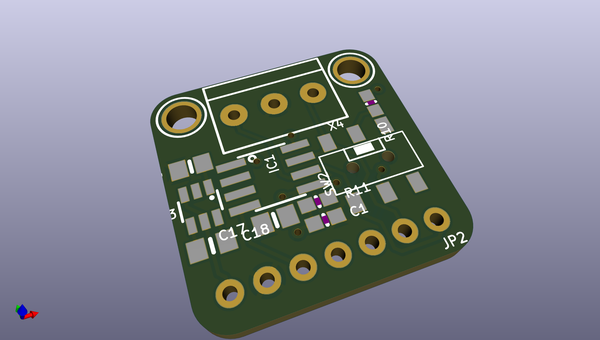

# adafruit_can_pal_pcb
 
## summary 
* id: adafruit_adafruit_can_pal_pcb_adafruit_can_pal_breakout
* user: adafruit
* name: adafruit_can_pal_pcb
* board: adafruit_can_pal_breakout
* repo: https://github.com/adafruit/Adafruit-CAN-Pal-PCB

* src_file_repo_sch: 
*
 src_file_repo_sch_link: https://github.com/adafruit/Adafruit-CAN-Pal-PCB/tree/main/
* full details link: https://github.com/oomlout/oomlout_oomp_project_bot_v_2/tree/main/projects/adafruit_adafruit_can_pal_pcb_adafruit_can_pal_breakout/current_version/working  

## schematic  
  
[schematic (pdf)](working_schematic.pdf)  

## pcb  
 
  
  
  
[board (pdf)](working.pdf)  

## working_bom
| Id | Designator | Footprint | Quantity | Designation | Supplier and ref |  | None | 
| --- | --- | --- | --- | --- | --- | --- | --- | 
| 1 | JP2 | 1X07_ROUND_70 | 1 |  |  |  | [''] | 
| 2 | PLABEL6 | PLABEL6 | 1 |  |  |  | [''] | 
| 3 | PLABEL3 | PLABEL3 | 1 |  |  |  | [''] | 
| 4 | IC1 | SOIC8_150MIL | 1 | TJA1051T/3 |  |  | [''] | 
| 5 | C17,C16 | 0805-NO | 2 | 10uF |  |  | [''] | 
| 6 | C18 | 0805_10MGAP | 1 | 1uF |  |  | [''] | 
| 7 | U$2,U$3 | MOUNTINGHOLE_2.5_PLATED | 2 | MOUNTINGHOLE2.5 |  |  | [''] | 
| 8 | PLABEL2 | PLABEL2 | 1 |  |  |  | [''] | 
| 9 | R11,R10 | 0603-NO | 2 | 60 ohm |  |  | [''] | 
| 10 | PLABEL0 | PLABEL0 | 1 |  |  |  | [''] | 
| 11 | PLABEL4 | PLABEL4 | 1 |  |  |  | [''] | 
| 12 | PLABEL7 | PLABEL7 | 1 |  |  |  | [''] | 
| 13 | C1 | 0603-NO | 1 | 4.7nF |  |  | [''] | 
| 14 | PLABEL11 | PLABEL11 | 1 |  |  |  | [''] | 
| 15 | IC3 | SOT23-6 | 1 | AP3602 |  |  | [''] | 
| 16 | SW2 | EG1390 | 1 | EG1390 |  |  | [''] | 
| 17 | PLABEL10 | PLABEL10 | 1 |  |  |  | [''] | 
| 18 | X4 | TERMBLOCK_1X3-3.5MM | 1 | 3.5mm Terminal |  |  | [''] | 
| 19 | PLABEL8 | PLABEL8 | 1 |  |  |  | [''] | 
| 20 | PLABEL5 | PLABEL5 | 1 |  |  |  | [''] | 
| 21 | PLABEL1 | PLABEL1 | 1 |  |  |  | [''] | 
| 22 | PLABEL9 | PLABEL9 | 1 |  |  |  | [''] | 
| 23 | PLABEL14 | PLABEL14 | 1 |  |  |  | [''] | 
| 24 | PLABEL12 | PLABEL12 | 1 |  |  |  | [''] | 
| 25 | PLABEL13 | PLABEL13 | 1 |  |  |  | [''] | 
| 26 | U$6 | ADAFRUIT_3.5MM | 1 |  |  |  | [''] | 
| 27 | U$7 | PCBFEAT-REV-040 | 1 |  |  |  | [''] | 

## bom_schematic
| Ref | Qnty | Value | Cmp name | Footprint | Description | Vendor | DNP | 
| --- | --- | --- | --- | --- | --- | --- | --- | 
| C1 | 1 | 4.7nF | CAP_CERAMIC0603_NO | working:0603-NO |  |  |  | 
| C16, C17 | 2 | 10uF | CAP_CERAMIC0805-NOOUTLINE | working:0805-NO |  |  |  | 
| C18 | 1 | 1uF | CAP_CERAMIC0805_10MGAP | working:0805_10MGAP |  |  |  | 
| IC1 | 1 | TJA1051T/3 | CAN_TRANSCIEVER_TCAN1051V | working:SOIC8_150MIL |  |  |  | 
| IC3 | 1 | AP3602 | AP3602 | working:SOT23-6 |  |  |  | 
| JP2 | 1 | HEADER-1X770MIL | HEADER-1X770MIL | working:1X07_ROUND_70 |  |  |  | 
| R10, R11 | 2 | 60 ohm | RESISTOR_0603_NOOUT | working:0603-NO |  |  |  | 
| SW2 | 1 | EG1390 | SWITCH_DPDTEG1390 | working:EG1390 |  |  |  | 
| U$2, U$3 | 2 | MOUNTINGHOLE2.5 | MOUNTINGHOLE2.5 | working:MOUNTINGHOLE_2.5_PLATED |  |  |  | 
| X4 | 1 | 3.5mm Terminal | TERMBLOCK_1X3 | working:TERMBLOCK_1X3-3.5MM |  |  |  | 

## mounting_holes
| x | y | package | value | ref | size | 
| --- | --- | --- | --- | --- | --- | 
| 0.0 | 0.0 | MOUNTINGHOLE_2.5_PLATED | MOUNTINGHOLE2.5 | U$2 | m3 | 
| 15.24 | 0.0 | MOUNTINGHOLE_2.5_PLATED | MOUNTINGHOLE2.5 | U$3 | m3 | 

