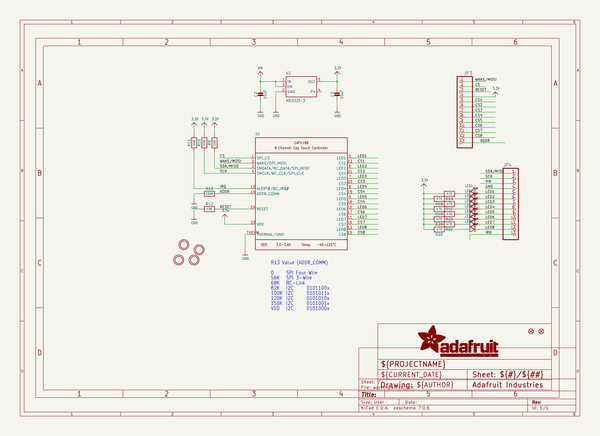
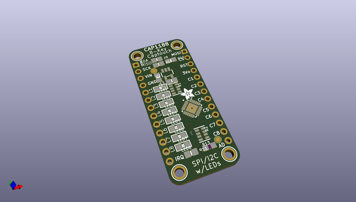
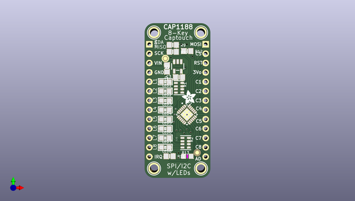
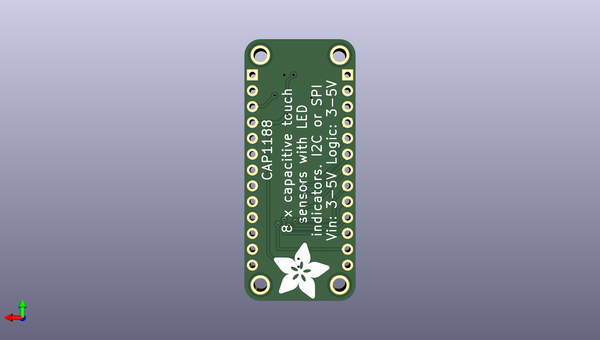

# adafruit_cap1188_pcb
 
## summary 
* id: adafruit_adafruit_cap1188_pcb_adafruit_cap1188
* user: adafruit
* name: adafruit_cap1188_pcb
* board: adafruit_cap1188
* repo: https://github.com/adafruit/Adafruit-CAP1188-PCB

* src_file_repo_sch: 
*
 src_file_repo_sch_link: https://github.com/adafruit/Adafruit-CAP1188-PCB/tree/master/
* full details link: https://github.com/oomlout/oomlout_oomp_project_bot_v_2/tree/main/projects/adafruit_adafruit_cap1188_pcb_adafruit_cap1188/current_version/working  

## schematic  
  
[schematic (pdf)](working_schematic.pdf)  

## pcb  
 
  
  
  
[board (pdf)](working.pdf)  

## working_bom
| Id | Designator | Footprint | Quantity | Designation | Supplier and ref |  | None | 
| --- | --- | --- | --- | --- | --- | --- | --- | 
| 1 | U2 | SOT23-5 | 1 | MIC5225-3 |  |  | [''] | 
| 2 | LED6,LED4,LED3,LED7,LED5,LED2,LED1,LED8 | CHIPLED_0805 | 8 |  |  |  | [''] | 
| 3 | U$7,U$10,U$9,U$8 | MOUNTINGHOLE_2.0_PLATED | 4 | MOUNTINGHOLE2.0 |  |  | [''] | 
| 4 | U$13 | ADAFRUIT_3.5MM | 1 |  |  |  | [''] | 
| 5 | U1 | QFN24_4MM_SMSC | 1 |  |  |  | [''] | 
| 6 | R11,R12,R10,R9 | 0805-NO | 4 | 10K |  |  | [''] | 
| 7 | R2,R1 | RESPACK_4X0603 | 2 | 470 |  |  | [''] | 
| 8 | JP3,JP4 | 1X13_ROUND_70 | 2 |  |  |  | [''] | 
| 9 | FID2,FID1 | FIDUCIAL_1MM | 2 | FIDUCIAL" |  |  | [''] | 
| 10 | R13 | _0805MP | 1 | 150K |  |  | [''] | 
| 11 | C2,C3 | 0805-NO | 2 | 10uF |  |  | [''] | 
| 12 | U$14 | ADAFRUIT_9MM | 1 |  |  |  | [''] | 

## bom_schematic
| Ref | Qnty | Value | Cmp name | Footprint | Description | Vendor | DNP | 
| --- | --- | --- | --- | --- | --- | --- | --- | 
| C2, C3 | 2 | 10uF | CAP_CERAMIC0805-NOOUTLINE | working:0805-NO |  |  |  | 
| FID1, FID2 | 2 | FIDUCIAL"" | FIDUCIAL{dblquote}{dblquote} | working:FIDUCIAL_1MM |  |  |  | 
| JP3, JP4 | 2 | HEADER-1X13 | HEADER-1X13 | working:1X13_ROUND_70 |  |  |  | 
| LED1, LED2, LED3, LED4, LED5, LED6, LED7, LED8 | 8 | LED0805 | LED0805 | working:CHIPLED_0805 |  |  |  | 
| R1, R2 | 2 | 470 | RESISTOR_4PACK | working:RESPACK_4X0603 |  |  |  | 
| R9, R10, R11, R12 | 4 | 10K | RESISTOR0805_NOOUTLINE | working:0805-NO |  |  |  | 
| R13 | 1 | 150K | RESISTOR_0805MP | working:_0805MP |  |  |  | 
| U1 | 1 | CAP1188 | CAP1188 | working:QFN24_4MM_SMSC |  |  |  | 
| U2 | 1 | MIC5225-3 | VREG_SOT23-5 | working:SOT23-5 |  |  |  | 
| U$7, U$8, U$9, U$10 | 4 | MOUNTINGHOLE2.0 | MOUNTINGHOLE2.0 | working:MOUNTINGHOLE_2.0_PLATED |  |  |  | 

## mounting_holes
| x | y | package | value | ref | size | 
| --- | --- | --- | --- | --- | --- | 
| 0.0 | 0.0 | MOUNTINGHOLE_2.0_PLATED | MOUNTINGHOLE2.0 | U$7 | m3 | 
| 12.7 | 0.0 | MOUNTINGHOLE_2.0_PLATED | MOUNTINGHOLE2.0 | U$8 | m3 | 
| 0.0 | 36.83 | MOUNTINGHOLE_2.0_PLATED | MOUNTINGHOLE2.0 | U$9 | m3 | 
| 12.7 | 36.83 | MOUNTINGHOLE_2.0_PLATED | MOUNTINGHOLE2.0 | U$10 | m3 | 

