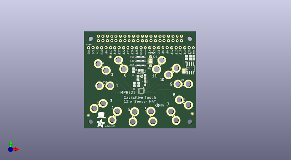

# adafruit_capacitive_touch_hat_pcb
 
## summary 
* id: adafruit_adafruit_capacitive_touch_hat_pcb_adafruit_capacitive_touch_hat
* user: adafruit
* name: adafruit_capacitive_touch_hat_pcb
* board: adafruit_capacitive_touch_hat
* repo: https://github.com/adafruit/Adafruit-Capacitive-Touch-HAT-PCB

* src_file_repo_sch: 
*
 src_file_repo_sch_link: https://github.com/adafruit/Adafruit-Capacitive-Touch-HAT-PCB/tree/master/
* full details link: https://github.com/oomlout/oomlout_oomp_project_bot_v_2/tree/main/projects/adafruit_adafruit_capacitive_touch_hat_pcb_adafruit_capacitive_touch_hat/current_version/working  

## schematic  
  
[schematic (pdf)](working_schematic.pdf)  

## pcb  
 
  
  
  
[board (pdf)](working.pdf)  

## working_bom
| Id | Designator | Footprint | Quantity | Designation | Supplier and ref |  | None | 
| --- | --- | --- | --- | --- | --- | --- | --- | 
| 1 | C4,C3 | 0805-NO | 2 | 0.1uF |  |  | [''] | 
| 2 | U$5 | PIHATLOGO | 1 |  |  |  | [''] | 
| 3 | JP5,ADDR0,JP4,JP6,UNK#26,JP3,JP1,IRQ0,JP7,JP12,JP10,JP8,JP11,JP2,JP9 | 1X01_ROUND | 15 |  |  |  | [''] | 
| 4 | AL4,AL2,AL8,AL6,AL12,AL5,AL11,AL1,AL3,AL9,AL10,AL7 | ALLIGATORCLIP | 12 | ALLIGATORCLIP_MICRO |  |  | [''] | 
| 5 | SJ1 | SOLDERJUMPER_CLOSEDWIRE | 1 | WP |  |  | [''] | 
| 6 | U$51 | ADAFRUIT_5MM | 1 |  |  |  | [''] | 
| 7 | C1 | 0805-NO | 1 | 10uF |  |  | [''] | 
| 8 | R6 | 0805-NO | 1 | 100K |  |  | [''] | 
| 9 | R2,R3,R1 | 0805-NO | 3 | 3.9K |  |  | [''] | 
| 10 | RPI1 | PI_HAT_SLOTS | 1 | RASPBERRYPI_BPLUS_HATSLOTS |  |  | [''] | 
| 11 | R7 | 0805-NO | 1 | 1K |  |  | [''] | 
| 12 | R5 | 0805-NO | 1 | 75K |  |  | [''] | 
| 13 | D1 | CHIPLED_0805_NOOUTLINE | 1 | RED |  |  | [''] | 
| 14 | SJ2 | SOLDERJUMPER_CLOSEDWIRE | 1 |  |  |  | [''] | 
| 15 | FID2,FID1,FID3 | FIDUCIAL_1MM | 3 | FIDUCIAL" |  |  | [''] | 
| 16 | CONN1 | 1X25_ROUND_70MIL | 1 | HEADER-1X25 |  |  | [''] | 
| 17 | U2 | QFN20_3MM_NOTHERMAL | 1 | MPR121 |  |  | [''] | 
| 18 | U$6 | PCBFEAT-REV-040 | 1 |  |  |  | [''] | 
| 19 | U1 | SOIC8_150MIL | 1 | CAT24C32 |  |  | [''] | 

## bom_schematic
| Ref | Qnty | Value | Cmp name | Footprint | Description | Vendor | DNP | 
| --- | --- | --- | --- | --- | --- | --- | --- | 
| ADDR0 | 1 | HEADER-1X1ROUND | HEADER-1X1ROUND | working:1X01_ROUND |  |  |  | 
| AL1, AL2, AL3, AL4, AL5, AL6, AL7, AL8, AL9, AL10, AL11, AL12 | 12 | ALLIGATORCLIP_MICRO | ALLIGATORCLIP_MICRO | working:ALLIGATORCLIP |  |  |  | 
| C1 | 1 | 10uF | CAP_CERAMIC0805-NOOUTLINE | working:0805-NO |  |  |  | 
| C3, C4 | 2 | 0.1uF | CAP_CERAMIC0805-NOOUTLINE | working:0805-NO |  |  |  | 
| CONN1 | 1 | HEADER-1X25 | HEADER-1X25 | working:1X25_ROUND_70MIL |  |  |  | 
| D1 | 1 | RED | LED0805_NOOUTLINE | working:CHIPLED_0805_NOOUTLINE |  |  |  | 
| FID1, FID2, FID3 | 3 | FIDUCIAL"" | FIDUCIAL{dblquote}{dblquote} | working:FIDUCIAL_1MM |  |  |  | 
| IRQ0 | 1 | HEADER-1X1ROUND | HEADER-1X1ROUND | working:1X01_ROUND |  |  |  | 
| JP1, JP2, JP3, JP4, JP5, JP6, JP7, JP8, JP9, JP10, JP11, JP12 | 12 | HEADER-1X1ROUND | HEADER-1X1ROUND | working:1X01_ROUND |  |  |  | 
| R1, R2, R3 | 3 | 3.9K | RESISTOR0805_NOOUTLINE | working:0805-NO |  |  |  | 
| R5 | 1 | 75K | RESISTOR0805_NOOUTLINE | working:0805-NO |  |  |  | 
| R6 | 1 | 100K | RESISTOR0805_NOOUTLINE | working:0805-NO |  |  |  | 
| R7 | 1 | 1K | RESISTOR0805_NOOUTLINE | working:0805-NO |  |  |  | 
| RPI1 | 1 | RASPBERRYPI_BPLUS_HATSLOTS | RASPBERRYPI_BPLUS_HATSLOTS | working:PI_HAT_SLOTS |  |  |  | 
| SJ1 | 1 | WP | SOLDERJUMPER_CLOSED | working:SOLDERJUMPER_CLOSEDWIRE |  |  |  | 
| SJ2 | 1 | SOLDERJUMPER_CLOSED | SOLDERJUMPER_CLOSED | working:SOLDERJUMPER_CLOSEDWIRE |  |  |  | 
| U1 | 1 | CAT24C32 | EEPROM_I2C_SOIC8_GENERIC | working:SOIC8_150MIL |  |  |  | 
| U2 | 1 | MPR121 | MPR121Q | working:QFN20_3MM_NOTHERMAL |  |  |  | 
| UNK#26 | 1 | HEADER-1X1ROUND | HEADER-1X1ROUND | working:1X01_ROUND |  |  |  | 

