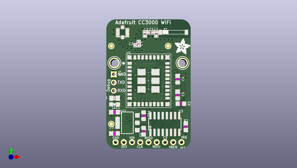

# adafruit_cc3000_breakout_pcb
 
## summary 
* id: adafruit_adafruit_cc3000_breakout_pcb_adafruit_cc3000_breakout
* user: adafruit
* name: adafruit_cc3000_breakout_pcb
* board: adafruit_cc3000_breakout
* repo: https://github.com/adafruit/Adafruit-CC3000-Breakout-PCB

* src_file_repo_sch: 
*
 src_file_repo_sch_link: https://github.com/adafruit/Adafruit-CC3000-Breakout-PCB/tree/master/
* full details link: https://github.com/oomlout/oomlout_oomp_project_bot_v_2/tree/main/projects/adafruit_adafruit_cc3000_breakout_pcb_adafruit_cc3000_breakout/current_version/working  

## schematic  
  
[schematic (pdf)](working_schematic.pdf)  

## pcb  
 
  
  
  
[board (pdf)](working.pdf)  

## working_bom
| Id | Designator | Footprint | Quantity | Designation | Supplier and ref |  | None | 
| --- | --- | --- | --- | --- | --- | --- | --- | 
| 1 | X1 | ANT_2500AT44M0400 | 1 | 2500AT44M0400E |  |  | [''] | 
| 2 | LED1 | CHIPLED_0805_NOOUTLINE | 1 | green |  |  | [''] | 
| 3 | L2 | _0402 | 1 | 2.2nH |  |  | [''] | 
| 4 | U3 | SOIC16 | 1 | 74HC4050D |  |  | [''] | 
| 5 | C7,C6,C8 | _0805MP | 3 | 10µF |  |  | [''] | 
| 6 | U$34,U$24 | MOUNTINGHOLE_2.5_PLATED | 2 | MOUNTINGHOLE2.5 |  |  | [''] | 
| 7 | C3 | _0402 | 1 | DNC_10pF |  |  | [''] | 
| 8 | C5,C4 | _0805MP | 2 | 1µF |  |  | [''] | 
| 9 | JP3 | 1X09_ROUND_70 | 1 |  |  |  | [''] | 
| 10 | U1 | CC3000MOD | 1 | CC3000MOD |  |  | [''] | 
| 11 | U$8 | ADAFRUIT_5MM | 1 |  |  |  | [''] | 
| 12 | C2 | _0402 | 1 | 10pF |  |  | [''] | 
| 13 | U2 | SOT223-R | 1 |  |  |  | [''] | 
| 14 | FB1 | _0805MP | 1 |  |  |  | [''] | 
| 15 | FID1,FID2,FID3 | FIDUCIAL_1MM | 3 | FIDUCIAL" |  |  | [''] | 
| 16 | R2,R3 | _0805MP | 2 | 10K |  |  | [''] | 
| 17 | U$35 | U.FL | 1 | U.FL |  |  | [''] | 
| 18 | L1 | _0402 | 1 | DNP |  |  | [''] | 
| 19 | C1 | _0402 | 1 | 2.2pF |  |  | [''] | 
| 20 | JP1 | 1X03_ROUND | 1 |  |  |  | [''] | 
| 21 | R1 | 0805-NO | 1 | 470 |  |  | [''] | 
| 22 | U$36 | ADAFRUIT_TEXT_20MM | 1 |  |  |  | [''] | 
| 23 | TP2 | TESTPOINT_PAD_1MM | 1 | SDA |  |  | [''] | 
| 24 | SJ1 | SOLDERJUMPER_CLOSEDWIRE | 1 | TESTMODE |  |  | [''] | 
| 25 | TP1 | TESTPOINT_PAD_1MM | 1 | SCL |  |  | [''] | 

## bom_schematic
| Ref | Qnty | Value | Cmp name | Footprint | Description | Vendor | DNP | 
| --- | --- | --- | --- | --- | --- | --- | --- | 
| C1 | 1 | 2.2pF | CAP_CERAMIC_0402 | working:_0402 |  |  |  | 
| C2 | 1 | 10pF | CAP_CERAMIC_0402 | working:_0402 |  |  |  | 
| C3 | 1 | DNC_10pF | CAP_CERAMIC_0402 | working:_0402 |  |  |  | 
| C4, C5 | 2 | 1µF | CAP_CERAMIC_0805MP | working:_0805MP |  |  |  | 
| C6, C7, C8 | 3 | 10µF | CAP_CERAMIC_0805MP | working:_0805MP |  |  |  | 
| FB1 | 1 | FERRITE_0805MP | FERRITE_0805MP | working:_0805MP |  |  |  | 
| FID1, FID2, FID3 | 3 | FIDUCIAL"" | FIDUCIAL{dblquote}{dblquote} | working:FIDUCIAL_1MM |  |  |  | 
| JP1 | 1 | HEADER-1X3ROUND | HEADER-1X3ROUND | working:1X03_ROUND |  |  |  | 
| JP3 | 1 | HEADER-1X970MIL | HEADER-1X970MIL | working:1X09_ROUND_70 |  |  |  | 
| L1 | 1 | DNP | INDUCTOR_0402 | working:_0402 |  |  |  | 
| L2 | 1 | 2.2nH | INDUCTOR_0402 | working:_0402 |  |  |  | 
| LED1 | 1 | green | LED0805_NOOUTLINE | working:CHIPLED_0805_NOOUTLINE |  |  |  | 
| R1 | 1 | 470 | RESISTOR0805_NOOUTLINE | working:0805-NO |  |  |  | 
| R2, R3 | 2 | 10K | RESISTOR_0805MP | working:_0805MP |  |  |  | 
| SJ1 | 1 | TESTMODE | SOLDERJUMPER_CLOSED | working:SOLDERJUMPER_CLOSEDWIRE |  |  |  | 
| TP1 | 1 | SCL | TESTPOINTPAD1MM | working:TESTPOINT_PAD_1MM |  |  |  | 
| TP2 | 1 | SDA | TESTPOINTPAD1MM | working:TESTPOINT_PAD_1MM |  |  |  | 
| U1 | 1 | CC3000MOD | CC3000MOD | working:CC3000MOD |  |  |  | 
| U2 | 1 | VREG_SOT223 | VREG_SOT223 | working:SOT223-R |  |  |  | 
| U3 | 1 | 74HC4050D | 74HC4050D | working:SOIC16 |  |  |  | 
| U$24, U$34 | 2 | MOUNTINGHOLE2.5 | MOUNTINGHOLE2.5 | working:MOUNTINGHOLE_2.5_PLATED |  |  |  | 
| U$35 | 1 | U.FL | U.FL | working:U.FL |  |  |  | 
| X1 | 1 | 2500AT44M0400E | ANTENNA_JOHANSON_2500AT44M0400 | working:ANT_2500AT44M0400 |  |  |  | 

## mounting_holes
| x | y | package | value | ref | size | 
| --- | --- | --- | --- | --- | --- | 
| 0.0 | 0.0 | MOUNTINGHOLE_2.5_PLATED | MOUNTINGHOLE2.5 | U$24 | m3 | 
| 21.0 | 0.0 | MOUNTINGHOLE_2.5_PLATED | MOUNTINGHOLE2.5 | U$34 | m3 | 

