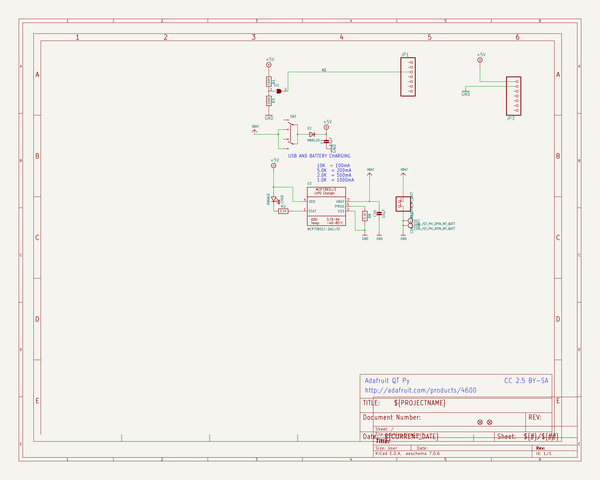
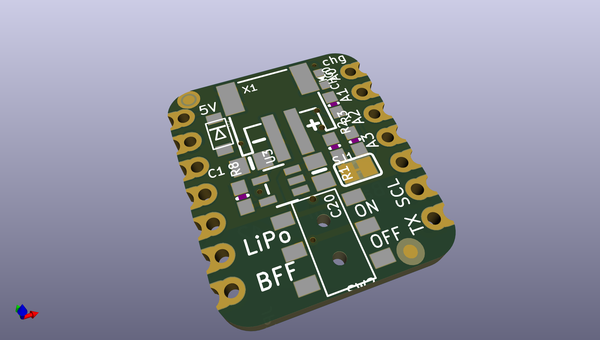
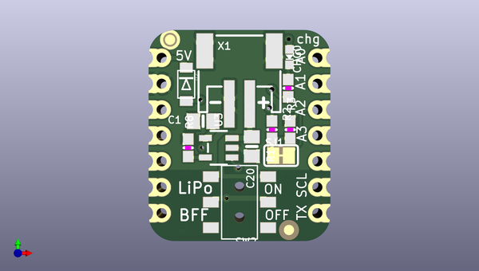
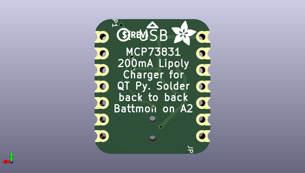

# adafruit_charger_bff_pcb
 
## summary 
* id: adafruit_adafruit_charger_bff_pcb_adafruit_lipoly_charger_bff
* user: adafruit
* name: adafruit_charger_bff_pcb
* board: adafruit_lipoly_charger_bff
* repo: https://github.com/adafruit/Adafruit-Charger-BFF-PCB

* src_file_repo_sch: 
*
 src_file_repo_sch_link: https://github.com/adafruit/Adafruit-Charger-BFF-PCB/tree/main/
* full details link: https://github.com/oomlout/oomlout_oomp_project_bot_v_2/tree/main/projects/adafruit_adafruit_charger_bff_pcb_adafruit_lipoly_charger_bff/current_version/working  

## schematic  
  
[schematic (pdf)](working_schematic.pdf)  

## pcb  
 
  
  
  
[board (pdf)](working.pdf)  

## working_bom
| Id | Designator | Footprint | Quantity | Designation | Supplier and ref |  | None | 
| --- | --- | --- | --- | --- | --- | --- | --- | 
| 1 | R2,R8 | 0603-NO | 2 | 5.1K |  |  | [''] | 
| 2 | R1,R3 | 0603-NO | 2 | 100K |  |  | [''] | 
| 3 | CHG0 | CHIPLED_0603_NOOUTLINE | 1 | ORANGE |  |  | [''] | 
| 4 | U$8,U$6 | FIDUCIAL_1MM | 2 | FIDUCIAL_1MM |  |  | [''] | 
| 5 | X1 | JSTPH2_BATT | 1 | JSTPH |  |  | [''] | 
| 6 | C20,C1 | 0805-NO | 2 | 10µF |  |  | [''] | 
| 7 | SW2 | EG1390 | 1 |  |  |  | [''] | 
| 8 | U3 | SOT23-5 | 1 | MCP73831T-2ACI/OT |  |  | [''] | 
| 9 | D2 | SOD-123FL | 1 | MBR120 |  |  | [''] | 
| 10 | SJ1 | SOLDERJUMPER_CLOSEDWIRE | 1 |  |  |  | [''] | 
| 11 | U$3 | PCBFEAT-REV-040 | 1 |  |  |  | [''] | 
| 12 | U$2 | ADAFRUIT_3.5MM | 1 |  |  |  | [''] | 
| 13 | JP1,JP3 | 1X07_CASTEL | 2 |  |  |  | [''] | 

## bom_schematic
| Ref | Qnty | Value | Cmp name | Footprint | Description | Vendor | DNP | 
| --- | --- | --- | --- | --- | --- | --- | --- | 
| C1, C20 | 2 | 10µF | CAP_CERAMIC0805-NOOUTLINE | working:0805-NO |  |  |  | 
| CHG0 | 1 | ORANGE | LED0603_NOOUTLINE | working:CHIPLED_0603_NOOUTLINE |  |  |  | 
| D2 | 1 | MBR120 | DIODE_SOD-123FL | working:SOD-123FL |  |  |  | 
| JP1, JP3 | 2 | HEADER-1X7_CASTEL | HEADER-1X7_CASTEL | working:1X07_CASTEL |  |  |  | 
| R1, R3 | 2 | 100K | RESISTOR_0603_NOOUT | working:0603-NO |  |  |  | 
| R2, R8 | 2 | 5.1K | RESISTOR_0603_NOOUT | working:0603-NO |  |  |  | 
| SJ1 | 1 | SOLDERJUMPERCLOSED | SOLDERJUMPERCLOSED | working:SOLDERJUMPER_CLOSEDWIRE |  |  |  | 
| SW2 | 1 | SWITCH_DPDTEG1390 | SWITCH_DPDTEG1390 | working:EG1390 |  |  |  | 
| U3 | 1 | MCP73831T-2ACI/OT | MCP73831/2 | working:SOT23-5 |  |  |  | 
| U$6, U$8 | 2 | FIDUCIAL_1MM | FIDUCIAL_1MM | working:FIDUCIAL_1MM |  |  |  | 
| X1 | 1 | CON_JST_PH_2PIN_MT_BATT | CON_JST_PH_2PIN_MT_BATT | working:JSTPH2_BATT |  |  |  | 

